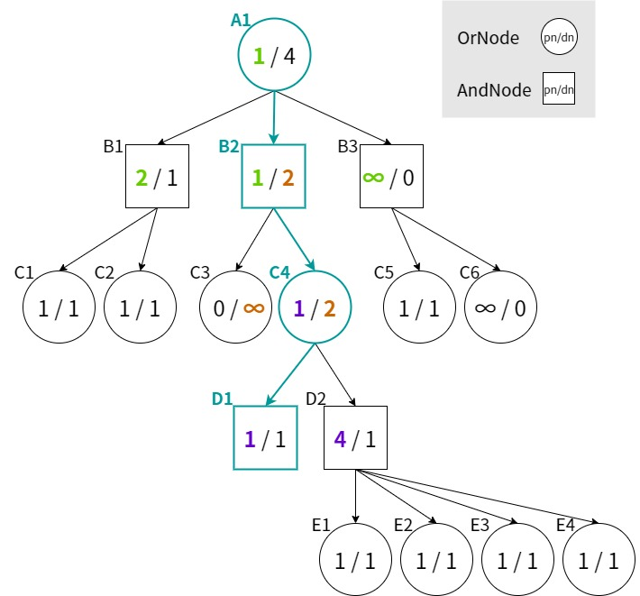
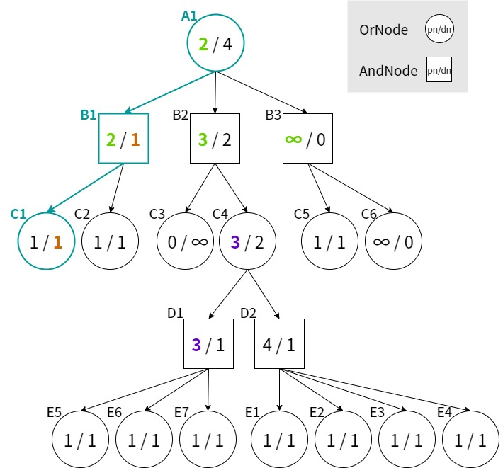
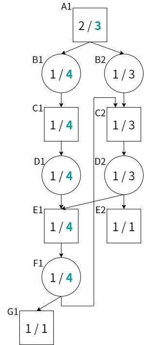
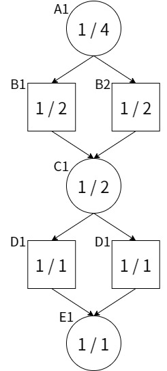



長手数の詰将棋の探索に用いられるdf-pnアルゴリズムについて、その概要と実用上の課題を解説する。

## 概要

詰め将棋において、各局面の平均着手可能数は5.8手程度と言われている[^1]。単純にこれを全探索することを考えると、\\(n\\) 手詰を解くためには \\(5.8^n\\) 局面を調べることになる。例えば、現時点で最長の詰将棋であるミクロコスモス（1525手詰）を解くためにはざっくり \\(10^{1164}\\) 局面を調べることになってしまう。このように、愚直な全探索では長手数の詰将棋を現実的な時間内で解くことはできないことが分かる。

[^1]: [やねうら王詰将棋ルーチンでミクロコスモスは解けますか？ | やねうら王 公式サイト](https://komorinfo.com/blog/df-pn-basics/#easy-footnote-bottom-1-1168)

しかし、ある局面が詰むことを示すだけならここまで膨大な探索は必要ない。例えば以下の局面を考える。


この局面の合法手は63金打、53金打など全部で9通りあるが、この局面が詰みであることを示すためには次の手順だけ探索できていればよい。

```text
* 53金打
  * 41玉42金打　まで
  * 51玉52金打　まで
  * 61玉62金打　まで
```

この探索結果より、玉方がどのように逃げても3手で詰むことが示せている。このような、ある局面が詰み（または不詰）だと証明するための局面の探索木のことを「証明木（または反証木）」という。df-pnアルゴリズムではできるだけ詰み（不詰）に近そうな局面から調べることで証明木（反証木）を構成していく。そうすることで、詰め将棋のように「詰みに近い局面もだいたい詰み」という性質を満たす問題であれば効率的に探索を行うことができる[^2]。

[^2]: 先の図で62金打 -> 42玉 -> 52金 -> … のように長く王手を続けることもできるが、玉方の応手がたくさんある方向に逃がすため考えなければならない局面数が多くなってしまう。それよりも、目先の簡単に詰ませられそうな局面に飛びついたほうが大体の場合はうまくいくということである。実際、53金打は玉方の応手数が最小で証明すべき局面数が局所的にも最小の手になっている

以下ではdf-pnアルゴリズムの具体的な探索方法を例を交えながら説明していく。

## 証明数と反証数

df-pnアルゴリズムでは、各局面でpn/dn (proof number/disproof number)というパラメータを持つ。pn/dnは探索が進むと変化する値で、それぞれ、詰みを示すために探索すべき局面数／不詰を示すために探索すべき局面数を表している。直感的には \\(\\mathrm{pn}\\) が小さい局面ほどより詰みに近く、\\(\\mathrm{dn}\\) が小さい局面ほど不詰に近いとイメージしてもよい。詰み局面では \\((\\mathrm{pn}, \\mathrm{dn})=(0, \\infty)\\)、不詰の局面では \\((\\mathrm{pn}, \\mathrm{dn})=(\\infty, 0)\\) となる[^3]。

[^3]: 詰みの局面ではいくら探索を続けても不詰を示すことはできないので (\\mathrm{dn}=\\infty) というイメージ"

言い換えると、df-pnアルゴリズムの世界では、与えられた局面の \\(\\mathrm{pn}, \\mathrm{dn}\\) を更新しながら探索を進めて \\((\\mathrm{pn}, \\mathrm{dn})=(0, \\infty)\\) （詰み）と \\((\\mathrm{pn}, \\mathrm{dn})=(\\infty, 0)\\) （不詰）のいずれであるかを明らかにする行為に帰着されるのである[^4]。

[^4]: なお、詰将棋では連続王手の千日手は攻め方の負けと決まっており有効な局面数は有限であるため、引き分けになるケースは存在しない。（『最後の審判』のような超例外を除けば）必ず詰みか不詰を証明できる"

詰み／不詰がまだ確定していない局面では、\\((\\mathrm{pn}, \\mathrm{dn})\\) は次のように計算する。以下では、局面 \\(n\\) の証明数／反証数をそれぞれ \\(\\mathrm{pn}\_{(n)}, \\mathrm{dn}\_{(n)}\\) とする。また、局面 \\(n\\) から手 \\(m\\) で一手動かした後の局面を \\(n_m\\) と表記する。また、以下で現れる \\(\\min_m\\) や \\(\\sum_m\\) は局面 \\(n\\) のすべての合法手に対する min, sum を表すとする。

### 攻め方（OrNode）

\\((\\mathrm{pn}, \\mathrm{dn})\\) は次のように計算する。

- $$\\mathrm{pn}\_{(n)}=\\min\_{m} \\ \\mathrm{pn}\_{(n\_m)}$$
- $$\\mathrm{dn}\_{(n)} = \\sum\_{m} \\ \\mathrm{dn}\_{(n\_m)}$$

ただし、末端局面（子局面を展開していない局面）では \\((\\mathrm{pn}\_{(n)}, \\mathrm{dn}\_{(n)}) = (1, 1)\\) である。

### 受け方（AndNode）

\\((\\mathrm{pn}, \\mathrm{dn})\\) は次のように計算する。

- $$\\mathrm{pn}\_{(n)} = \\sum\_{m} \\ \\mathrm{pn}\_{(n\_m)}$$
- $$\\mathrm{dn}\_{(n)}=\\min\_{m} \\ \\mathrm{dn}\_{(n\_m)}$$

ただし、末端局面（子局面を展開していない局面）では \\((\\mathrm{pn}\_{(n)}, \\mathrm{dn}\_{(n)}) = (1, 1)\\) である。

## 探索方法

df-pnアルゴリズムでは探索開始局面の証明（ \\((\\mathrm{pn}, \\mathrm{dn})=(0, \\infty)\\) ）または反証（ \\((\\mathrm{pn}, \\mathrm{dn})=(\\infty, 0)\\) ）が示されるまでの間、OrNodeでは\\(\\mathrm{pn}\\)が最小の局面を、AndNodeでは\\(\\mathrm{dn}\\)が最小の局面を選んで探索を進める。

例を挙げて説明する。



探索途中で図のようになっている状況を考える。この瞬間にOrNodeではpn最小の子局面、AndNodeではdn最小の子局面というルール通りに節点をたどっていくと、最善応手列（PV）はA1-&gt;B2-&gt;C4-&gt;D1であることがわかる。よって次に展開すべき局面はD1となる。

D1を展開すると以下のようになったとする。



D1の子にE5, E6, E7という未証明局面があるため、D1のpnが3に変化した。これに伴い、A1, B2, C4のpnも更新される。更新後の探索木ではPVがA1-&gt;B1-&gt;C1に変化しているため、次に展開すべき局面はC1となる[^5]。

[^5]: C1とC2のpnは等しいので、A1-&gt;B1-&gt;C2をPVとみなしても問題ない

このように、PVを順々に更新しながらその時点で最も証明（反証）しやすい局面を選択的に読むことがdf-pnアルゴリズムの特徴である。ぱっと見でめんどくさそうなD2は後回しにして、より詰みやすそうなD1やB1を先に探索することで高速に詰みを見つけられるイメージである。

## 特徴

### よい点

df-pnアルゴリズムは一般的には以下のような利点が知られている。

- 闇雲な全探索と比べて圧倒的に高速に詰み・不詰を見つけられる
- ハッシュ（置換表）の恩恵を受けやすい
- 深さ優先探索だが最良優先探索に近い順序で探索できる
  - メモリ消費を抑えながら良さげ風なノードから順に探索できる

df-pnアルゴリズムの発表から20年以上が経過しているが、2021年現在のところ長手数の詰将棋を解く最も効率的なアルゴリズムとして認知されている。

### よくない点（実装が難しい点）

一方で、df-pnアルゴリズムは以下のような難点が存在する。

- 得られた証明木（反証木）が最良（最短）手順とは限らない
- 探索順序が探索性能に大きく影響する
- 探索局面の合流に関連する処理が非自明
  - 局面のループ（GHI問題）[^6]
  - 分岐の合流（証明数の二重カウント問題）[^7]

[^6]: 実際に開発中に遭遇したことがある探索木。この瞬間のPVはA1-&gt;B1-&gt;C1-&gt;D1-&gt;E1-&gt;F1だが、F1の子にC2(1, 3)がいるのでB1~F1のdnが4へと更新される。すると、PVがA1-&gt;B1-&gt;C2-&gt;D2に切り替わる。しかし、D2の子にE1(1, 4)がいるのでB2~D2のdnが5に更新され、PVがA1-&gt;B1-&gt;C1-&gt;D1-&gt;E1-&gt;F1に戻る。つまり、無限ループが発生してしまう。
[^7]: 図の局面のとき、A1でdn=4と計算されているが、もしE1が不詰ならA1の不詰を示せるのでdn=1であるべきである") 

特に、最後の探索局面の合流が厄介な問題として常につきまとう。細心の注意を払わないと詰／不詰の判定を誤ったり、無限ループに陥ったりする可能性がある。

この合流問題については、df-pnを詰将棋へ適用した元論文[^8]に解決方法が記載されているが、現在のコンピュータ将棋開発者の中には懐疑的な意見を持つ人が一定数いる[^9]。局面ループの対処方法については、上記論文記載の方法以外にもやねうらお氏提案の方法[^10]やtanuki-詰めのように探索を延長して頑張る方法[^11]、DLShogiのようにdepth違いの局面を区別する方法[^12]が知られている。また、分岐の合流に関しては証明数・反証数の計算方法を変えて過度に数字が大きくならないようにする方法[^13]が知られている。

[^8]: <https://ipsj.ixsq.nii.ac.jp/ej/?action=repository_action_common_download&item_id=11597&item_no=1&attribute_id=1&file_no=1>
[^9]: 僕もその一人である。例えば、論文中には「千日手はハッシュエントリに1手前のエントリへのポインタを保存することで検出できる」と記載されているが、これをそのまま実装すると別手順で合流した局面はすべて別エントリに保存しなければならなくなってしまう。このようなナイーブなアルゴリズムだけでは、当時の記憶容量ではミクロコスモスの詰みを証明することは困難だったと考えられる。そのため、論文に記載されていない裏テクニックがあるのではないかと思われる。
[^10]: [協力詰めsolverを並列化するとGHI問題に行き当たる件 | やねうら王 公式サイト](https://yaneuraou.yaneu.com/2016/01/08/%e5%8d%94%e5%8a%9b%e8%a9%b0%e3%82%81solver%e3%82%92%e4%b8%a6%e5%88%97%e5%8c%96%e3%81%99%e3%82%8b%e3%81%a8ghi%e5%95%8f%e9%a1%8c%e3%81%ab%e8%a1%8c%e3%81%8d%e5%bd%93%e3%81%9f%e3%82%8b%e4%bb%b6/)
[^11]: [YaneuraOu/tanuki-mate-search.cpp at master · yaneurao/YaneuraOu](https://github.com/yaneurao/YaneuraOu/blob/master/source/engine/tanuki-mate-engine/tanuki-mate-search.cpp#L548-L553)
[^12]: [詰み探索のループ対策 &#8211; TadaoYamaokaの日記](https://tadaoyamaoka.hatenablog.com/entry/2018/05/21/225238)
[^13]: [(PDF) Weak Proof-Number Search](https://www.researchgate.net/publication/220962458_Weak_Proof-Number_Search)

### 拡張

やねうら王の詰将棋ルーチンでは証明数／反証数の概念を拡張している。新規探索節点の \\(\\mathrm{pn}, \\mathrm{dn}\\) を \\((1, 1)\\) の固定値を使うのではなく、詰みやすそうな局面ではpnが小さく、詰みにくそうな局面ではdnが小さくなるようにヒューリスティックに値を増減させている。このようにすることで、depthの違う局面の比較を行うことができ、pnとdnを方策と見立てた最良優先探索に落とすことができる。

## まとめ

長手数の詰将棋を短時間で解くためのdf-pnアルゴリズムの概要について解説した。多くのケースで探索局面数を大幅に減らすことができるが、理論と実装の間にはそこそこギャップがあることが感じ取れていただければ幸いである。

次回は詰将棋探索特有のテクニックである証明駒／反証駒について解説する。
