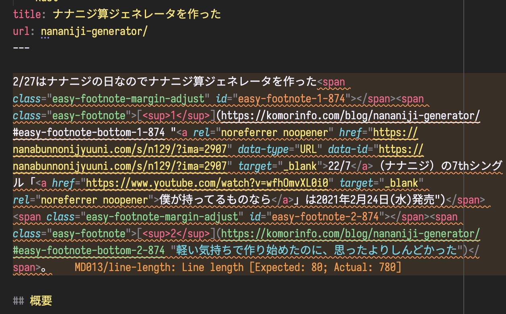
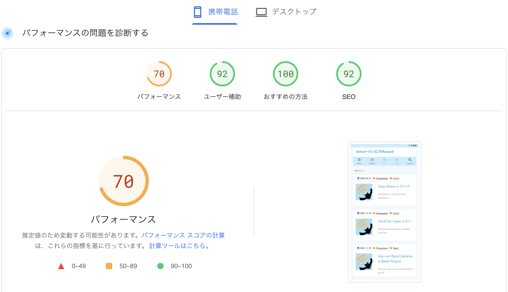
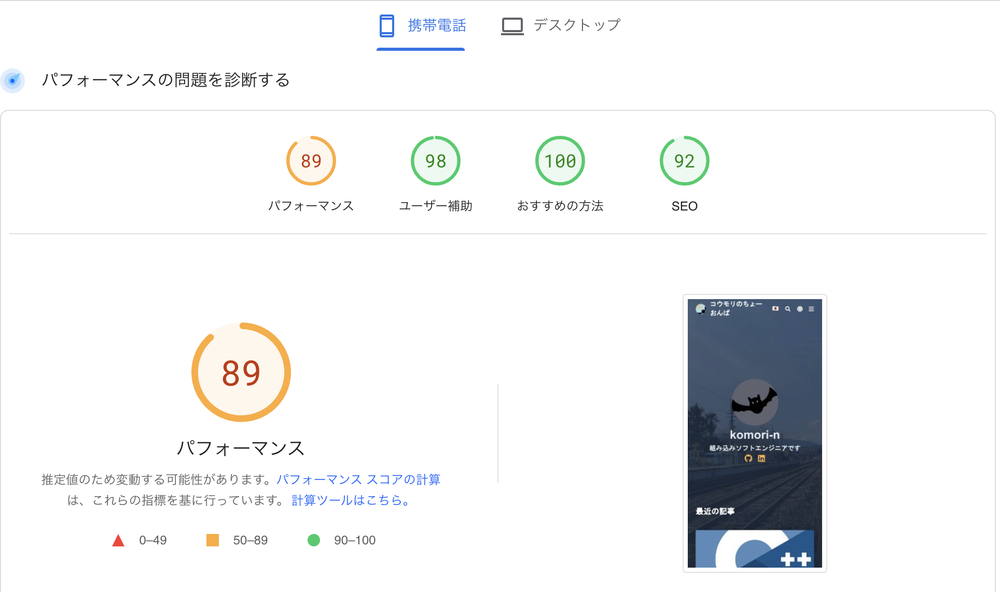

## 背景

はてなブログからWordPress on AWSに変えてそろそろ3年。WordPressに移行したことで、
豊富なプラグインやテーマの恩恵を受けることができ、快適に文章を投稿できるようになった。

しかし、最近ではWordPressサーバーの保守に問題が生じてきていた。
ありがたいことにブログの閲覧者数は順調に増加しているのだが、AWSで借りている弱小サーバーでは力不足のようで、
アクセス数の増加に十分ではなかった。実際、最近ではアクセス数が急激に増加した際にサーバーが落ちてしまう事象が
しばしは発生していた。

AWSで借りるサーバーのグレードを上げれば鯖落ち問題は回避できるのだが、WordPressサーバーの移行は意外と面倒だと判明した。
新しくサーバーを借りてWordPressを立ち上げ、データベースを丸ごとコピーし、ドメインを移行する必要がある。
旧サーバーではプラグインを多くインストールしていたため、サーバー移転には多くリスクがあると感じた。

そこで、これを機にAWSサーバーでホスティングするのではなく、GitHub Pagesで静的に配信する方式に切り替えることにした。

GitHub Pagesにサイトを構築するには、HTML/CSSを静的に生成するフレームワークが必要になる。
静的サイトを生成するフレームワークは多数存在するが、今回はHugoを用いて構築することにした。
[Hugo](https://gohugo.io/)はGoで作られた最近人気が高まっている静的サイトジェネレータである。
Hugoはシンプルながらカスタマイズが容易なフレームワークであり、
[Hugoテーマ](https://themes.gohugo.io/)がとても充実している。加えて、
Markdownベースのジェネレータなので、他のフレームワークへの乗り換えも容易に行える。
このような理由からHugoへの乗り換えを決めた。

## 乗り換え方法

WordPressからHugoへの乗り換え事例はネットで探せば多数が見つかるし、
[Hugoの公式サイトにも移行方法が詳細に書かれている](https://gohugo.io/tools/migrations/#wordpress)
ので、ここでは特に詰まった点だけ触れる。

WordPressの記事を移行してHugoで新しくサイトを構築するには、以下の手順を踏むことになる。

1. Hugoテーマを選ぶ（重要）
2. 既存の記事を変換する
3. コンフィグをいじって仕上げる

### Hugoのテーマを選ぶ

[Hugo公式サイトのテーマ一覧](https://themes.gohugo.io/)から、サイトに適用するテーマを選ぶ。
このステップがブログ移行にあたって最も重要であり、
選択を間違えると後から大きな手戻りが発生してしまうので慎重にテーマを選ばなければならない。

テーマによって見た目が変わるだけでなく、テーマによって拡張性やカスタマイズ性が大きくことなるので
注意が必要である。例えば、このブログで使用している[Blowfish / ブルーフグ](https://blowfish.page)
というテーマは、[豊富なドキュメント](https://blowfish.page/docs/)や
[便利なショートコード](https://blowfish.page/docs/shortcodes/)、
[優れたカスタイマイズ性](https://blowfish.page/docs/configuration/)が魅力である。
テーマによってコンフィグやショートコードのラインナップが異なるので、
後からテーマを変更すると大きな手直しが必要になる。
このように、見た目だけでなく要件に合ったHugoテーマを選ぶことがとても重要なのである。

### 既存の記事を変換する

次にWordPress版の記事をHugoで扱えるように変換する。

まず、[公式サイトに書かれている通り](https://gohugo.io/tools/migrations/#wordpress)
WordPressにプラグインをインストールし、記事をMarkdown形式で変換する。
今回は[Jekyll Exporter](https://wordpress.org/plugins/jekyll-exporter/)を使用してJekyll形式に変換してから
[JekyllToHugo](https://github.com/fredrikloch/JekyllToHugo)により変換した。
更新日時やタイトル、`<h1>~<h6>`タグなどはきれいに変換することができた。

一方で、いくつかのコンポーネントは機械的に変換できていないようだった。

- 画像
- 内部リンク／外部リンク
- コードブロック
- 脚注

これらについては一つ一つ手作業で直していった[^1]。

[^1]: ついでに著しくクオリティが低い記事はそっと消した

特に脚注の手直しがとても手間がかかった。WordPress版では
[Easy Footnotes](https://ja.wordpress.org/plugins/easy-footnotes/)というプラグインを使用していたのだが、
これを使っていた箇所は変換によりすべて壊れてしまっていたので、
全て手作業で直していった[^2]。一部、どうしてもMarkdownでは表現できない脚注があったのだが、
そのような部分は記事本文を直して話の流れが壊れないようにした。

[^2]:
    一番大変だったのが[df-pnの最初の記事](http://localhost:1313/blog/blog/df-pn-basics/)。
    参考文献が多く、壊れた脚注を直すのに15分ぐらいかかった。

また、せっかくなのでHugoの機能をいくつか試してみた。
HugoやBlowfishにはshortcodeと呼ばれる便利記法がいくつか存在している。
ブログ移行を機に既存記事にざっと目を通し、shortcodeで書き換えられる部分は手直しを行った。


Markdown拡張によりこんなボックスを出すこともできる。


記事の移行は試行錯誤しながら行ったため、70個の記事の移行に約12時間かかった。

### コンフィグをいじって仕上げる

先述した通り、Hugoではカスタマイズできる箇所が多くある。

旧サイトからシームレスに移行するためには、URLが変わらないように気をつける必要がある。
このブログは、WordPress版では`https://komorinfo.com/blog/<Title>`の形式でURLを決めていた。
そのため、以前と同じURLに配置させるためには、`relpermalink`や`url`の値を`blog/<Title>`のように設定する必要がある[^3]。
こうすることで、移行前後で同じURLを使い続けることができる。

[^3]:
    HugoやBlowfishの良くない点として、baseURLと相対パスの扱いが少し粗いことが挙げられる。
    baseURLが`https://example.com/hoge/`のとき、Hugoが管理するのは`/hoge/`以下に限られるのだが、
    `/blog/nyan`という記事の参照が`https://example.com/hoge/blog/nyan`ではなく
    `https://example.com/blog/nyan`とbaseURLを無視してしまうことがあった。
    そのため、本サイトではBlowfishのレイアウトに少してを入れることでこの問題を回避している。

また、HugoとBlowfishにはこれ以外にもカスタマイズできるコンフィグがとても多くある。
それにより、旧サイトとにはなかった以下の新機能が使えるようになった。

-  / によりライトモードとダークモードの切り替えができる
- から記事検索ができる
- 記事の末尾に関連記事を表示する
- とてもいい感じの背景画像を設定する

## 速度比較

狙い通りページ読み込み速度が向上したかどうか調べるために、
[PageSpeed Insights](https://pagespeed.web.dev/)でページ読み込み速度の比較を行った。

Hugo版への移植により、パフォーマンスが70から89に向上した。
体感的にも、旧サイト特有のもっさり感が薄まり、ページ読み込みが爆速になったと感じる。

## まとめ

WordPress on AWSからHugo on GitHub Pagesへの移行を行った。
サーバー保守の必要がなくなり、しかもページ読み込み速度がかなり向上した。
さらに、Hugoの機能によりシンプルでモダンな見た目の良いサイトになった。
