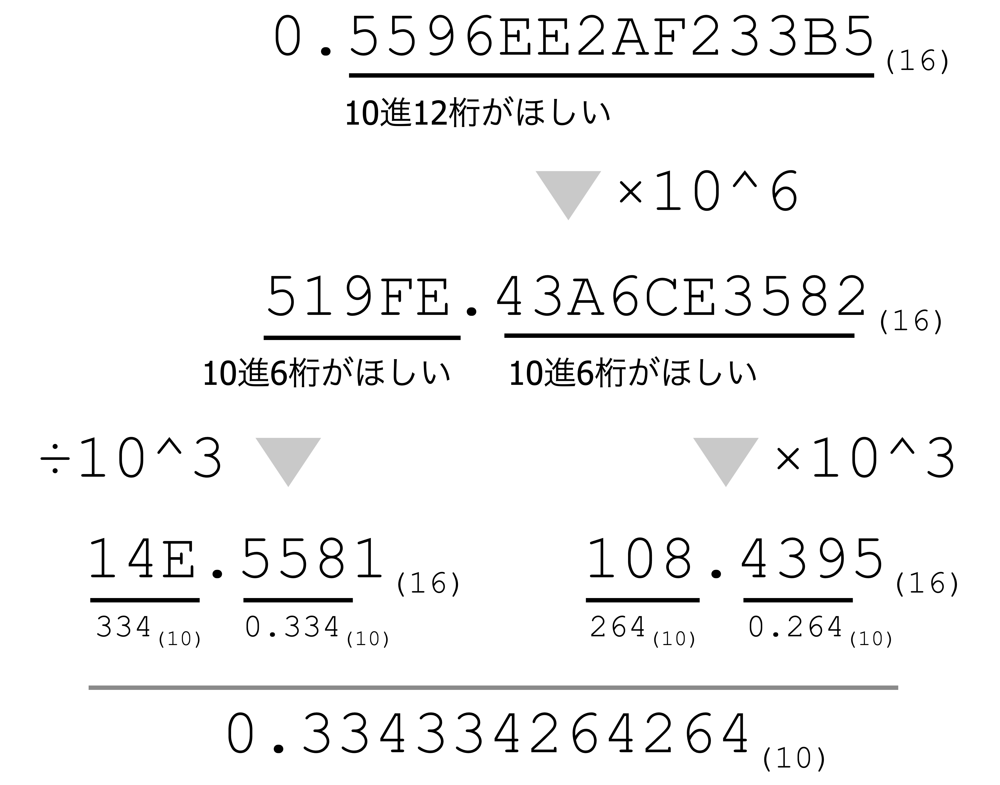
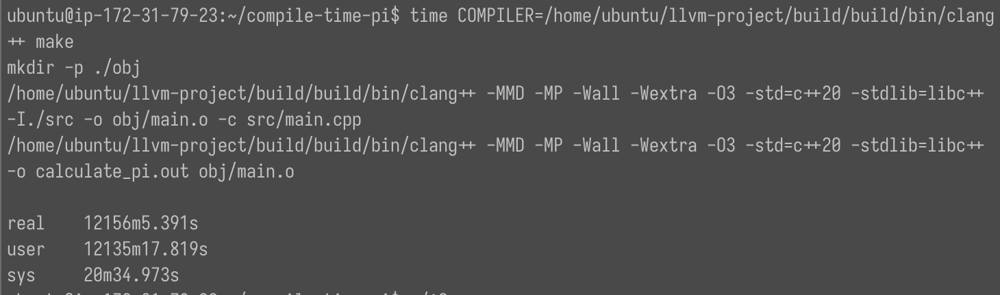



C++20でconstexprの制限が緩和されたことを利用して、コンパイル時に円周率100万桁まで計算した。

## はじめに

C++20では、constexprに関する制限がいくつか緩和された。例えば、
[constexpr関数内でのtry-catchブロック](https://cpprefjp.github.io/lang/cpp20/try-catch_blocks_in_constexpr_functions.html)
や
[可変サイズをもつコンテナの`constexpr`化](https://cpprefjp.github.io/lang/cpp20/more_constexpr_containers.html)
などが挙げられる。この緩和により、実用上ほとんどすべての計算をコンパイル時に実行可能になった。

本ページでは、このC++20 constexprを悪用して、コンパイル時に円周率100万桁を計算する方法について概説する。

コンパイル時に円周率計算するためには、高速な乗算が可能な任意精度演算ライブラリが必要になる。
通常の円周率の計算では、[GNU Multi-Precision Library(GMP)](https://gmplib.org)
のような任意精度演算ライブラリを使用することで、円周率100万桁を1秒以内に求めることができる。
しかし、GMPを含む任意精度演算ライブラリは基本的にconstexpr計算に対応していない。
そのため、constexpr計算に対応した独自の任意精度演算ライブラリを作成して、円周率の計算を行った。

## 円周率の計算方式

コンピュータで円周率を計算する場合、Chudnovsky の公式[^1]

$$
\frac{1}{\pi} = 12\sum_{n=0}^{\infty} \frac{(-1)^n (6n)! (A+Bn)}{(n!)^3 (3n)! C^{3n+3/2}}
$$

がよく用いられる。ただし、

$$
A=13591409,\quad B=545140134,\quad C=640320
$$

である。Chudnovsky の公式は極めて収束が早く、$n=0$ で計算を打ち切っても、$3.141592653589734\dots$ と小数点以下13桁の精度がある。

[^1]: D. V. Chudnovsky and G. V. Chudnovsky, Approximations and complex multiplication according to Ramanujan, in Ramanujan Revisited, Academic Press Inc., Boston, (1988), p. 375-396 &amp; p. 468-472.

この式をそのまま適用すると、除算や平方根の演算が多くあるため、計算に時間がかかる。
しかし、F. Bellard氏の論文[^2]のような計算の工夫をすることで、結果を高速に求められる。

[^2]: [Computation of 2700 billion decimal digits of Pi using a Desktop Computer](https://bellard.org/pi/pi2700e9/pipcrecord.pdf)

以下では、F. Bellard氏の論文のAlgorithm 1に沿って円周率の計算を行う。
このアルゴリズムの中身は[^2]に詳しく記載されているのでここでは深くは触れない。

このアルゴリズムでは、次のような任意精度演算を行う必要がある。

1. 乗算
2. 除算と平方根
3. 16進数→10進数変換

次節では、それぞれの演算に対するアルゴリズムについて簡潔に述べる。

## 多倍長整数演算

### 乗算

以下では、多倍長整数 $X, Y$ を、 $N$ 個の $B$ 未満の非負整数を用いて
\\begin{align}
X &= \\sum\_{i=0}^{N - 1} x\_{i} B^{i}, \\notag \\\
 Y &= \\sum\_{i=0}^{N - 1} y\_{i} B^{i} \\notag
\\end{align}
と表す。

多倍長整数の乗算を愚直に実装すると、$O(N^2)$の計算量が必要になる。
この計算量を減らす方法として、Karatsuba法やFFT/NTTを用いる方法などが知られている。

#### Karatsuba法

Karatsuba法では、乗算したい多倍長整数 $X, Y$ を、

$$
X=X_u C + X_l, \quad Y=Y_u C + Y_l
$$

とそれぞれ2つの多倍長整数へ分割する。
ただし、$C=B^{m}$で、$X_u, X_l, Y_u, Y_l$ は $C$ 未満の非負整数とする。

ここで、積 $XY$ を考えると、
\\begin{align}
XY &amp;= X_u Y_u C^2 + (X_u Y_l + X_l Y_u) C + X_l Y_l \tag{1}\\\\
&amp;= X_u Y_u C^2 + ((X_u + X_u)(Y_u + Y_l) - X_u Y_u - X_l Y_l) C + X_l Y_l \tag{2}
\\end{align}
と変形できる。式 $(1)$ では、積 $X\_\* Y\_\*$ を4回行っているのに対し、
式 $(2)$ では、$X_u Y_u$ と $X_l Y_l$ の計算結果を使い回すことで、
積の回数を3回に減らすことができている。この3箇所の積についても、
同様の手法を再帰的に適用することで、全体の計算量を $O(N^{\log_2 3})$
に落とすことができる。

#### FFT/NTT

FFTを用いることでも、任意精度整数の乗算を高速に行うことができる。

2つの整数列 $(x\_{i})\_{i=0}^{N-1}, (y\_{i})\_{i=0}^{N-1}$ に対し、畳み込み演算

$$
\mathrm{IDFT}[\mathrm{DFT}[(x_i)] \otimes \mathrm{DFT}[(y_i)]] \tag{3}
$$

を考える。ここで、$\mathrm{DFT}[\bullet]$ は離散フーリエ変換、
$\mathrm{IDFT}[\bullet]$ は逆離散フーリエ変換を表し、$\otimes$ は数列の項ごとに積を取る演算を表す。
この演算結果の第 $i$ 項は、

$$
z_{i}
:=
\sum_{j=0}^{n - 1} x_{j} y_{i - j}
$$

となる。ただし、$x_{i} = 0, y_{i} = 0 ~~(i \notin \{0, 1, \dots, n - 1\})$ とする。
こうして得られた $(z_{i})_{i=0}^{2n-1}$ を $X$ や $Y$ と同様に多倍長整数とみなすと、

$$
Z := \sum\_{i=0}^{2n - 1} \left(\sum\_{j=0}^{n - 1} x\_{j} y\_{i - j} \right) B^{i}
$$

となる。これは、積 $X Y$ の計算結果に他ならない。

式 $(3)$ で現れるフーリエ変換、逆フーリエ変換はいずれも高速フーリエ変換（FFT）が適用できる。
このように、フーリエ変換した後の世界で乗算を考えることで、
多倍長整数の乗算の計算量を大幅に削減することができる。

ただし、実用上は、フーリエ変換の際に浮動小数の計算を行わなければならず、誤差が混入する可能性があるので、
代わりに **数論変換（Number-Theoretical Transform; NTT）** が用いられることが多い。
NTTはフーリエ変換を $\mathbb{Z}/p\mathbb{Z}$ 上で行う方法で、
FFTによる高速化の恩恵を受けつつ整数の世界で畳み込み演算ができる。

NTTを用いた多倍長整数乗算の実現方法にはいくつか選択肢があるが、
本ページでの計算ではSchönhage-Strassen Algorithm（SSA）を用いて実装を行った。
SSAの詳しい理論については[^ssa] [^ssa2]を参照。

[^ssa]: A. Schönhage and V. Strassen, "Schnelle Multiplikation großer Zahlen", Computing 7 (1971), pp. 281–292.
[^ssa2]: <https://tonjanee.home.xs4all.nl/SSAdescription.pdf>

#### Karatsuba法とSSAの比較

[後述する改造コンパイラ](#コンパイル方法)を用いてKaratsuba法とSSAの速度比較を行った。
この2つの手法は、計算量はSSAの方が小さいのだが、桁数が少ないときはKaratsuba法の方が高速であることが知られている。

以下は、2進数で $n$ 桁 $\times$ $n$ 桁の乗算をコンパイル時計算で計算したときの計算時間である。
以下の表で桁数 $n$ が中途半端な値である理由は、
SSAの分割サイズを決める変数 $k$ がギリギリ繰り上がらないような値を選んでいるためである。

| 桁数[bit] | Karatsuba法[s] | SSA[s] |
| --------: | -------------: | -----: |
|      1792 |           0.81 |   1.23 |
|      7680 |           1.19 |   4.53 |
|     31488 |           3.22 |  11.01 |
|    128512 |          25.33 |  28.95 |
|    518144 |          229.9 |   95.0 |
|   2084864 |              - |  329.9 |


type: 'line',
data: {
datasets: [{
label: "Karatsuba法",
data: [{x: 1792, y: 0.81}, {x: 7680, y: 1.19}, {x: 31488, y: 3.22}, {x: 128512, y: 25.33}, {x: 518144, y: 229.9}]
}, {
label: "SSA",
data: [{x: 1792, y: 1.23}, {x: 7680, y: 4.53}, {x: 31488, y: 11.01}, {x: 128512, y: 28.95}, {x: 518144, y: 95.0}, {x: 2084864, y: 329.9}]
}],
},
options: { scales: {
x: { display: true, type: 'logarithmic', title: { display: true, text: "計算桁数[bit]" } },
y: { display: true, type: 'logarithmic', title: { display: true, text: "計算時間[s]" }}
}, plugins: { title: {display: true, text: "Karatsuba法とSSAに対する計算桁数と計算時間の関係"}}}


およそ $n=130000$ 以下では Karatsuba 法の速度が SSA を上回っているが、
それ以上の領域ではSSAのパフォーマンスの方が上回った。

この結果から、なぜ既存の多倍長整数ライブラリがconstexpr対応されたSSAを実装していないかが推察できる。
それは、SSAがKaratsuba法の性能を上回るのは10万桁を超える乗算のときに限られていて、
しかも1回の乗算に1分以上の時間を要するためである。
このような長時間かかるconstexpr計算は改造コンパイラを用意しなければ実行すらできない。
これが既存のライブラリがconstexpr版SSAを持っていない理由だと考えられる。

### 除算と平方根

多倍長整数の除算および平方根の計算には、いずれもNewton-Raphson法を用いる[^3]。

[^3]: 参考：[円周率.jp - Newton 法](https://xn--w6q13e505b.jp/method/newton.html)

除算 $X / Y$ を計算する場合、Newton-Raphson法を用いて $Y$ の逆数 $Y^{-1}$ を求め、
それを $X$ に乗じるという手順を踏む。整数 $Y$ の逆数（の近似値）は、
$1/Y$ を根に持つ関数 $f(x) := 1/x - Y$ に対しNewton-Raphson法を適用することで求められる。
$f$ に対するNewton-Raphson法の反復式は

$$
a_{n+1} = a_n (2 - Y a_n)
$$

となる。この反復式を用いると、列 $(a_n)$ は $1/Y$ へ2次収束する。
このように、Newton-Raphson法を用いることで効率的に $Y$ の逆数を求めたり除算を行う事ができる。

平方根についても逆数と同様に、Newton-Raphson法で求める。
ただし、$h(x) := x^2 - Y$ のような関数を用いて平方根を求めようとすると、反復式の計算に除算が必要になり、とても時間がかかる。
そのため、$1/\\sqrt{Y}$を根に持つ関数 $g(x) := 1/x^2 - Y$ に対しNewton-Raphson法を適用する。
$g$ に対するNewton-Raphson法の反復式は

$$
a_{n+1} = \frac{1}{2} a_{n} (3 - Y a_{n}^2)
$$

となる。このようにして得られた $1/\sqrt{Y}$ （の近似値）に対し、
$Y \times (1 / \sqrt{Y})$ を計算することで $\sqrt{Y}$ を求めることができる。

### 16進数→10進数変換

円周率の計算を行う場合、大部分の計算は16進数で行われるが、最終的には10進数として出力する必要がある。
16進数で表された多倍長浮動小数を10進数への変換にも少し工夫が要る[^4]。

[^4]: 参考：[円周率.jp - 基底変換](https://xn--w6q13e505b.jp/method/base.html)

まず、0以上1未満の16進数で表された小数$x$を$n$桁の10進数の小数へ変換する方法を考える。



例えば、0.5596EE2AF233B5を12桁の10進数に変換することを考える。
この数に$10^6$をかけると、519FE.43A6CE3582が得られる。
次に、この数を整数部519FEと小数部0.43A6CE3582に分け、それぞれ6桁の10進数に変換することを考える。
整数部を$10^3$で割り、小数部へ$10^3$をかけることで、それぞれ14E.5581、108.4395が得られる。
これらの数の整数部、小数部を3桁ごと10進数へ変換すると、それぞれ334、0.334、264、0.264となる。
こうして得られた数をつなげることで、元の小数は10進数で0.334334264264であったことが分かった。

このように、$10^{n/2}$をかけて整数部、小数部を再帰的に分解していくことで、
0以上1未満の16進数を10進数へ変換することができる。

同様に、16進数で表された整数を10進数に変換する場合、
元の整数を $10^{n}$ で割ることで0以上1未満の小数にすることができ、上記の問題に帰着させることができる。

## コンパイル方法

さて、コンパイル時に円周率のような大規模な計算を行う場合、普通のコンパイラを使うことはできない。
なぜなら、多くのコンパイラはconstexpr演算回数に制限を設けており、
円周率100万計算ではその制限を優に上回ってしまうためである。

```text
// clang++のエラー例
src/komori/main.cpp:109:18: error: constexpr variable 'ans' must be initialized by a constant expression
  constexpr auto ans = GetPiString<100000>();
                 ^     ~~~~~~~~~~~~~~~~~~~~
/opt/homebrew/opt/llvm/bin/../include/c++/v1/__iterator/reverse_iterator.h:242:5: note: constexpr evaluation hit maximum step limit; possible infinite loop?
    return __x.base() != __y.base();
```

そのため、clangを改造してconstexprが半永久的に行えるようなコンパイラを用意した。
clangの改造は
[Clangでコンパイル時に評価されるコード量を増やす – Qiita](https://qiita.com/ushitora_anqou/items/6322c6839f39f6b03a4e)
を参考に行った。具体的な改造パッチは
[infinite-constexpr.patch](https://github.com/komori-n/compile-time-pi/blob/main/infinite-constexpr.patch) を参照。

この改造により、円周率100万桁計算に耐えられるコンパイラが手に入った。

## 数値結果

作成した円周率計算プログラムに対し、コンパイル時計算と実行時計算でコンパイル時間の比較を行った。
加えて、参考として[GMPライブラリを用いた実行時計算](https://gmplib.org/pi-with-gmp)の計算時間の計測も行った。
なお、（財布の都合上）計測回数は1回だけなので、計測結果はあくまで参考程度として受け取っていただきたい。

計算にはAWS EC2 r7g.2xlarge（Ubuntu 22.04）を用いた。
constexpr計算はコンパイルにかかった時間、
実行時計算とGMPライブラリを用いた計算では実行にかかった時間それぞれをtimeコマンドを用いてそれぞれ計測した。
コンパイラはclang++（`200cc952a28a73687ba24d5334415df6332f2d5b`）をベースに、
前節で説明したconstexpr演算回数の制限を外すパッチを当てたものを使用した。

以下に計測結果を示す。

|      桁数 |   constexpr計算[s] | 実行時計算[s] | GMP[s] |
| --------: | -----------------: | ------------: | -----: |
|       100 |              1.475 |         0.002 |  0.002 |
|     1,000 |              4.075 |         0.002 |  0.002 |
|    10,000 |            157.750 |         0.018 |  0.003 |
|   100,000 |         12,787.984 |         1.049 |  0.032 |
| 1,000,000 | 729,365.391[^time] |        51.824 |  0.520 |

[^time]:
    729,365秒=202.6時間。今回計算に用いたr7g.2xlargeのコストは1時間あたり0.4284 USDであるため、
    この計算だけで**86.9 USD**かかっている。
    


type: 'line',
data: {
datasets: [{ label: "constexpr計算",
data: [{x: 100, y: 1.475}, {x: 1000, y: 4.075}, {x: 10000, y: 157.750}, {x: 100000, y: 12787.984}, {x: 1000000, y: 729365.391}]
}, { label: "実行時計算",
data: [{x: 100, y: 0.002}, {x: 1000, y: 0.002}, {x: 10000, y: 0.018}, {x: 100000, y: 1.049}, {x: 1000000, y: 51.824}]
}, { label: "GMP",
data: [{x: 100, y: 0.002}, {x: 1000, y: 0.002}, {x: 10000, y: 0.003}, {x: 100000, y: 0.032}, {x: 1000000, y: 0.520}]
}],
}, options: { scales: {
x: { display: true, type: 'logarithmic', title: { display: true, text: "計算桁数" } },
y: { display: true, type: 'logarithmic', title: { display: true, text: "計算時間[s]" } }
}, plugins: { title: {display: true, text: "各手法に対する計算桁数と計算時間の関係"}}}


constexpr計算は、同じコードを用いた実行時計算と比較して約1.4万倍、
GMPを用いた実行時計算と比較して約140万倍の時間がかかった。
これは、コンパイル時計算ではほぼ最適化なしで計算が行われるのに対し、
実行時計算ではコンパイラによる最適化が効くためであると考えられる。

このように、コンパイル時計算では実行時と比較して多大な計算コストが必要になる。
C++20で様々な制限が緩和されてほとんどあらゆることがコンパイル時に計算できるようになったが、
円周率の計算のような大規模計算はコンパイル時ではなく実行時に行うべきだということがよく分かった。

## まとめ

本ページではC++20のコンパイル時計算を駆使してconstexpr対応の任意精度演算ライブラリを自作した。
自作したライブラリを用いて数値実験を行ったところ、
コンパイル時計算は既存のライブラリと比べると圧倒的に遅いことが分かった。


