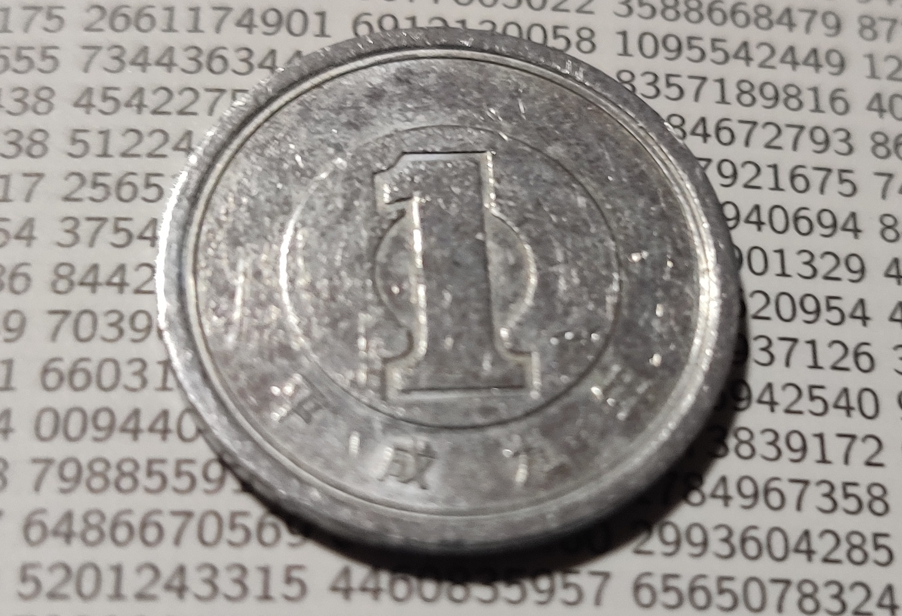
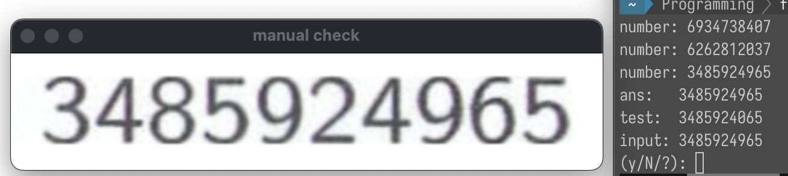

暗黒通信団『間違いだらけの円周率1,000,000桁表』に対して、Python（OpenCV+Tesseract）を用いて310個の間違いを見つけた。

なお、本ページは間違いを見つける方法ついてのみ説明する。
著作権や間違い探しの楽しみを考慮して、間違いの詳細については触れない。
どうしても気になる方は、この記事の手順に従うことで結果を再現できる。

この記事で使用したコードは、以下のリポジトリで確認することができる。



## はじめに

先日、友人から[間違いだらけの円周率1,000,000桁表](https://ankokudan.org/d/d.htm?detail315-detailread-e.html)
という本をもらった。この本は、[円周率1,000,000桁表](http://ankokudan.org/d/d.htm?detail002-detailread-j.html)
で有名な同人サークル『暗黒通信団』が発行している本で、タイトルの通り、微妙に間違った円周率が100万桁分掲載されている。

この本には、1ページあたり約3個の間違いが含まれているそうだ。
誤り率は 0.03 % であり、残りの 99.97 % は正しい円周率が記載されている。
つまり、この本はほとんどが円周率表であり、ごく一部混入された間違いを探して楽しむ本なのである。

この本では、1ページあたり10,000桁の数字が詰め込まれており、文字がとても細かい。



この本に含まれる全ての間違いを人力で見つけるのはほぼ不可能である。
というのも、円周率は10桁ごとに区切られて掲載されているのだが、10桁を2秒のペースで読めたとしても、
全文読み終わるまで55時間もかかってしまう。そもそも、
字が細かすぎて10桁2秒のペースで読み続けること自体が困難である。

せっかく頂いた間違い探し本の間違いを見つけられないのはなんだか悔しい。
そこで、コンピュータの力を借りてできるだけ間違いを探してみた。
本記事では、この間違いの見つける方法の概要について説明する。

## 間違い探しの方針

本文を文字に起こす際は[Tesseract OCR](https://github.com/tesseract-ocr/tesseract)を使用した。
TesseractはオープンソースのOCR（Optical Character Recognition/Reader, 光学的文字認識）エンジンである。
英語にとどまらず、日本語やギリシャ語など数多くの言語のテキストを精度良く認識することができる。

ただし、Tesseractへ丸投げするだけでは読み取り精度があまり良くない。
そのため、Tesseractに画像を渡す前に、[OpenCV](https://opencv.org)で画像の前処理を行う必要がある。

全体としては、以下のような手順で作業を行った。

1. テキストのスキャン
2. 画像の前処理
3. 文字認識（Tesseract）
4. 結果の手修正
5. 間違いの列挙

手順 1., 3., 5. については特に工夫の余地がない。よって以下では手順2., 4.で工夫したポイントについて説明する。

### 前処理

Tesseractへ文字認識を投げる前に、入力画像に対し以下の前処理を行った。

- 画像の傾き補正
- 10文字ごとの切り出し
- 文字のシャープ化とコントラスト調整

### 画像の傾き補正

手作業で本文をスキャンしたため、どうしても文字に傾きが生じてしまう。
Tesseractは文字の傾きに弱いので、前処理で傾きを直す必要がある。

本に数字がびっしりと書かれていることを利用してページの傾きを求める。
具体的には、`cv2.dilate()` で数字が書かれた領域を塗りつぶして、`cv2.findContours()` で輪郭抽出すればよい。

```python
def _make_flat(img: cv2.Mat) -> cv2.Mat:
    tmp_img = cv2.cvtColor(img, cv2.COLOR_BGR2GRAY)
    tmp_img = cv2.bitwise_not(tmp_img)
    tmp_img = cv2.dilate(src=tmp_img, kernel=np.ones((10, 10)), iterations=5)
    _, tmp_img = cv2.threshold(tmp_img, 100, 255, cv2.THRESH_BINARY)

    contours, _ = cv2.findContours(tmp_img, cv2.RETR_LIST, cv2.CHAIN_APPROX_SIMPLE)
    for cnt in contours:
        if cv2.contourArea(cnt) < 1000000:
            continue

        rect = cv2.minAreaRect(cnt)
        angle = rect[2]

        orig_height, orig_width, _ = img.shape
        rect_width, rect_height = rect[1]
        if rect_width > rect_height:
            angle += 90.0

        height, width = max(orig_height, orig_width), min(orig_height, orig_width)
        rot_center = (height / 2, height / 2)
        matrix = cv2.getRotationMatrix2D(rot_center, angle, 1.0)

        return cv2.warpAffine(img, matrix, (width, height), borderValue=(255, 255, 255))

    raise RuntimeError("Text area is not found")
```

### 10文字ごとの切り出し

円周率表には、1ページあたり10,000桁が書かれている。各ページは100行で構成されており、
各行は10桁区切りで100桁が掲載されている。この10桁区切りおよび各行の行間は、約0.5mmのスペースによって区切られている。

行や列の認識は、傾き検出のときと同様に、`cv2.dilate()` で数字領域を塗りつぶして、
`cv2.findContours()` により検出した。また、画像の切り出しの際は、検出した行・列以外の範囲を
白（背景色）で塗りつぶして余計な文字を消した。

### 文字のシャープ化とコントラスト調整

スキャンする際、どうしても画像に濃淡が生じてしまう。特に、文字が薄くなってしまった箇所は、
Tesseractでの文字認識に失敗しやすい。そのため、そのような箇所では文字のシャープ化とコントラスト調整を行った。

```python
# 文字のシャープ化
# 薄い部分は薄く、濃い部分はより濃く鳴るようなフィルターを通す
# これにより、文字のぼやけた部分がはっきりとして、Tesseractの認識精度が向上する
cell_img = cv2.filter2D(
    cell_img, -1, np.array([[0, -1, 0], [-1, 5, -1], [0, -1, 0]])
)
# コントラスト調整
cell_img = cv2.bitwise_not(
    cv2.convertScaleAbs(cv2.bitwise_not(cell_img), None, 1.5)
```

## 手修正

上記の前処理を施しても、Tesseractの文字認識精度は100 %にならない。
どれだけ前処理を頑張っても、9と0を取り違えるケースが多く見られた。
今回の目的は100 %の文字認識を達成することではなく、間違いをできるだけ列挙することであった。
そのため、認識精度はそのままとし、目視により結果の手修正を行った。

Tesseractで認識した数字と正しい円周率100万桁表を比較したところ、410箇所の相違点が見つかった。
この410箇所の中には、Tesseractで正しく文字認識できなかった箇所と、本の記載が間違っている箇所の両方が含まれる。
この410箇所すべてを目で確認し、本物の間違いだけを抽出しなければならない。

目視で確認すべき箇所が大量にあるので、単純に本と認識結果を突き合わせる方法だととても時間がかかる。
よって、目視確認の作業を効率化するために、Tesseractの前処理で使用した、10桁ごとに切り出す処理を流用した。

手修正の手順は大まかに以下のようになった。

1. 確認したい文字を含む10桁の塊を画像として切り出す
2. 切り出した画像を表示する
3. 画像を目視で確認して、10桁の数字を打ち込む
4. 打ち込んだ数字とTesseractの認識結果を比較し、異なるなら認識結果を修正する



この手作業により、410箇所の検出箇所のうち、100箇所はTesseractによる文字認識誤りだと判明した。

## 結果

上記の手順により、結果として間違いを310個見つけることができた。
間違いの内訳としては、普通の（正しくない数字が書かれている）間違いが293個、
普通ではない間違い17個あった。特に「普通ではない間違い」が曲者で、
Tesseractで認識するのがとても難しい間違いだった[^2]。

[^2]:
    原本が手元にあって、「普通ではない間違い」を実際に見てみたい方は、
    例えば以下の箇所で見つけられる。①0170001-0180000 ページ下部のほう中央
    ②0260001-0270000 ページ右上のあたり ③0500001-0510000 ページ中央やや下

1ページあたりの間違い個数の分布を以下に示す。


type: 'bar',
data: {
labels: ["0", "1", "2", "3", "4", "5", "6", "7"],
datasets: [{ label: "間違い個数",
data: [1, 17, 22, 25, 16, 8, 7, 4]
}]
},
options: { scales: {
x: { display: true, title: { display: true, text: "1ページあたりの間違い個数" }},
y: { display: true, title: { display: true, text: "ページ数" }}
}, plugins: { legend: { display: false },
title: {display: true, text: "ページあたりの間違い個数"}}}


今回の手法で発見できた間違いに限ると、全く間違いがないページが1つあったのに対し、
間違いが7個あるページが4つ見つかった。

今回の手法では310個の間違いを見つけることができた。
ただし、310個というのは中途半端な数字である。
予想として、残りの間違いはあと4個（3.14 x 100=314個）または5個（この本の税抜価格=315個）程度だと考えられる。

この本の間違いを全て見つけるためには、Tesseractで楽をする方法を用いることは難しい。
Tesseractの認識精度が100 %であることを証明することはできないためである。
よって、今回検出できなかった間違いを全て見つけるためには、目視で全数確認するしかないと考えられる。
