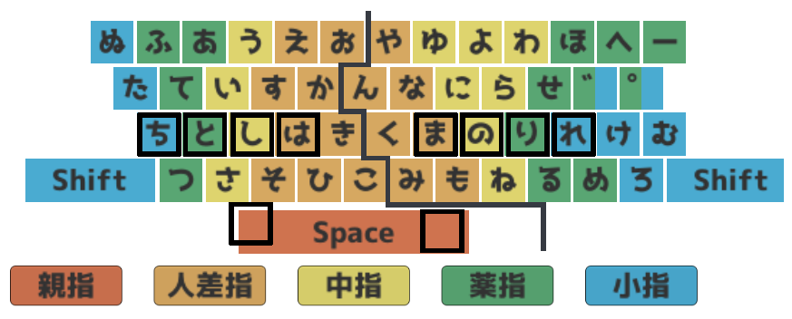
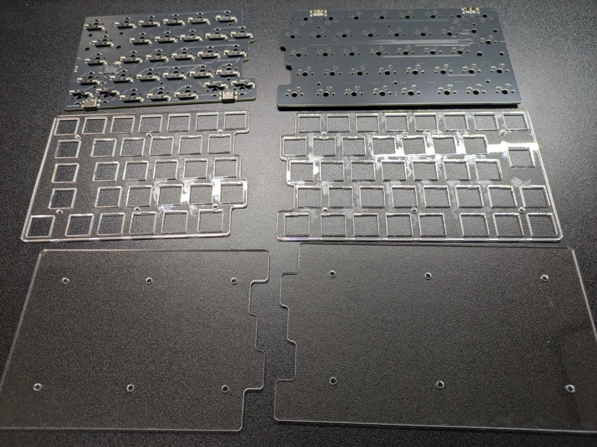
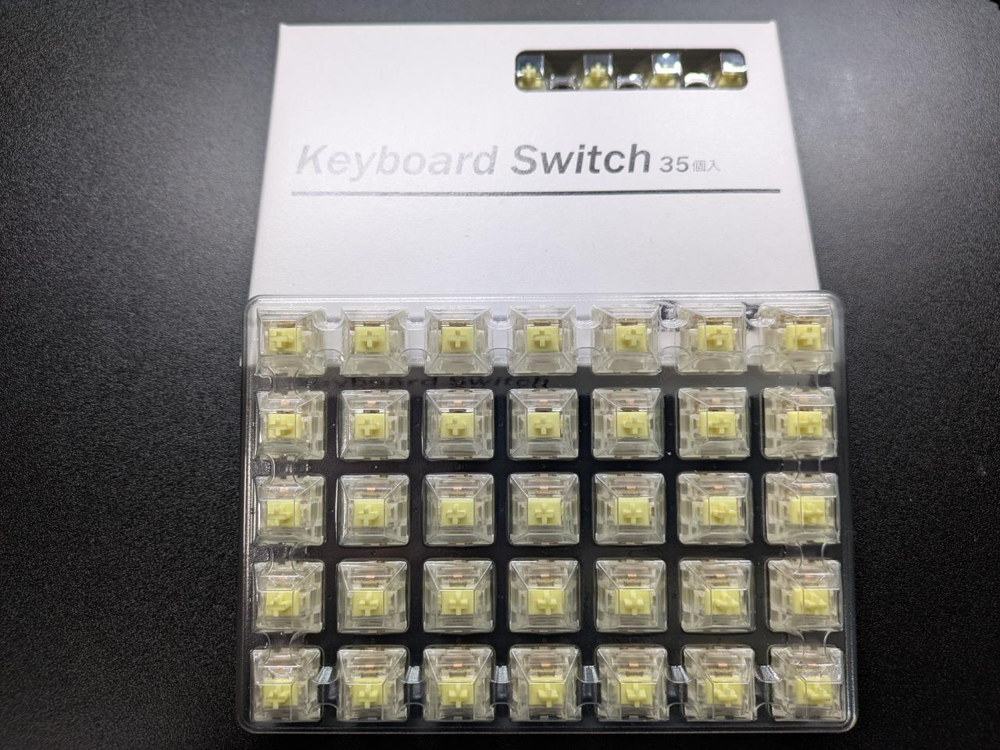
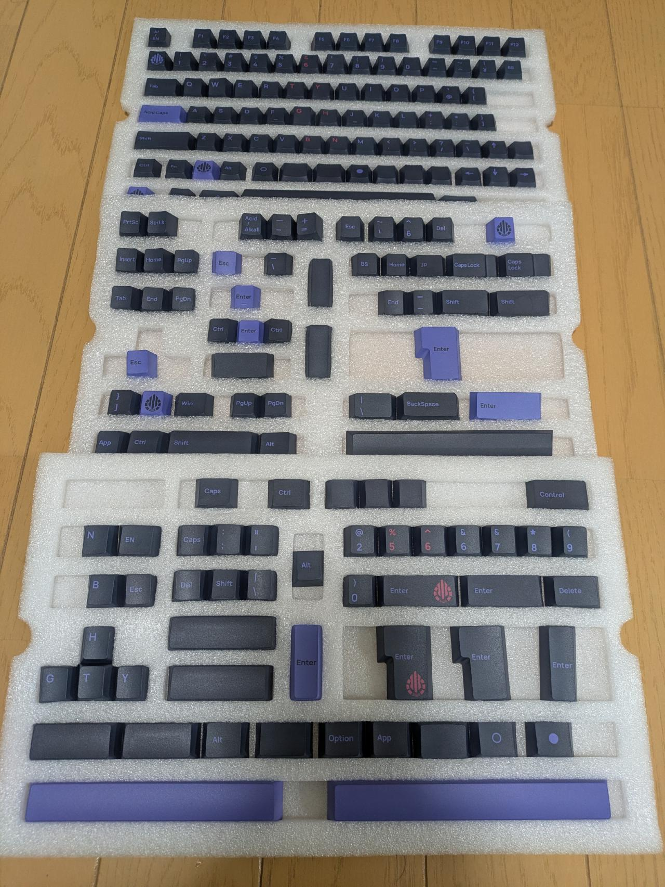
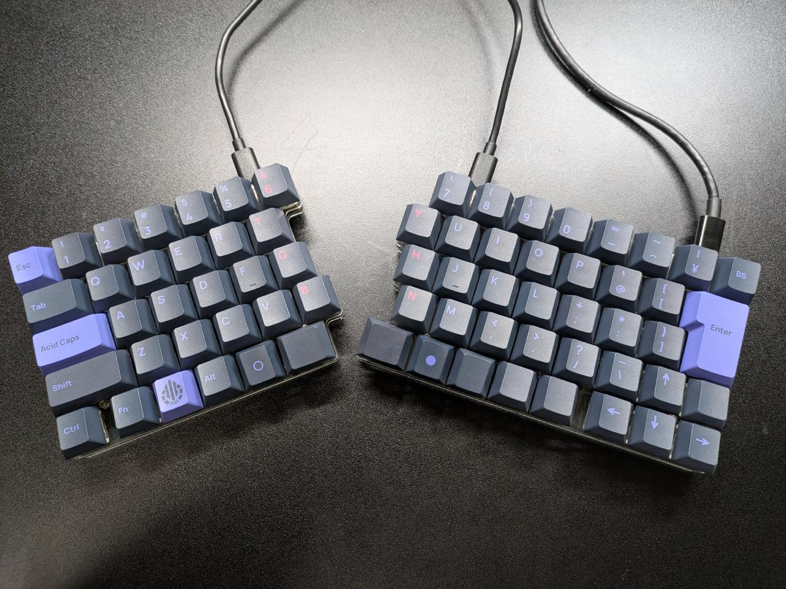
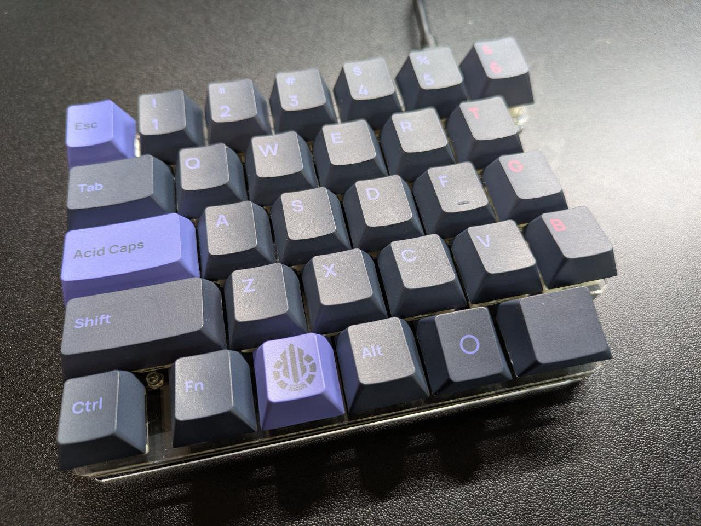
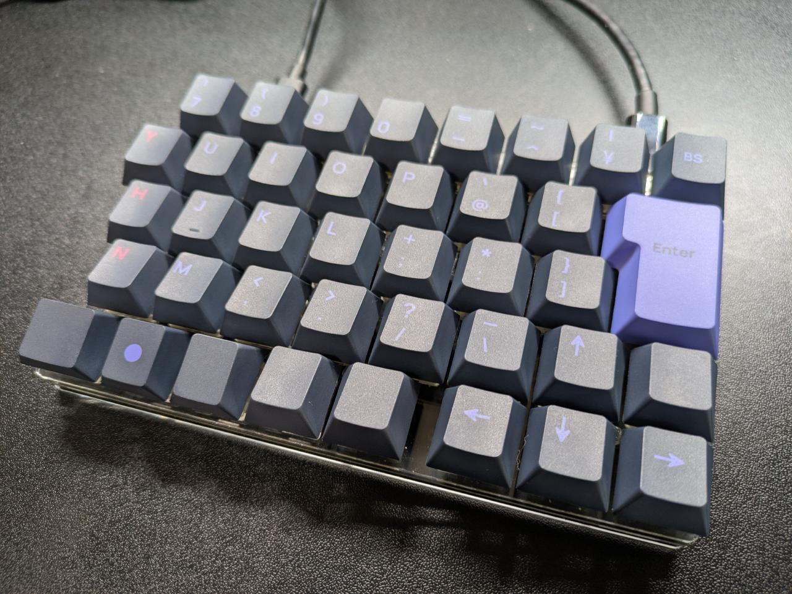

JIS 配列の分割キーボードキット『sphh jp v2』を買って自作キーボード沼に足を踏み入れてしまったので、
その経緯や感想などをまとめる。

## 背景

普段は Realforce R2（非静音・テンキーレス）を使っていて、気づけば8年近く経っていた。
少し前まではなんの不満もなく使えていたのだが、最近水をこぼしてしまった影響で、
`Fn`キーが押しっぱなしになったような挙動が出ていた[^fn-key]。
一晩経って復旧したものの、いつ再発するか分からない。
せっかくなので、これを機に新しいキーボードを買うことにした。

[^fn-key]: `Fn` キーが押しっぱなしになると電卓の起動とLED色の変更ぐらいしかできなくなる (<https://www.realforce.co.jp/support/files/fnc-keys-R2.pdf>)

当初は Realforce R4 の購入を検討していた。
しかし、最近のRealforceは静音モデルしかラインナップされておらず、
これまでの打鍵感から大きく変わってしまうのが気になった。

その流れで、以前から気になっていた分割キーボードを自作することを本気で検討し始めた。

## 買うものの選定

### ボードキット

ボードキットの要件は次の通りとした。

| 要件                | 理由                                                  |
| ------------------- | ----------------------------------------------------- |
| 左右分割            | 分割型を使ってみたかったため                          |
| JIS配列             | JISかな入力をするため                                 |
| `6/お` キーが左手側 | 自分の運指のクセに合わせるため[^my_finger_preference] |
| テンキーレス        | テンキーは甘えのため                                  |

[^my_finger_preference]: 私の運指は次のとおり（generated by <https://unsi.nonip.net>）。小指の守備範囲が狭いこと、濁音 `゛` と半濁音 `゜` に対して薬指・小指の両方を使うのが特徴。 

逆に、次の点は優先度を下げた。あまりこだわりが強くないのと、そもそもJIS配列の分割キーボード自体の選択肢がかなり少ないためである。

- F1〜F12 の有無
- row staggered かどうか

要件を満たして、かつ終売になっていなさそうなものを（ChatGPTくんが）調べたところ、候補は次の4つしかないようだった。

- [Radon_kb](https://booth.pm/ja/items/4996743)
- [JP60 Split (Otaku Split v2)](https://booth.pm/ja/items/2470855)
- [sphh jp v2](https://booth.pm/ja/items/4678724)
- [Earth95s](https://booth.pm/ja/items/6095962)

この中から、購入時点（2026-03-15）で在庫があり、
キー数が少なく構成がシンプルで、最初の1台として扱いやすそうだった
[sphh jp v2](https://booth.pm/ja/items/4678724) を選んだ。

はんだに自信がなかったのと、そもそもはんだごてを所持していなかったので、追加で組み立てサービスを利用した。

### キースイッチ

キースイッチは実物を触らないと決められないので、
秋葉原の[遊舎工房](https://shop.yushakobo.jp)に行って複数のスイッチを試打した。
打鍵感がRealforce R2に近く、タクタイルで荷重45g〜60gあたりのスイッチを打ち比べた結果、
[Gateron Jupiter Switch Banana](https://shop.yushakobo.jp/products/8299) が一番好みだったのでこれを選んだ。

### キーキャップ

日本語JIS配列に対応したキーキャップは選択肢がかなり少ない。
sphh jp v2でもいくつか[キーキャップが紹介されている](https://abitkeys.com/sphhjp/jp_keycaps.html)が、
最終的に[先駆者様の記事](https://note.com/sikaesi/n/n5c536fe641ed)で紹介されていた
[Acid Caps "Standard" Peri on Gray](https://keeb-on.com/products/acid-caps-standard-peri-on-gray) を選んだ。

## 組み立て

[sphh jp v2の組み立てガイド](https://abitkeys.com/sphhjp/build_v2.html) に従って組み立てた。
といっても、組み立てサービスを利用したので、「トッププレートにネジ、スペーサーを固定する」以降のみを自分で行った。
はんだ付けをプロの方におまかせしたのでその後の工程はすぐ終わると思っていたのだが、キースイッチの取り付けが意外と面倒なのと、キー配置をどうしようかあれこれ悩んでいたせいで、結局2時間位かかってしまった。

組み立てに苦戦している先駆者様方のブログをいくつか見ていたので、ちゃんと動作するか不安だったが、左右両方とも問題なく一発で動作してくれて安心した。

## 完成

完成したキーボードがこちら。

  

見た目がおしゃれで気に入っている[^thumb]。紫のキーキャップとグレーの組み合わせがよくまとまっていて、
高級感のある仕上がりになったと思う。

[^thumb]: 親指付近のキーが手前側に向いているのは、キーキャップをあえて上下逆向きにつけているため。こうすることで、キーキャップが親指に食い込んで痛くなるのを防ぐことができる。

### 費用

今回の自作キーボードでかかった費用の合計は **43,762円** だった。内訳は次の通り。
なお、費用には含まれていないが、これらに加えてUSB-Cケーブルx2本が必要だった。

| 項目         | 内容                                  | 金額（円） |
| ------------ | ------------------------------------- | ---------: |
| ボードキット | sphh jp v2                            |     16,800 |
|              | + 組み立てサービス                    |      8,800 |
|              | + 送料                                |        198 |
| キースイッチ | Gateron Jupiter Switch Banana（70個） |      3,464 |
|              | + 送料                                |        500 |
| キーキャップ | Acid Caps "Standard" Peri on Gray     |     13,000 |
|              | + 送料                                |      1,000 |
| **合計**     |                                       | **43,762** |

結果的にRealforce R4よりも高額になってしまったが、満足度は高いので今のところ後悔はしていない。

## 感想

分割キーボードに初挑戦だったので慣れるまで苦戦するかと思っていたが、意外にも初日からそれなりに使えた。
ミスタイプは少し増えたものの、じきになれるだろうと思える程度で大きなストレスは感じなかった。

一方で、使い始めてから自分が英語を打つときに単語によっては `y` や `h` を左手で押していたことに気づいた。
「city」とか「night」とか、tyまたはghが連続しているときは左手で打っていたのだが、分割されたことでそれができなくなってしまった。
`y` や `h` はかな入力では右手で打っているキーなので、矯正すればすぐになれると思う。

打鍵感と見た目については、どちらも満足している。
キーキャップを少し奮発したおかげで完成品の雰囲気がかなりよくなったし、
机の上に置いたときの満足感も大きい。ただ、打鍵音は想像していたよりしっかりうるさいので、
静かなオフィスで常用するには少し気を遣いそうではある。
キースイッチを自由に変えられるのが自作キーボードの強みだと思うので、
今後機会があれば変荷重にしたり他のスイッチに変えてみたりなど色々試してみたい。
