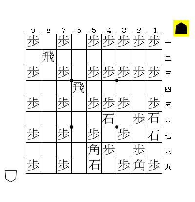
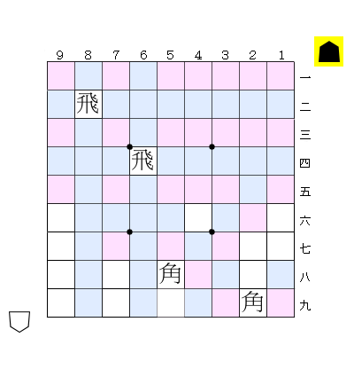
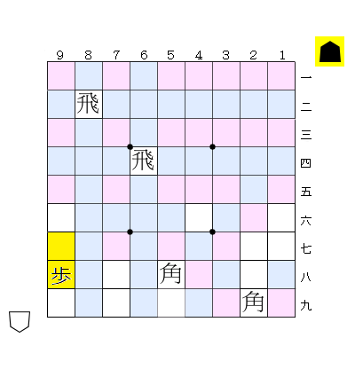
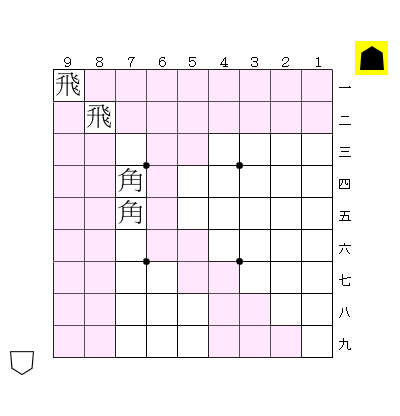
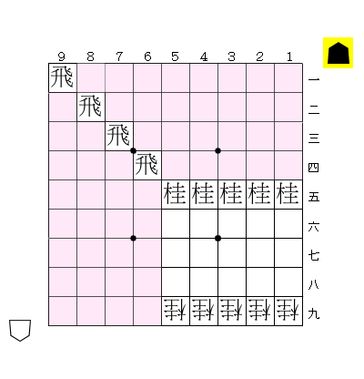

利かずの駒並べを現実的な時間で解くソフトを作った。



## 概要

**利かずの駒並べ**とは、将棋の駒を他の駒の利きに入らないように配置する遊びのこと。2歩や行きどころのない駒の配置も許される。

すべての駒を先手の駒として扱う単方向の駒並べでは、本将棋で使う40枚の駒（歩18香4桂4銀4金4玉2飛2角2）を盤面に配置できることが知られている[^1][^2]。

[^1]: 40枚が上限。これ以上駒を置くことはできない。
[^2]: 3720通りある配置の一例。実は、3720通りの解のうち、飛車と角の位置は（左右鏡像を除いて）すべて同じ。

利かずの駒並べには、すべての先手側の駒として並べる **単方向バージョン** と、上下の向きを指定せずに並べる **双方向バージョン** がある。単方向バージョンについては江戸時代あたりから知られている遊びで配置方法は広く知られているが、双方向バージョンについてはあまり知られていない。

利かずの駒並べについて、詳しくは[^3]を参照。似たような遊びとして、チェスの [8-queen puzzle](https://en.wikipedia.org/wiki/Eight_queens_puzzle) と呼ばれるものがある。

[^3]: <http://toybox.tea-nifty.com/memo/2005/07/post_1a14.html>

この問題の解をプログラムで探す場合、素朴に深さ優先探索で駒を1枚ずつ置いていくと指数関数的に時間がかかる[^4]。今回は、これを現実的な時間で解く方法について説明する。

[^4]: <http://www.pluto.ai.kyutech.ac.jp/~matumoto/syougi/>

アルゴリズムに興味がなく結果を早く見たい方は、次回の記事利かずの駒並べ｜実践編を参照。



## 理論

以下では、他の駒の利きに入らない配置のことを**利かずの配置**と呼ぶ。単に配置と呼ぶこともある。

### 単方向

#### 劣化駒

まず、利きのない仮想の駒「**石**」を導入する。石自体は利きを発生させないが、他の駒が利くマスに置くことができない。

次に、**劣化駒**という概念を導入する。劣化駒とは、元の駒に対し利きの範囲が減らされた駒のことを指す。例えば、銀や歩は玉の劣化駒である。劣化駒を考えることで、探索時間を劇的に削減できる。

ここでは、上で掲載した39枚配置をベースに説明する。上の図中の「香、銀、金、玉」をすべて「歩」に、「桂」を「石」に置き換えた図を考えると、利かずの配置が得られる。

このように、ある駒集合に対し利かずの配置法が存在する場合、劣化駒に置き換えるてもやはり利かずの配置になる。

この主張の対偶を取ると、「**ある駒集合に対し、利きを劣化させた駒集合の配置が不可能ならば、元の駒集合も配置不可能である**」ということが言える。当たり前の事実に見えるかもしれないが、この事実から探索を途中で打ち切ることができるようになる。

#### 歩と石の配置可能性判定｜単方向

盤面がある程度埋まっていて、残りの置く駒が歩と石だけの場合、そこそこ高速に配置可能性を判定できる。

この盤面に対し追加で歩27枚石11枚が配置可能であることはすぐに判定できる。なぜなら、ピンクが27マス、白が11マスあるので、それぞれに歩と石を敷き詰めればよいため。

また、少し一般化して歩N枚石38-N枚（0&lt;=N&lt;=27）が配置可能であることも示せる。これは、ピンクのうちNマスに歩を置き、残りの空きマスに石を置けばよい。

さらに、歩をピンクのマス以外に置くことも考えれば、上記の図には最大で歩を32枚まで置くことができる。一般化すると、歩27+M枚石11-2M枚（0&lt;=M&lt;=5）が配置可能である。白マスに歩を置くと、置ける石の枚数が2枚減ることがポイントである。

上で示した枚数は置ける駒の上限枚数になっている。例えば、歩27枚石12枚を置くことはできない（利きのないマスが38マスしかないので）し、歩28枚石10枚も配置不可能である（ピンク以外のマスに歩を置くと空きマスが減ってしまうため）。

このような考え方は一般に成り立つ。すなわち、以下のようなアルゴリズムにより歩N枚石M枚が配置可能かを判定できる。

##### 歩N枚石M枚配置可能性判定（単方向）

1. 一段目または直上に利きのある空きマス（ピンク）に歩を置けるだけ置く。
2. 直上が空きマスで、かつ直下に駒または利きのあるマスに歩を順に置いていく。
   - 歩N枚が置き終わったら、残りの空きマスを数える。空きマスがMマス以上なら配置可能、M枚未満なら配置不可能
   - 2の手順で歩を置ききれなかったら配置不可能。

手順2で下から置いているのは、下図のように空きマスを無駄遣いすることを防ぐため。（上から順でも可）。

#### 劣化駒を用いた枝刈り

探索の途中で「残りの駒を歩と石に劣化させても配置可能か」を判定する。置く駒が歩と石だけであれば、上記のアルゴリズムで高速に配置可能性を判定できる。もし配置不可能であれば、元の駒集合も配置不可能なので探索を打ち切ることができる。

この枝刈りを導入するだけで、探索局面数が劇的に減らせる。

例えば下の局面。

残り駒は「歩18香4桂4銀4金4玉2」なので、劣化駒に直すと「歩32石4」となる。しかし、図の局面は歩が19枚までしか置けないので、この配置は不可能であると分かる。

このように、歩と石に劣化させるというアイデアだけで、もともと数日単位でかかっていた計算時間を100ms程度まで落とせる。

### 双方向

双方向駒並べの場合も、配置する駒の上下が予め決めれば劣化駒による枝刈りを行うことができる。しかし、単方向バージョンのときと比較すると、石に劣化される駒が多い枝刈りの性能は良くない。

- 歩に劣化｜▲歩▲香▲銀▲金▲玉▲飛 △金△玉△飛
- 石に劣化｜▲桂▲角 △歩△香△桂△銀△角

そこで、歩と石の配置可能性判定アルゴリズムを駒の向きが定まっていない場合にも使えるように拡張する。

#### 歩と石の配置可能性判定｜双方向

どちら向きに置いてもよい歩N枚石M枚が配置可能かも同様にして判定することができる。

##### 歩N枚石M枚配置可能性判定（双方向）

1. 一段目または直上に利きのある空きマスに▲歩を置けるだけ置く。
2. 九段目または直下に利きのある空きマスに△歩を置けるだけ置く。
3. 直下が駒または利きのある縦に連続した3マスの空きマスに「△歩 空 ▲歩」を順に置いてい
4. 直上が空きマスで、かつ直下に駒または利きのあるマスに▲歩を順に置いていく。
   - 歩N枚が置き終わったら、残りの空きマスを数える。空きマスがMマス以上なら配置可能、M枚未満なら配置不可能
   - 4の手順で歩を置ききれなかったら配置不可能。

双方向バージョンでポイントになるのは3の手順。例えば下図の配置の場合、単方向バージョンでは歩が5枚までしか置くことができないが、双方向バージョンでは歩を向かい合わせにすることで最大で10枚まで置くことが可能になる。

（上記のアルゴリズムでちゃんと判定できることの証明は略。直感的に言うと、「空きマスをできるだけ無駄にしない」配置法になっているので、上記アルゴリズムでは配置不可能と判定されるが実際には配置可能な局面の存在を仮定すると矛盾が導ける）

## まとめ

利かずの駒並べに対し、劣化駒を導入して枝刈りする方法を説明した。次回は実際にプログラムを走らせて、双方向バージョンの新しい配置を見つける。
