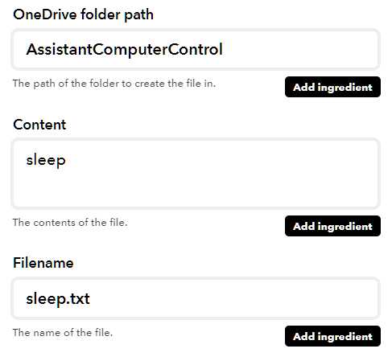
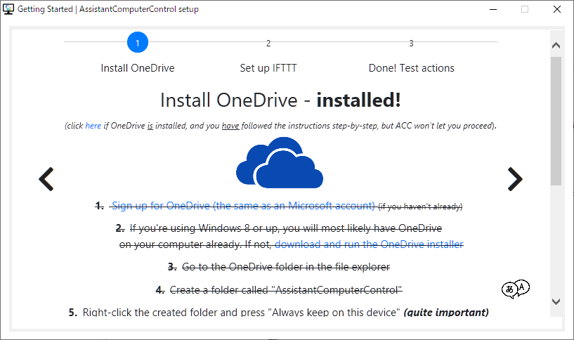
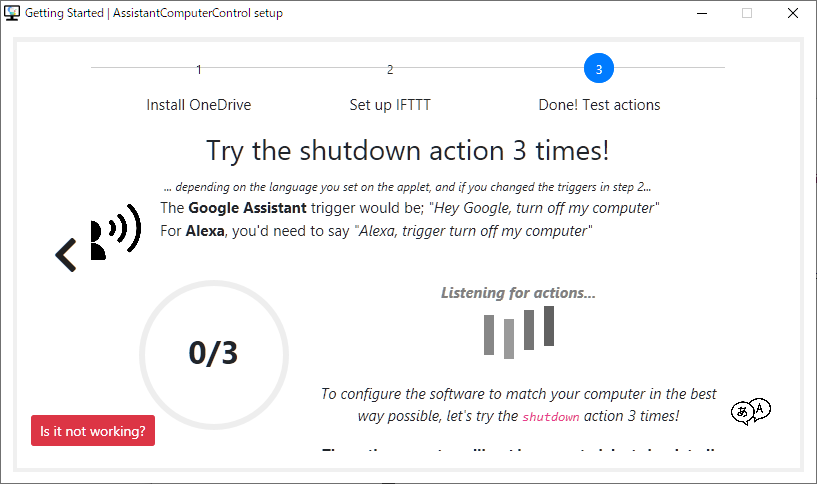

NFCタグを読み取ってPCをスリープするやつを作ったら意外と手間取ったので忘れないようにメモ。

## 概要

最近、PCをスリープせずに放置することが増えた気がする。スリープするためには2クリックも必要なので、それが面倒に感じてしまう。

そこで、机の上のnfcタグをスマホで読み取ったらPCをスリープさせる仕組みを作った。nfcタグの代わりに時刻やIOTボタンをトリガにすることもできる。（電源ボタンは手を伸ばすのに疲れるのでダメ）

構成図は以下のようにした。


PCのスリープ処理はAssistantComputerControl（AAC）[^1]を用いた。これは、OneDriveやGoogle Driveのファイル同期を利用してPCを操作するツールである。トリガがAlexaやGoogle Assistantであれば、<https://ifttt.com/applets/qzhUdpaY> のようなレシピがACC公式から提供されているが、それ以外をトリガにしたい場合はIFTTTレシピを自作する必要がある。

[^1]: <https://assistantcomputercontrol.com>

## 実現方法

### NFC -&gt; IFTTT

スマホ自動化アプリのAutomate[^2]を用いる。

[^2]: <https://play.google.com/store/apps/details?id=com.llamalab.automate&hl=ja>

nfcタグにIFTTT WebhookのEvent名を予め書き込んでおいく。nfcタグを検知したら、下記URLにPOSTを打つように設定する[^3]。

[^3]: Webhookで投げるEvent名をそのままnfcタグに書き込んでおくと、コマンドを増やしたくなったときに使いまわしが利いて便利。お行儀は悪いけど。

```text
url: https://maker.ifttt.com/trigger/{tag}/with/key/[my-key]
```

作ったFlowを常時起動しておけば、nfcタグからIFTTTトリガをかけられるようになる。

### IFTTT -&gt; OneDrive

IFTTTのthatの部分は、OneDriveの「Create text file」を選択して下記のように設定する。



Contentの欄が作成するテキストファイルの中身になる。ここに、ACCへのAction命令を記載する。ACCで使える命令の一覧は <https://acc.readme.io/docs/actions> を参照。今回はsleepとした。

Filenameの部分は拡張子が`.txt`であれば何でもよい。

これで、nfcタグを読み取ったらOneDriveのAssistantComputerControlフォルダに`sleep.txt`が生成されるようになった[^4]。

[^4]: 最初はOneDriveではなくGoogle Driveで作ろうとしていたが、IFTTTとの連携がうまく行かずやめた。エラーメッセージが雑で、バグ取りに時間がかかりそうだったため。

### OneDrive -&gt; ACC

ACCをPCにインストールし、ガイドに従って初期設定を行う。最初にどのストレージサービスを使うかを利かれるので、「OneDrive」を選択して設定を進める。



設定の最後で「3回shutdownして導通を確認しよう！」みたいな表示が出るが、sleepでも問題なかった。



これで、OneDriveのAssistantComputerControlフォルダにテキストファイルが追加されたら、その内容のActionを実行してくれるようになる。
