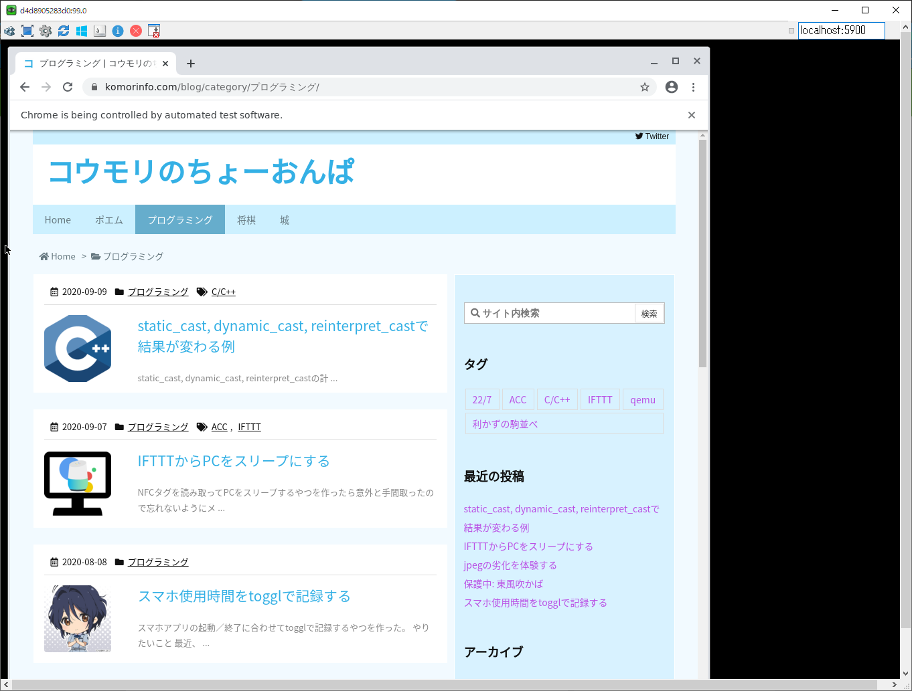

Seleniumの環境構築は、chromedriverとGoogle Chromeのバージョンを合わせたりパスを通したりするなど結構手間が多い。WSLからWindows側のGoogle Chromeを操作しようとするとハマることが結構ある（あった）。

実は、Selenium公式でDockerコンテナが配布されていて、これを用いればどんな環境でもすぐにSeleniumデバッグ環境が構築できる。headlessモードだけでなく、GUIでブラウザの表示を確認しながらデバッグすることも可能である。

Dockerコンテナ起動のコマンドは以下。

```sh
docker run -d -p 4444:4444 -p 5900:5900 -v /dev/shm:/dev/shm selenium/standalone-chrome-debug
```

ポート5900がGUIデバッグ用。Ultra VNC[^1]などのVNCクライアントからコンテナに接続すれば、コンテナ内のデスクトップ画面が表示できる[^2]。

[^1]: <https://forest.watch.impress.co.jp/library/software/ultravnc/>
[^2]: PWは`secret`。


