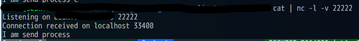

BSD socket APIでclient側のport番号を静的に決めたい。ググってもport番号を動的に決める例ばかりヒットして正しい情報になかなかたどり着けなかったのでメモ。

### 環境

- Ubuntu 20.04 LTS(WSL2)
- gcc 9.3.0
- netcat 1.206-1ubuntu1

### portのbind

以下のサイトが参考になる。
[Bind privileged port and remote authorization](http://cms.phys.s.u-tokyo.ac.jp/~naoki/CIPINTRO/NETWORK/bindpriv.html)

サーバー側として起動するときと全く同様に、`connect`する前に`bind`を唱えればいいらしい。33400ポートを開けるコードは以下のような感じ。

```cpp
  c_addr.sin_family = AF_INET;
  c_addr.sin_port = htons(33400);
  c_addr.sin_addr.s_addr = inet_addr("127.0.0.1");
  if (bind(sd, (struct sockaddr*)&c_addr, sizeof(c_addr))) {
    perror("client bind");
    return EXIT_FAILURE;
  }
```

### 実行結果

指定したポートが使用されているか`nc`コマンドで確認してみる。以下はサーバー側（netcat）のログ。



ちゃんと33400番ポートを使って通信できていた。

コードの全文は以下[^1]。

[^1]: [C言語ソケット通信サンプル | 　mathkuro](https://www.mathkuro.com/network/socket/c-tcp-socket-sample)


