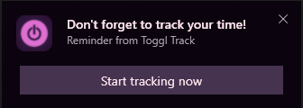
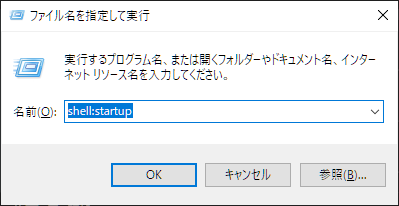

## 背景とやりたいこと

半年ぐらい前から、暇つぶしや勉強時間の記録に [Toggl Track](https://track.toggl.com) を使用している。日々、どれだけ無為に時間を浪費しているかを可視化できて、生産性の向上に役立っている……気がする。

Togglの使い方はとても単純で、作業開始時にタイマー開始を押して、作業終了時にタイマーを止めるだけである。計測記録には説明やカテゴリをつけることができ、作業前、作業中、作業後の任意のタイミングで記入できる。


『手軽に記録をつけられるから続けやすい』と紹介されることが多いツールだが、僕にとってはめんどくさい作業に感じていた。作業を始めるときは「5分だけだから……」と思っていても、集中しているうちにn時間経過していて記録に残せていないということが多々あった。

PCの使用時間は、起動しているアプリと作業内容が一対一に対応していなかったり、PCを点けたまま席を外すことがあったりするので自動化はできていなかった[^1]。PCアプリ版では、タイマーが動いていない状態が続くと最短1分間隔で警告を出す機能があるが、警告のポップアップが作業の邪魔にならないのであまり効果はなかった。

[^1]: PCアプリの使用時間を計測するだけなら [ManicTime](https://www.manictime.com) で実現できる。ただ、アプリの使用時間と作業内容はあまり結びついていない気がして、見返してもよくわからなかったので辞めた。



そこで、Togglでの時間計測を強制するために、Togglで計測していないとPCが使えなくなる仕組みを作った。

## 環境

- Windows 10 Education 2004
- Ubuntu 20.04 LTS(WSL2)

スクリプトの動作には `jq` （jsonのパースコマンド）が必要。

## Toggl監視スクリプト

PCを使えなくする手段はいくつか考えられるが、今回は単純にPCをロックしてしまうことにした。一定間隔でTogglの計測状態をポーリングし、計測されていない状態が続いた場合、PCをロックして作業を続けられなくする。

作成したスクリプトを以下に示す。このスクリプトはWSL上のbashで動作されることを想定している。スクリプト中の変数 `TOGGL_USER` には `https://track.toggl.com/profile` で確認できるAPIキーを記入する必要がある。

```sh
#!/bin/bash
LOCK_SCRIPT='rundll32.exe user32.dll,LockWorkStation'
ISLOCK_SCRIPT='
$lockapp = Get-Process lockapp;
$process=[System.Diagnostics.Process]::GetProcessById($lockapp.Id);
$threads=$process.Threads;
if ($threads[0].WaitReason -eq "Suspended") { "1" }
'
TOGGL_CURR_URL='https://www.toggl.com/api/v8/time_entries/current'
TOGGL_USER='<<your API key>>'
AUTH=$(echo -n "${TOGGL_USER}:api_token" | base64)
check_toggl() {
  curl -s -H "Authorization: Basic ${AUTH}" ${TOGGL_CURR_URL}
}
exec_powershell() {
  echo $@ | powershell.exe -Command -
}
UNTRACK_CNT=0
while true; do
  sleep 30
  RES=$(check_toggl | jq '.data')
  if [ "$RES" = 'null' ]; then
    UNTRACK_CNT=$((UNTRACK_CNT + 1))
    if [ $UNTRACK_CNT -ge 2 ]; then
      echo lock
      exec_powershell ${LOCK_SCRIPT}
      # wait unlock
      while true; do
        sleep 10
        RES=$(exec_powershell ${ISLOCK_SCRIPT})
        if [ "${RES}" != "" ]; then
          break
        fi
      done
      UNTRACK_CNT=0
    else
      echo warn: UNTRACK_CNT=${UNTRACK_CNT}
    fi
  else
    UNTRACK_CNT=0
    echo running
  fi
done
```

30秒ごとにTogglへGETを打ち、2回連続でタイマ停止状態が返ってきた場合はPCをロックする。また、PCのロック解除を検知した場合、Togglへのポーリングを再開する。

Windowsのlockなどの操作はWSLから直接触ることができないので、PowerShellを経由している。画面がロックされているかどうかの判定は、以下のQAを参考にした[^2]。

[^2]: 画面のロック判定は意外と難しいらしく、かなり苦戦した。Windows10以前とはロックの仕様が変わっていて、ググって出てきたサンプルコードの多くは手元の環境で動作しなかった。

[c# – Check if Windows is currently locked – Stack Overflow](https://stackoverflow.com/questions/47393776/check-if-windows-is-currently-locked)

## 起動時にスクリプトをスタートさせる

最後に、作成したスクリプトが起動時に自動的に開始されるようにする。

Win+Rを押して、「ファイル名を指定して実行」ウィンドウで `shell:startup` と入力してOKを押す。

explorerが起動するので以下のようなスクリプトを `force_toggl.bat` というファイル名で保存する。

```powershell
@echo off
wsl -u root -- [[path to script]]/force_toggl.sh&
```

Windowsを再起動してログインし直せば、自動的にToggl監視スクリプトが開始される[^3]。

[^3]: "ポーリング間隔が間違っている等スクリプトにバグがあると、永久にログインできなくなるので注意（1敗）
