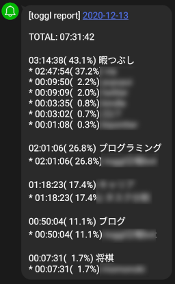
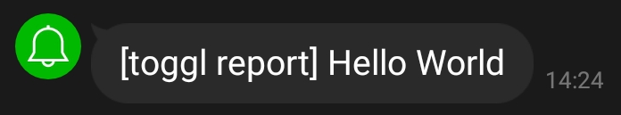
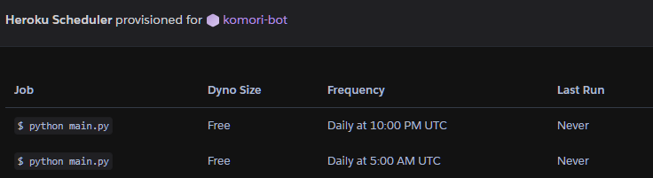

## 目的

最近、人生の時間の浪費が激しい。[Toggl Track](https://track.toggl.com/timer)で時間の追跡はできているものの、2週に1回ぐらいしか確認しないので、時間の浪費改善にはあまり役に立っていない。

そこで、Togglの計測結果を朝昼2回、LINEに送りつけるようにした。いかに人生を無駄にしているか知る機会が増えて、時間を有効に使えるようになることが目的である。

## 作業記録を取ってくる

[Toggl Reports API](https://github.com/toggl/toggl_api_docs/blob/master/reports.md#toggl-reports-api-v2) を用いてToggl Trackの作業記録を取ってくる。詳細な使い方は公式のリファレンスページが詳しい。

使用方法はとても簡単。以下のように、GETを打つだけで作業記録を取ってくることができる。

```sh
$ curl -u ${API_TOKEN}:api_token -X GET "https://api.track.toggl.com/reports/api/v2/summary?workspace_id=${WORKSPACE_ID}&user_agent=${MAIL_ADDR}" | jq
{
  "total_grand": 139728000,
  "total_billable": null,
  "total_currencies": [
    {
      "currency": null,
      "amount": null
    }
  ],
  "data": [
    {
      "id": <proj id>,
      "title": {
        "project": "ブログ",
        "client": null,
        "color": "0",
        "hex_color": "#0b83d9"
      },
      "time": 2029000,
      "total_currencies": [
        {
          "currency": null,
          "amount": null
        }
      ],
      "items": [
        {
          "title": {
            "time_entry": "ポエム"
          },
          "time": 1869000,
          "cur": null,
          "sum": null,
          "rate": null
        },
 ...（省略）
```

ここで、`API_TOKEN`はtogglから自分の記録を取ってくるために必要なトークンで、 <https://track.toggl.com/profile> にて確認できる。また、`WORKSPACE_ID`はワークスペース固有のIDで、ProjectsのURL（track.toggl.com/projects/${WORKSPACE_ID}/list）から確認できる。`MAIL_ADDR`には使用者を特定できる情報（メールアドレス等）を記載する[^1]。

[^1]: APIの使い方が間違っている場合、Toggl側からお叱りのメールが飛んでくるらしい"

レスポンスはjson形式で返ってくる。各project、各entryの記録時間が階層化されて返ってくる。`time`の単位はミリ秒である。URLのクエリ文字列に`since=XXXX-XX-XX`や`until=XXXX-XX-XX`を指定することで検索期間を変えることもできる（デフォルトは過去7日間）。

## LINEに通知を送る

LINE botをゼロから作ってもよいが、今回は簡単のために [LINE Notify](https://notify-bot.line.me/ja/) を用いる[^2]。LINE Notifyは手軽にLINEにメッセージを送るためのツールで、1分程度で登録できてLINEへ通知を飛ばせるようになる。

[^2]: LINE botを作るためには[LINE Developer](https://developers.line.biz/ja/)の登録でけっこう手間がかかる

発行したtokenを携えてPOSTを打つと、LINEにメッセージが飛んでいく。`curl`を使う場合、以下のように使用する。

```sh
$ curl -X POST -H "Authorization: Bearer ${TOKEN}" -F "message=Hello World" https://notify-api.line.me/api/notify
{"status":200,"message":"ok"}
```

POSTを叩くと、LINE Notify作成時に選択したroomに通知が飛んでいく。



## togglレポートをLINEに送りつける

以上を踏まえ、今日のTogglでの作業記録をLINEに通知するコードを書いた。コードの全文を以下に示す。

```python
import requests
import datetime
import urllib
import os

SUMMARY_URL = "https://api.track.toggl.com/reports/api/v2/summary"

def time_ms2str(time_ms):
    hour, time_ms = divmod(time_ms, 1000 * 60 * 60)
    min_, time_ms = divmod(time_ms, 1000 * 60)
    sec, _ = divmod(time_ms, 1000)

    return "{:02d}:{:02d}:{:02d}".format(hour, min_, sec)

def postToLine(token, message):
    DST_URL = "https://notify-api.line.me/api/notify"

    headers = { "Authorization": "Bearer {0}".format(token) }
    payload = {}

    payload["message"] = message

    try:
        payload = urllib.parse.urlencode(payload).encode("utf-8")
        req = urllib.request.Request(DST_URL, payload, headers)
        with urllib.request.urlopen(req) as response:
            res = response.read()
            print(res)
    except Exception as e:
        raise e

def getReport(token, workspace_id, email, date):

    params = {
        "workspace_id": workspace_id,
        "user_agent": email,
        "since": date,
        "until": date
    }
    r = requests.get(SUMMARY_URL, params=params, auth=(token, "api_token"))
    return r.json()

def createMessage(body, date):
    data = body["data"]

    track_total = body["total_grand"]

    # (sec, 文字列)のリスト
    # for文のあとで、sec が大きい順に並び替えた文字列を作りたい
    proj_list = []
    for proj_data in data:
        proj_name = proj_data["title"]["project"]
        proj_total = proj_data["time"]
        proj_ratio = proj_total / track_total

        proj_text = []
        proj_text.append("{1}({2:5.1f}%) {0}".format(proj_name, time_ms2str(proj_total), proj_ratio * 100))

        # (sec, 文字列)のリスト
        # for文のあとで、sec が大きい順に並び替えた文字列を作りたい
        entry_list = []
        for entry in proj_data["items"]:
            entry_name = entry["title"]["time_entry"]
            entry_time =entry["time"]
            entry_total_ratio = entry_time / track_total

            entry_str = "* {1}({2:5.1f}%) {0}".format(
                entry_name, time_ms2str(entry_time), entry_total_ratio * 100)
            entry_list.append((entry_time, entry_str))

        entry_list.sort(key=lambda x: -x[0])
        proj_text.extend(map(lambda x: x[1], entry_list))
        proj_list.append((proj_total, '\n'.join(proj_text)))

    proj_list.sort(key=lambda x: -x[0])

    report_data = []
    report_data.append("{}".format(date))
    report_data.append("TOTAL: {}".format(time_ms2str(track_total)))
    report_data.extend(map(lambda x: x[1], proj_list))
    return "\n\n".join(report_data)


if __name__ == "__main__":
    EMAIL_ADDRESS = "xxxx@example.com"
    LINE_TOKEN =os.environ["LINE_TOKEN"]
    TOGGL_TOKEN = os.environ["TOGGL_TOKEN"]
    WORKSPACE_ID = os.environ["WORKSPACE_ID"]

    today_date = datetime.date.today()

    data = getReport(TOGGL_TOKEN, WORKSPACE_ID, EMAIL_ADDRESS, today_date)
    message = createMessage(data, today_date)
    postToLine(LINE_TOKEN, message)
```

環境変数`LINE_TOKEN`, `TOGGL_TOKEN`, `WORKSPACE_ID`は各自の環境に合わせて予め設定しておく必要がある。

基本的には、Togglから取ってきたjsonを文字列に変換し、LINE notifyに投げるだけである。通知内容を見やすくするために、projectごと、entryごとにそれぞれ降順になるように文字列を並び替えている。

上記のスクリプトを実行すると、今日のAPI実行までにつけた作業記録がLINEに送られる。


## 定期実行

上記のスクリプトをherokuで定期実行させる。[Herokuでお天気Pythonの定期実行](https://qiita.com/seigo-pon/items/ca9951dac0b7fa29cce0) を参考に、作ったアプリをherokuにあげてheroku schedulerに登録する。

herokuへのデプロイは参考サイトの通りにやるだけなので割愛する。

herokuアプリを定期実行させるためには、Heroku Schedulerを用いる。毎日7:00 AM(JST)/2:00 PM(JST)に通知してほしい場合は以下のように設定する。herokuに設定する時刻はUTCであることに注意。



herokuサーバーはUTCで動いているので、0:00 AM – 8:59 AM(JST)にプログラムが実行された場合、`datetime.date.today()`で得られる日付が1日ずれるので注意。今回のプログラムでは、7:00 AM(JST)は前日、2:00 PM(JST)は当日の集計結果をそれぞれ送って欲しいので、特に修正の必要はない。

## 使ってみた感想

半日に一回自分の時間の使い方を反省できるのでかなり効果があると思う。自分の行動履歴を割合で表されると、人生もう少し頑張ったほうがいいかなと感じられた。
