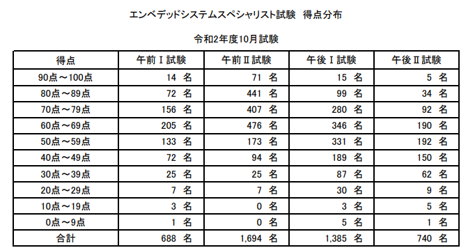
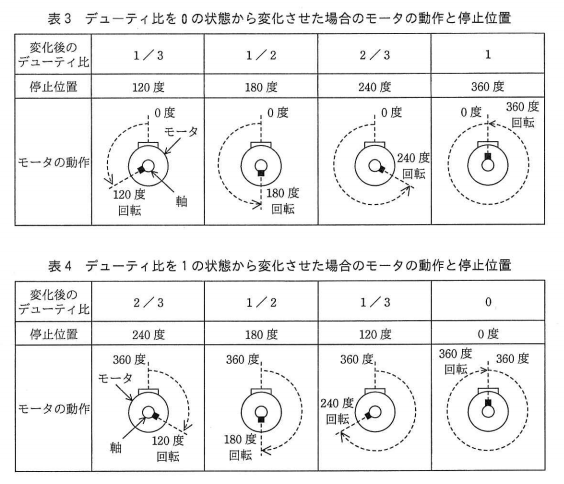
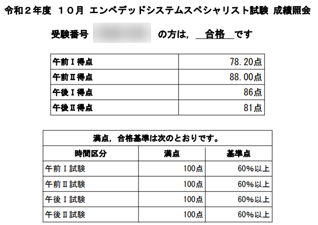

**_2022/12/22 追記_**｜[2023年度から午後IIの出題形式が大きく変更](https://www.jitec.ipa.go.jp/1_00topic/topic_20221220.html)され、小論文の課題が課されるようになる。そのため今後は**お気持ちポエム**の練習をしておく必要がある。

2020年10月18日。エンベデッドシステムスペシャリスト試験（ES）を受験してきた。

## エンベデッドシステムスペシャリスト試験

**[エンベデッドシステムスペシャリスト試験](https://www.jitec.ipa.go.jp/1_11seido/es.html)**（ES）とは、IPAが行う情報処理技術者試験の一つで、主に組み込み機器向けのソフトウェア、ハードウェアエンジニアのための資格試験である。

基本情報技術者試験（FE）、応用情報技術者試験（AP）の上位に位置する高度試験で、平均合格率は17%前後である[^1]。ニッチな内容を問う試験のため、他の高度試験と比較して受験者数が少なく、参考書籍はほとんどない。

[^1]: <https://www.ipa.go.jp/shiken/reports/toukei.html>

## 問題構成

試験は午前I ~ 午後IIの4つに区切られている。それぞれの回答方法以下の通りである。

| 区分   | 解答方式           |
| ------ | ------------------ |
| 午前I  | 4択30問            |
| 午前II | 4択25問            |
| 午後I  | 記述式 必答1+選択1 |
| 午後II | 記述式 選択1       |

1日で4つすべての試験区分を受験し、すべての区分で正答率が60%以上の場合のみ合格となる。午前I試験は直近2年間にAPや高度試験の午前I試験を突破していれば免除されるが、それ以外は次年以降に繰り越すことができない。

午前Iは応用情報技術者試験の午前問題相当、午前IIは組み込みシステムに関する基本的な知識が問われる。午後試験では実務で出てくるような仕様書を読み、設問に答えていく記述式の試験である。

ES試験は、高度試験にも関わらず専門知識をあまり問われない。午後問題はほぼ現代文の試験である。長文を読み、空欄を埋めたり本文の傍線部の理由を答えたりする。ある程度出題パターンはあるものの、基本的には文章から読み取れることしか問われないため、合格に最も必要なものは国語力だと思う[^2]。

[^2]: 次に必要なのは作問者と波長をあわせる能力"

今年度試験の得点分布は以下の通り。

午前II試験が突破率80%程度で、午後試験はいずれも突破率50%程度である。特に、午後試験は60点を平均とするきれいな正規分布になっている。

今回、令和2年度秋季のES試験を受験したので、以下ではその試験対策方法について紹介する。

## 勉強方法

ES試験を受験するにあたり以下の書籍で勉強を進めた。

[情報処理教科書 エンベデッドシステムスペシャリスト 2021～2022年版（牧 隆史 松原 敬二）｜翔泳社の本](https://www.shoeisha.co.jp/book/detail/9784798167787)

### 午前試験

午前I試験はAPの午前問題と同じ対策方法で問題ない。前回APを受験したのはn年前（n&gt;3）だが、4択6割合格なので一般的なソフトウェアエンジニアなら苦労せず突破できると思う[^3]。

[^3]: APと同じく、午前試験で最も難しいのは起床である

午前II試験は過去問の出題率が異常に高い。自分の場合、上記書籍の午前II過去問抜粋の100問を丸暗記して臨んだ。想像以上に過去問しか出ないので、これさえやっていれば落ちることはないと思う。

### 午後試験

ちゃんと対策しなければならないのは午後試験。他の高度試験の午後問題とは異なり、ほとんどの問題は知識なしでも解ける。しかし、ES試験特有の解答しぐさがあるので過去問で慣れておく必要がある。

例えば次の問題。平成29年の午後Iの問題で、ロボットの制御プログラムに関する問題である。

> 
> (2) 体の回転を次のように制御している。例えば，体を正面の位置からモータの150度の位置に最も近い位置まで回転させる時に，正面の位置を示すデューティ比のHighの幅の設定値から，20ミリ秒ごとに，1ずつ減算した値をHighの幅の設定値に設定して，停止位置がモータの150度の位置に最も近いデューティ比になるように制御している。その理由を，ロボットの動作の観点から，40字以内で述べよ。
>
> （平成29年度 春期 エンベデッドシステムスペシャリスト試験 午後I 問1 設問2 (2)）

PWM出力のデューティ比に応じて回転するモータを制御する際に、いきなり設定値のデューティ比にしない理由を問われている。つい「ロボットが急に回転したら危ない」とか「サーボモータに負荷がかかる」等と考えてしまいがちだが、それではES試験に合格することはできない。もっとシンプルに考えなければならない[^4]。

[^4]: 「ロボットが急に回転したら危ない」が正解の場合、出題された文章の中でその事実が明確に触れられるケースが多い。また、「サーボモーターに負荷がかかる」が正解の場合、具体的にどの程度の速度で回転させたら壊れるのか必ず文章中に書いてある。ES試験では、文章から自明に類推できることしか解答用紙に書いてはならない。

IPA様が用意した解答例がこちら。

> 体の回転を開始してから停止位置になるまでの時間を長くしたいから
>
> （平成29年度 春期 エンベデッドシステムスペシャリスト試験 解答例）

「デューティ比を20ミリ秒ごとに1ずつ減算していく」理由を問われているから、「時間を長くしたいから」と答えなければならない。

一部計算問題もあるが、大部分はこのような国語の文章題のような問題なので、知識がなくても気合と根性とお祈りでなんとかなると思う。

## 結果

試験から2ヶ月後。12月25日に合格発表が行われた。

無事合格していた。午後Iでやらかしたと思っていたので、意外と高得点でびっくりした。正直、運の要素が強い試験なので、次受けたらまた受かるかといわれたら首をかしげてしまう。
