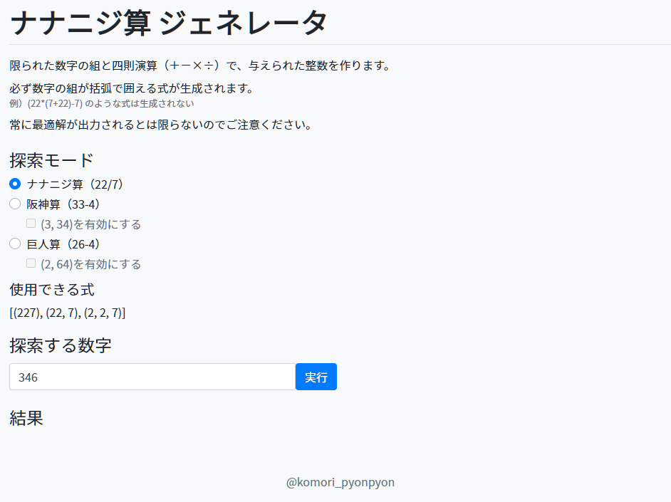



2/27はナナニジの日なのでナナニジ算ジェネレータを作った[^1]

[^1]: 軽い気持ちで作り始めたのに、思ったよりしんどかった

## 概要

ナナニジ算ジェネレータ｜<https://komori-n.github.io/nananiji-generator/>

任意の整数に対しナナニジ算を生成するサービスを作った。テキストボックスへ整数（負も可）を入力して「実行」ボタンを押すと、与えられた整数を「2, 2, 7」と四則演算で表現した式を表示する。また、オマケ機能として阪神算、巨人算の生成にも対応している[^2]。

[^2]: 先駆者様<http://wada314.jp/334.html>との比較のために、(3, 34)の組み合わせを許容するオプションを追加している

ナナニジ算ジェネレータは大きく演算サーバーとWebページに分かれている。それぞれのコードは以下で確認できる。





本ページは、主に演算部のアルゴリズム解説を行う。

## ナナニジ算

まずはナナニジ算を定義する。ナナニジ算に似たようなものとして、「阪神算」や「巨人算」が広く知られている。以下の解説内容は巨人算、阪神算にも同様に適用できる。

**ナナニジ算**とは「2, 2, 7」という数字の組を1つ以上用いた四則演算で構成される計算式のことを言う。\\(227\\)や\\(22\\times 7\\)のように数字をくっつけ使用してもよいが、\\(2\\times 27\\)のように2と27の組に分離することは許されない。また、”\\(-\\)”を単項演算子として使用してはいけない。さらに、「2, 2, 7」のカタマリごとに括弧で括れる式でなければならない。

ルールがやや複雑なので例を挙げる。

**ナナニジ算の例**

- \\(22\\times 7\\)
- \\(((2-2)/7)-(22\\times 7)\\)
- \\(227-(2\\times 2-7)\\)

**ナナニジ算でない例**

- \\(2\\times 27\\)
  - 2と27で分離している
- \\(-22\\times 7\\)
  - 単項演算子の”\\(-\\)”を使用している
- \\((227-2)\\times 2-7\\)
  - 後半の2, 2, 7を括弧でくくれない

以下では任意の有理数\\(x\\)に対し、計算結果がその有理数になるようなナナニジ算（の計算式）のことを\\(x\\)の**ナナニジ表現**と呼ぶ。例えば、\\(((2×(2-7))+(22-7))\\)は\\(5\\)のナナニジ表現である。

## 探索アルゴリズム

簡単に作れるナナニジ表現はあらかじめ全探索しておき、全探索に含まれない数は絶対値を小さくすることでナナニジ表現を求める。

### 全探索

まず、(2, 2, 7)ひと組で作れるナナニジ表現を全列挙する。

- \\((2□2)□7\\)
- \\(2□(2□7)\\)
- \\(22□7\\)
- \\(227\\)

□には四則演算のいずれかを入れる。このような式で表せる有理数は（重複を除いて）全部で23個ある[^3]。

[^3]: 小さい順に、-12, -10, -7, -6, -3, -2/5, 0, 1/7, 2/9, 4/7, 12/7, 16/7, 22/7, 7, 8, 11, 15, 16, 18, 28, 29, 154, 227である。ナナニジ表現が気になる場合は、（整数限定になるが）実際にジェネレータへ入力して確かめてほしい

次に、既知の2つのナナニジ数から新たなナナニジ数を生成する。

- \\((\\mathrm{ナナニジ表現})□(\\mathrm{ナナニジ表現})\\)

この作業を順々に繰り返すことで、数の使用個数が少ないナナニジ算を全探索することができる。

使用する(2, 2, 7)の組の数を\\(n\\)とすると、\\(n\\)で初めて見つかるナナニジ表現可能な有理数の個数は以下のようになる。

| n   | ナナニジ算 | 阪神算  | 阪神算+(3, 34) | 巨人算  | 巨人算+(2, 64) |
| --- | ---------- | ------- | -------------- | ------- | -------------- |
| 1   | 23         | 23      | 26             | 28      | 32             |
| 2   | 965        | 868     | 1192           | 982     | 1338           |
| 3   | 40418      | 35230   | 59237          | 36011   | 62006          |
| 4   | 1737148    | 1507599 | 3090247        | 1364762 | 2964509        |

上の表で示した有理数のうち、整数の個数だけカウントすると以下のようになる。

| n   | ナナニジ算 | 阪神算 | 阪神算+(3, 34) | 巨人算 | 巨人算+(2, 64) |
| --- | ---------- | ------ | -------------- | ------ | -------------- |
| 1   | 16         | 17     | 19             | 20     | 23             |
| 2   | 257        | 273    | 359            | 281    | 370            |
| 3   | 3675       | 4236   | 6097           | 4054   | 6324           |
| 4   | 53216      | 67499  | 106622         | 57281  | 99123          |

組の数\\(n\\)が大きくなるほど、生成可能な有理数に対する整数の個数の割合が小さくなっている。整数のナナニジ表現を求めるという目的を考えると、\\(n\\)が大きくなるほど無駄な探索の割合が増えていると言える。

無駄な探索を減らすために、すべての可能性を探索せず分母が大きい有理数の探索は枝刈りすることが考えられる。しかし、その閾値の設定方法は自明ではない。

例えば、以下のように10771や38115は\\(n=4\\)のナナニジ表現を持つが、分母が30以上の有理数を経由しないと\\(n=4\\)のナナニジ表現を見つけられない[^4]。

[^4]: 同様の数としては、-38115、-10859、-10771、10859、11387、11607も分母が30以上の有理数を経由しないとn=4で構成できない

- \\(10771 = ((227/(22/7))-(2+2/7))\\times (22\\times 7)\\)
- \\(38115 = (22\\times 7)\\times ((22\\times 7)/((2/(2+7))-(2/(2-7))))\\)

このようなパターンが存在するため、計算途中の有理数の探索を簡単に打ち切ることができないので注意が必要である。

このようにして\\(n\\leq4\\)までの探索を行うと、絶対値が10000以下の整数のうち84.6%について最適なナナニジ表現を求めることができる。特に、絶対値が2000以下の整数はすべて\\(n\\leq 4\\)のナナニジ表現を持つ。

### 大きな数の分解

絶対値の小さな数は全探索を行えるが、絶対値の大きな数の最適解を求めるのは困難である。そのため、実行時に与えられた数を絶対値の小さな数の組み合わせへと分解し、既知のナナニジ算へ帰着することを考える。

以下では、生成対象の整数を\\(x\\)とする。もし、ナナニジ表現が既知の整数\\(a, y\\)（\\(|a|&gt;1\\)）とナナニジ表現が既知または0である整数\\(b\\)が存在して

\\begin{align}
x = a\\times y + b\\ \\ \\mathrm{or}\\ \\ x = a\\times y – b
\\end{align}

とできるならば、分解式から\\(x\\)のナナニジ表現が得られる。以下では、このような分解のことを単に分解\\((a, b)\\)と呼ぶことにする。整数\\(x\\)が分解\\((a, b)\\)を持つとき、\\(|x|\\gg|b|\\)ならば

\\begin{align}
|y| \\simeq \\frac{|x|}{|a|}
\\end{align}

と評価できる。すなわち、分解\\((a, b)\\)により絶対値が元の数の約\\(1/|a|\\)になり、\\(x\\)のナナニジ表現を求めるという問題を、より絶対値の小さい\\(y\\)のナナニジ表現を求める問題に帰着できる。

任意の整数\\(x\\)に対し、\\(a, b\\)を\\(n=1\\)のナナニジ整数に限定しても分解\\((a, b)\\)を必ず行えることが示せる。実際、任意の整数xに対し、

- \\(x\\)
- \\(x+(2/(2/7))\\)
- \\(x-(2/(2/7))\\)

のいずれかは\\((2\\times 2-7)=-3\\)で割り切れる[^5]。

[^5]: 少し頭の体操をすると、(n=1)のナナニジ数だけで任意の自然数に対し((6, b))の分解ができることが示せる

\\(y\\)に対して同様の分解を繰り返していけば、絶対値が単調に減少する列が得られる。絶対値の小さな範囲のナナニジ表現は全探索により最適解が求まっているので、この分解により任意の整数のナナニジ表現を求められる。

ただし、上記のように3で割るアルゴリズムは最悪で\\(2 \\log\_{3} |x|+\\alpha\\)（\\(\\alpha\\)は定数）個の(2, 2, 7)の組が必要になり、コスパが悪い。そのため、この3で貪欲に割る方法より分解効率の良い分解\\((a, b)\\)を選ぶ必要がある。

### 分解効率

効率良い分解方法を見つけるためには、「分解効率」についてもう少し考える必要がある。

例えば、整数\\(70587\\)に対する次の2つの分解はどちらの方が分解効率がいいと言えるだろうか。

1. \\(70587 = (2\\times 2+7) \\times (6417)\\)
2. \\(70587 = 227 \\times 311 + (2\\times (2-7))\\)

素直に\\(2\\times 2+7=11\\)で割る分解と、\\(2\\times (2-7)=-10\\)を加えて\\(227\\)で割る分解の比較である。ざっくり評価すると、分解1は一手で11分の1にする分解なのに対し、分解2は二手かけて元の数を約227分の1にする分解である。一手ごとの効率に直すと、分解2は一手あたり

\\begin{align}
\\sqrt{227}\\simeq 15.07
\\end{align}

で割っている計算になる。そのため、分解2の方が分解効率のいい分解と言える[^6]。このように\\(|x|\\)が十分大きいときは、分解\\((a, b)\\)の分解効率の良さを

[^6]: 分解効率がいいことは必ずしも最適解に近いことを意味しない。例えば、一瞬分解効率が悪いが、計算結果の近く（加減算で用意に作れる数の中に）(227^m)がいた場合、短手数で絶対値を減らすことができる。このように、局所的な分解効率の良さは厳密に最適であるとは限らない

\\begin{align}
|a|^{1/\\ell\_{a,b}}\\ \\ (\\ell\_{a,b}=a, bのナナニジ表現に必要な組の個数)
\\end{align}

で測ることができる[^7]。

[^7]: ナナニジ算の分解効率は((0, 227])の範囲に分布する。分解効率が最大となる分解は((227^m, 0))（(m\\in \\mathbb{N})）である

よって、整数\\(x\\)が与えられたとき、

\\begin{align}
{\\mathop{\\rm arg~max}\\limits} \\{|a|^{\\frac{1}{\\ell\_{a,b}}} | \\mathrm{分解}(a, b)\\mathrm{は}x\\mathrm{を分解可能}\\}
\\end{align}

により分解\\((a, b)\\)を選ぶことで効率良く絶対値を小さくしていくことができる。

## 高速化

本質的なアルゴリズムは以上だが、このまま演算サーバーを構築するとAWSの課金額が多くなり財布が散華することになる。そのため、いくつかの高速化を施した。

### 事前計算

リクエストが来るたびに最適解を求めていると時間がかかる。そのため、事前に計算できる部分をファイルへ格納し、実行時に読み出すことで実行時間やメモリ使用量を減らす。

まず、\\(n\\leq 4\\)の全探索の探索結果（結果が整数になるもののみ）を事前計算の対象にした。全探索時は有理数のナナニジ表現をすべて保持する必要があるが、実行時は整数のナナニジ表現だけ保持していれば十分であるため、メモリ使用量を大幅に削減できる。

また、絶対値の大きな数に対する分解\\((a, b)\\)のリストについても事前計算できる。\\(n\\leq 4\\)の全探索結果を用いて

\\begin{align}
\\{(a, b) | a, b \\in n\\leq 4\\mathrm{のナナニジ表現を持つ整数}\\}
\\end{align}

の要領で配列を作成し、前節で定義した分解効率の降順になるようにソートしておく。分解を行う際は、ソートされた配列を前から順に探索し

\\begin{align}
x – b = 0 \\mod |a|
\\end{align}

となるものを探す。こうして最初に見つかった\\((a, b)\\)は、\\(x\\)に対して\\(n\\leq 4\\)かつ可能な（\\(a\\)でちゃんと割り切れる）分解のうち最もコスパがいい。

このように、\\((a, b)\\)を分解効率順に並べた配列を事前計算しておくことで、計算時間を短縮できる。

### 無駄な要素の除去

前節のファイルを用いると、サーバー起動時のファイル読み込みに10秒程度かかってしまう。そのため、無駄な要素を削ることでさらに課金額を抑えることができる。

分解\\((a, b_1)\\)と\\((a, b_2)\\)で、\\(b_1 = b_2 \\mod |a|\\)が満たされている場合、分解効率が良くない方は分解候補として覚えておく必要はない。常に分解効率の良い方を分解に用いればよく、そうでない方は決して使われることはないためである。このようにして、配列の要素数を 53.2%（3684407 -&gt; 1722696）、事前計算ファイルを51.6 %（74.3MB -&gt; 36.0MB）削ることができる。

また、分解\\((227, b_0)\\ (b_0=0\\mod 227)\\)、\\((227, b_1)\\ (b_1 =1\\mod 227)\\)、\\(\\dots\\)、\\((227, b\_{226})\\ (b\_{226}=226\\mod 227)\\)のどれよりも分解効率の悪い分解\\((a, b)\\)もまた安全に削除することができる。このようにして、配列の要素数を 9.3%（1722696 -&gt; 1562095）、事前計算ファイルを 8.8%（36.0MB -&gt; 32.8MB）削ることができる。
