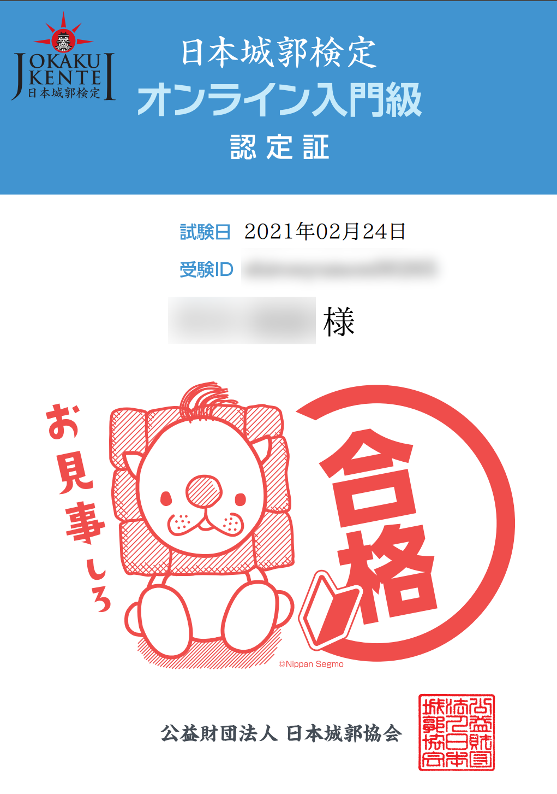

無料なのでぜひ。

## 検定の内容

**日本城郭検定**とは、公益財団法人・日本城郭協会が主催する日本のお城にまつわる検定試験である。試験区分は5階級に分かれており、初心者から玄人まで幅広い層が受験できる。

2020年までに半年ごとに18回行われているこの試験だが、最も易しい4級（シロッぷ級）が2021年2月からオンライン入門級として**誰でも無料で**受験できるようになった。受験申し込みをすればいつでも試験を受けることができ、合格すれば認定証をダウンロードできる。

[日本城郭検定 オンライン入門級 公式サイト](https://www.kentei-uketsuke.com/shiro/online/?utm_source=twitter&utm_medium=post&utm_campaign=210304)

問題はすべて4択で、50問中30問以上正答すれば合格である。内容は主に日本の各城の特徴や城にまつわる歴史などが問われる[^1]。

[^1]: 「○○城の堀にいない魚はどれ？」のような奇問が出題される可能性もある（他の級で過去にあった）

問題の難易度はかなり易しく、国宝5天守の特徴と日本の有名な地名と一般的な歴史の知識さえあれば合格は容易いと思う。もし不合格になっても何回でも挑戦できるので、試行回数を重ねれば誰でも合格できる。

## 受験結果

無料なので早速受験してきた。

結果は45/50で合格[^2]。

[^2]: 2問は模範解答の方が間違っていた。悲しい

程よい難易度で誰でも無料で受けられるので、ぜひ受験してみてほしい。4級の知識を仕入れて城攻めに行けば、現地の案内板やガイドさんの説明がより楽しめるようになると思う。
