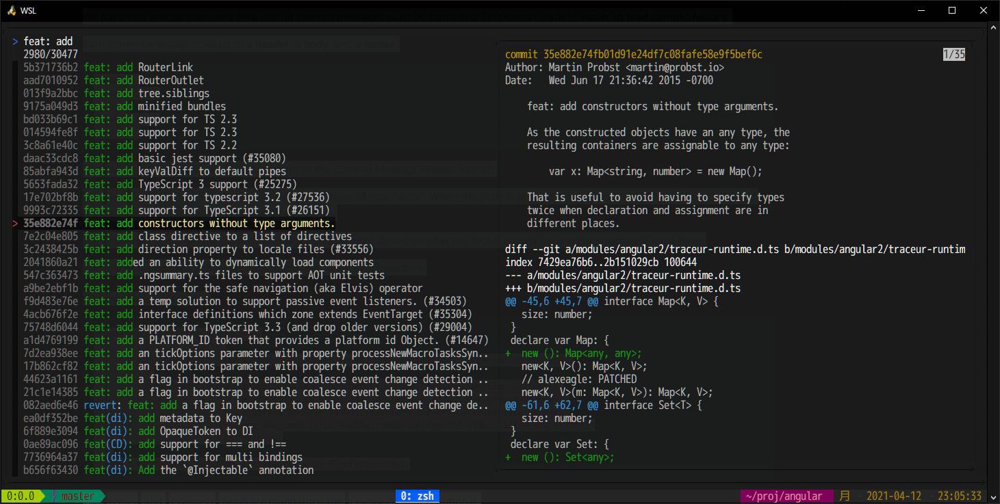

英語でコミットメッセージを書くときに、しっくりくる表現がなかなか出て来なくて時間を溶かすことがそこそこある。純粋に英文法だけなら単語でググれば答えは見つかるかもしれないが、少ない文字数で伝わるコミットメッセージを書くのはまだまだ苦手意識を感じる。

そこで、Angularリポジトリのコミットメッセージをfuzzy search（あいまい検索）して文例を検索できる環境を整えた。

## 必要なもの

- [angular/angular: One framework. Mobile &amp; desktop.](https://github.com/angular/angular)
- [junegunn/fzf: A command-line fuzzy finder](https://github.com/junegunn/fzf)

Angularリポジトリのコミットを適当に整形して `fzf` コマンドで曖昧検索できるようにする。

検索対象のリポジトリはコミット数が豊富で自チームのコミットルールに近しいリポジトリならば何でもよい。今回は、コミットメッセージの規約が整っていて個人的に見やすいと感じた Angular を例に説明する。

## やり方

fzfの左ペインにコミットメッセージのSummary行を、右ペインに選択中のコミットの `git show` の結果を表示する。

```sh
#!/bin/bash

cd ${ANGULAR_DIR} && \
  git log --format="%h %s" --all | \
  sed -r "s/^([0-9a-f]*) ([^:]*):/\x1b[90m\1\x1b[0m \x1b[36m\2\x1b[0m:/g" |\
  fzf --ansi --preview-window=right:50% --preview="echo {} | awk '{print \$1}' | xargs git show --color=always"
```

`git log --format="%h %s"` で `<short hash> <message summary>` の一覧を抜き出してきて、`sed` コマンドで着色した後でfzfコマンドに渡している。previewペインでは、`<short hash>` からコミットを特定して `git show` を行っている。

`git show` を用いることで、右ペインにコミットメッセージ全文だけでなくコードの変更内容も表示することができるので、自分が今まさにコミットしようとしているコードに近い用例を見つけやすくなっている。


