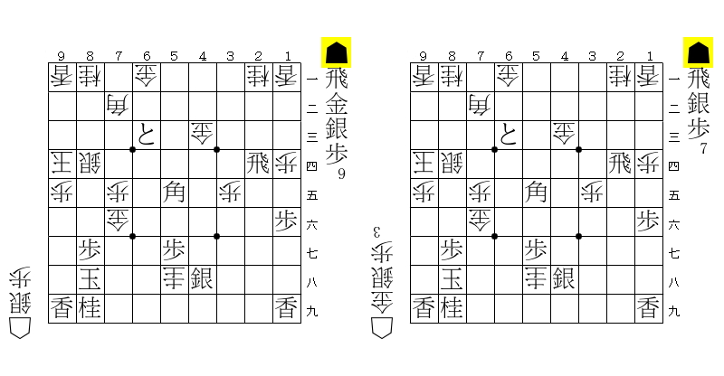
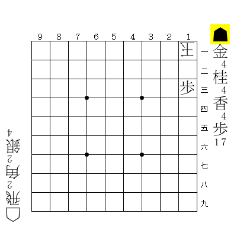
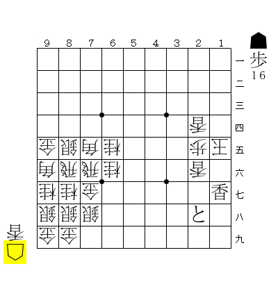
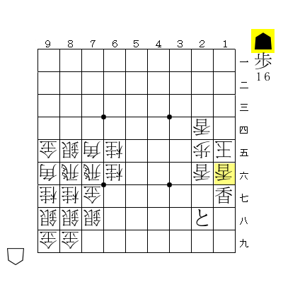
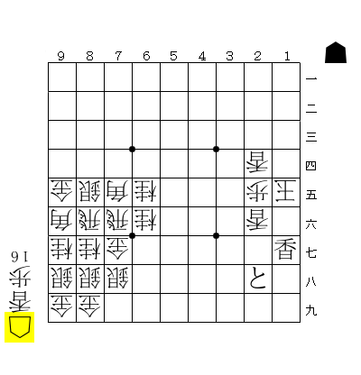



## はじめに

詰将棋探索では局面同士の優等関係を利用することで探索を省略することができる。これは長手数の詰将棋を解くためには重要な技術である。このページでは局面の優等性から得られる性質の紹介と、実際の詰将棋探索への応用方法について解説する。

本記事は前の投稿の続きである。ただし、前の投稿を読まなくても大部分は理解できると思う。



以下では、持ち駒は多重集合（重複が許された集合）として扱うものとする。

まず、局面同士の優等関係を導入する。局面 \\(n_1\\) が局面 \\(n_2\\) の **優等局面** であるとは、2つの局面 \\(n_1, n_2\\) の盤上の駒配置と手番が同一で、\\(n_1\\)における攻め方側の持ち駒集合が \\(n_2\\) のそれよりも大きいことを言う[^1]。

[^1]: 「持ち駒集合 (A) が (B) より大きい」をより正確に言うと、(A \\neq B) かつすべて駒種（歩、香、…）に対し、(A) における該駒種の数が (B) における該駒種の数と等しいまたは大きい状態のことを言う"

やねうら王の実装では、持ち駒のデータ構造を工夫することにより、任意の2局面が優等関係にあるかどうかを数命令で求めることができる[^2]。

[^2]: [連載やねうら王miniを強くしよう！6日目 | やねうら王 公式サイト](https://yaneuraou.yaneu.com/2016/01/07/%e9%80%a3%e8%bc%89%e3%82%84%e3%81%ad%e3%81%86%e3%82%89%e7%8e%8bmini%e3%82%92%e5%bc%b7%e3%81%8f%e3%81%97%e3%82%88%e3%81%86%ef%bc%816%e6%97%a5%e7%9b%ae/)

優等関係は推移律が成り立つ。すなわち、優等局面の優等局面は元の局面の優等局面となる[^3]。

[^3]: 「優等関係または等しい」という関係演算子は反射律、反対称律、推移律が成り立つので半順序となっている。この事実から、以降の極小元を取るという議論につながっていく

**劣等局面** についても同様にして定義できる。

### 性質

優等関係に対し、次が成り立つ。

**性質**：局面 \\(n\\) が詰みのとき、\\(n\\) の任意の優等局面も詰みである。

（証明の概略）\\(n\\) の証明木を元にして、以下の方針で優等局面の探索を進めることで証明木を構成できる。

- OrNode（攻め方）：もとの局面よりも持ち駒が多いので、もとの局面で可能な着手は優等局面でも着手可能なのでそれを選ぶ。
- AndNode（受け方）：もとの局面よりも持ち駒が少ないので、優等局面から辿れるAndNodeにおける合法手の集合は\\(n\\) のそれより小さい。したがって、どの手を選んで \\(n\\) の証明木の部分木に行き着く。

（証明終）

直感的には、持ち駒が多ければ多いほど詰みやすくなると言っているに過ぎない[^4]。

[^4]: なお、協力詰め（ばか詰め）では「攻め方の得=受け方の損」という図式が成り立たないのでこの性質は成り立たない

同様に、局面 \\(n\\) が不詰のとき、\\(n\\) の任意の劣等局面も不詰であることが示せる。

## 証明駒と反証駒

ある局面が詰みであるとき、その局面で詰みを示すために必要な攻め方の持ち駒を **証明駒** という。同様にある局面が不詰であるとき、その局面で不詰を示すために必要な攻め方の持ち駒を **反証駒** という。

証明駒の数は少なければ少ないほどよい。なぜなら、証明駒が少なくなると、優等性から詰みが示せる局面が増えるためである。

例えば、以下の局面を考える。

図の局面は攻め方に豊富な持ち駒があるが、☗12金（打）までの1手詰みである。つまり、金1枚以外の持ち駒は詰みには不要なのである。

したがって、上の例では「☗金」が極小な証明駒（もっとも駒数が少ない証明駒）になっている[^5]。

[^5]: 各局面における最小な証明駒は必ずしも一意には決まらない。例えば、図の局面では「☗飛香」でも詰みだが、「☗金」の局面と比較すると優等でも劣等でもないため、どちらも最小とは言えない。同様に、ある局面に対し極小な証明駒を複数通り考えられるケースも存在するため、「極小な証明駒」も実は一意ではない

実際の詰将棋探索では、探索中の詰み手順を眺めてどの駒が詰みに必要なのかを判別し、詰みに必要最小限の証明駒を求めることで探索を効率化できる。

以下では、詰み手順から極小な証明駒を求めるための方法について考える。ただし、連続王手の千日手が絡む場合、反証駒の計算が難しくなるため本ページでは考えないものとする[^6]。また、攻め方の玉への逆王手が絡む場合も、以下の議論を拡張することで用意に対応できるのでここでは考えないことにする。

[^6]: 反証に局面ループにが絡む場合、盤面自体だけでなく盤面に至るまでの経路の情報も必要になるため、反証の判定が非常に難しくなるためである。実際、DLShogiの詰将棋ルーチンでは千日手絡みの不詰局面は反証駒として扱わないようになっている（[DeepLearningShogi/dfpn.cpp at master · TadaoYamaoka/DeepLearningShogi](https://github.com/TadaoYamaoka/DeepLearningShogi/blob/master/usi/dfpn.cpp#L132-L134)）

アルゴリズムの説明の前に、いくつか記号を導入する。

### 記号

局面 \\(n\\) が詰みのとき、その証明駒を \\(p\_{n}\\) と表記する。証明駒の選び方は一意ではないが、以下ではなるべく極小な集合になるように \\(p\_{n}\\) を選ぶ方法について議論する。同様に、局面 \\(n\\) の反証駒を \\(d\_{n}\\) と表記する。

局面 \\(n\\) から手 \\(m\\) で1手進めた局面を \\(m(n)\\) と表記する。また、\\(n\\) がOrNodeのとき、局面 \\(m(n)\\) における攻め方側の持ち駒が \\(h\\) のときに、\\(m\\) で動かす前の持ち駒を \\(\\mathrm{Before}\_{n, m}(h)\\) と表記する。より詳細に定義を書くと、以下のようになる。

- \\(m\\) が駒を取る手のとき：\\(\\mathrm{Before}\_{n, m}(h) := h +\\)（\\(m\\) で取った駒）
- \\(m\\) が駒を打つ手のとき：\\(\\mathrm{Before}\_{n, m}(h) := h -\\)（\\(m\\) で打った駒）
- それ以外：\\(\\mathrm{Before}\_{n, m}(h) := h\\)

## 証明駒の計算方法

### OrNode（攻め方）

局面 \\(n\\) （OrNode）で詰みが見つかったと仮定する。このとき、ある手 \\(m\\) が存在して \\(m(n)\\) が詰みとなる。このときの証明駒は、\\(m\\) による持ち駒の増減を考慮するだけで簡単に求められる。$$p\_n=\\mathrm{Before}\_{n, m}(p\_{m(n)})$$

### AndNode（受け方）

局面 \\(n\\) （AndNode）で詰みが見つかったと仮定する。このとき、\\(n\\) における合法手 \\(m_1, m_2, \\dots, m\_{k}\\) すべてに対し、\\(m_l(n)\\)（\\(l=1, 2, \\dots, k\\)）が詰みとなる。このときの証明駒は、各子局面における持ち駒の和集合を取った$$p\_n = \\bigcup\_{m\_l} \\,p\_{m\_l(n)}$$**とはならない**。多くのケースではこの式は正しいが、遠隔駒による王手の場合はこの限りではない。

例えば、以下の局面を考える。

17の香で王手されている状況である。受け方の応手は☖16香しかない。

☖16香と合駒した局面。以下☗同香 ☖同玉 ☗17香（打）までの詰みである。この局面では取った香をそのまま打てば他の持ち駒を使うことなく詰むので、証明駒は \\(\\emptyset\\) （空集合）である。

一方、もとの局面の証明駒は \\(\\emptyset\\) ではない。なぜなら、もし後手が歩を持っていれば、その歩を合駒することで詰みを免れることができるためである。

つまり、元の局面では**攻め方が歩を独占している** ために受け方は歩合という選択ができずに詰んでしまったのである。もし受け方に歩が1枚でもあれば詰まない。よって、元の局面の証明駒は「☗歩16枚」となる。

以上の話をまとめると、AndNodeにおける証明駒の計算方法は以下のようになる[^7]。

- 近接王手のとき：$$p\_n = \\bigcup\_{m\_l} \\,p\_{m\_l(n)}$$
- 遠隔王手（合駒がきく王手）のとき：$$p\_n = \\left(\\bigcup\_{m\_l} \\,p\_{m\_l(n)}\\right) \\cup A\_{n}$$
  - \\(A\_{n}\\)：局面 \\(n\\) で受け方側は所持しておらず攻め方の持ち駒に独占されている駒種をすべて集めた集合

[^7]: なお、この定義は指す手がない局面（詰み局面）でも正しい

## 反証駒の計算方法

反証駒も証明駒と同じ要領で計算することができる。反証駒は、なるべく極大な集合になるように \\(d_n\\) を選ぶのがよい。

### AndNode（受け方）

局面 \\(n\\) （AndNode）で不詰が見つかったと仮定する。このとき、ある手 \\(m\\) が存在して \\(m(n)\\) が不詰となるので、反証駒は$$d\_{n} = d\_{n(m)}$$となる。

### OrNode（攻め方）

局面 \\(n\\) （OrNode）で不詰が見つかったと仮定する。このとき、\\(n\\) の反証駒は以下のようになる。

- $$d\_n = \\left(\\bigcap\_{m\_l} \\,\\mathrm{Before}\_{n, m\_l} \\left(d\_{m\_l(n)}\\right)\\right) \\cap B\_n$$
  - \\(B_n\\)：局面 \\(n\\) で攻め方は所持しておらず受け方の持ち駒に独占されている駒種のうち、現局面でもし攻め方側の持ち駒にあれば合法手が増える（別の王手ができる）ような駒種をすべて集めた集合

## まとめ

詰将棋探索における証明駒／反証駒の活用方法について解説した。概念としては単純なものの、実用上は以外と多くの落とし穴があることが実感できたと思う。
