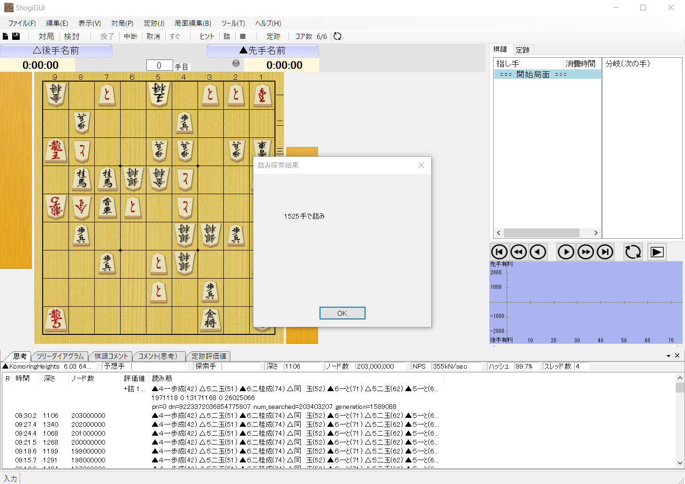

詰将棋エンジン「KomoringHeights」を公開した。



やねうら王ベースのオープンソースの詰将棋エンジンで、df-pnアルゴリズムにより長手数の詰将棋でも短時間で詰みを見つけられる。手元の環境だと、現在最長手数の詰将棋であるミクロコスモス（1525手詰）の詰みを10分程度で読み切ることができる。

## ソフトの概要

df-pnアルゴリズムをベースにして、n手詰めルーチンや証明駒／反証駒による探索ノード数の削減を行うことで、現実的な時間内で長手数の詰将棋を解くことができる。指し手生成などの基本的なデータ構造はやねうら王のコードをほぼそのまま使用している。

新たに書いたコード量は1500行弱と短いが、詰将棋探索の基本的な探索手法がすべて凝縮されている。今後、自力で詰将棋エンジンを作ろうとしている人の参考になれば嬉しい[^1]。

[^1]: 1500行の割にはコーディングやデバッグ作業にかなり手こずった。感覚的には6000行ぐらい書いた気分である

細かい技術解説は最近の詰将棋技術の解説記事を参照。





実装にあたってtanuki-詰め[^2]やdlshogiのdf-pnエンジン[^3]、やねうら王の詰将棋エンジン[^4]を大いに参考にしている。

[^2]: [YaneuraOu/tanuki-mate-search.cpp at master · yaneurao/YaneuraOu](https://github.com/yaneurao/YaneuraOu/blob/master/source/engine/tanuki-mate-engine/tanuki-mate-search.cpp)
[^3]: [TadaoYamaoka/DeepLearningShogi](https://github.com/TadaoYamaoka/DeepLearningShogi)
[^4]: [YaneuraOu/yaneuraou-mate-search.cpp at master · yaneurao/YaneuraOu](https://github.com/yaneurao/YaneuraOu/blob/master/source/engine/yaneuraou-mate-engine/yaneuraou-mate-search.cpp)

また、作成したエンジンの動作チェックにはやねうらお氏作成の詰将棋500万問を使用している[^5]。

[^5]: [やねうら王公式からクリスマスプレゼントに詰将棋500万問を謹呈 | やねうら王 公式サイト]("https://yaneuraou.yaneu.com/2020/12/25/christmas-present/)

### よくありそうなQ&A

#### Q. なんでこれを作ったんですか？

現実的な時間、メモリサイズでミクロコスモスが解けるソフトを自分の手で作ってみたいと思ったから。オープンソースの詰将棋エンジンを探してみたが、既存のエンジンはほとんどが実戦特化型で、超長手数の詰将棋には向かない実装になっていた。長手数の詰将棋エンジンの理論自体は20年以上前からほとんど変わっていないので、自分でも作ってみたいと思い実装した。

#### Q. 脊尾詰は256MBでミクロコスモスを解けるのに、KomoringHeightsは1GB以上必要なのはなぜですか？

局面の先読みが甘いからである。おそらく、脊尾詰はおそらく3手先ぐらいまで局面を展開しながら探索をしているので、KomoringHeightsよりも詰みに早く気づきやすいのだと思われる。

#### Q. 詰み手順に無駄合が含まれていて美しくないのはなんとかならないですか？

無駄合や余詰の検知は判定がかなり複雑なので、KomoringHeightsでは一切考慮していない。そのため、これらの用途で詰将棋エンジンを使いたい場合は脊尾詰を使うのがおすすめである。

#### Q. スレッド数を2以上にしても探索が並列化されないようですが、今後並列化を実装する予定はありますか？

並列化の予定は今のところはない。

並列化をするためにはかなりの大改造が必要になるが、今の実装で解けない問題が解けるようになる改造ではない（n並列化ならシングルスレッドでもn倍の時間をかければ解ける）のであまり気が進まないというのが現状である。

#### なんで「KomoringHeights」って名前なんですか？

気づいたときにはこの名前になっていた。響きだけで決めているので深い理由はない。
