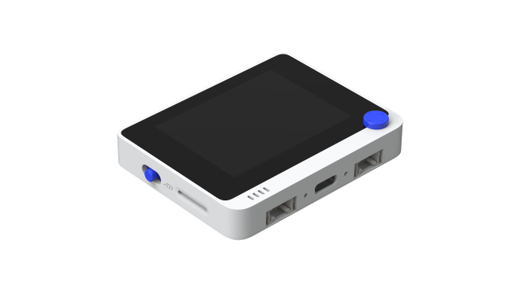
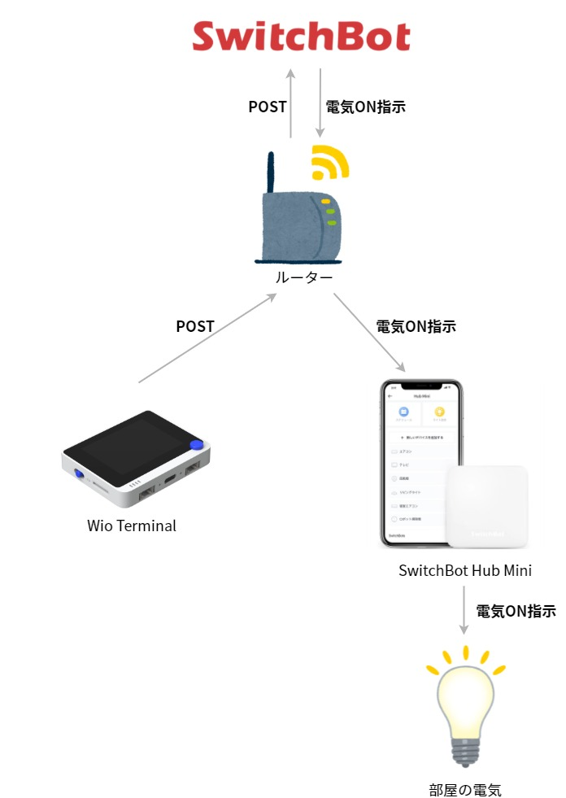

2021年7月現在、wifiに接続できるIoTボタンは意外と高い。単純にWiFiに接続してボタンを押すだけの SORACOM LTE-M Button（旧AWS IoT Button）でも、7980 円もする。Raspberry Piや格安スマホが1万円程度で買えることを考えると、かなり高く感じてしまう。

そこで、安く買える組み込みデバイスである Wio Terminal を IoT Button 化する手順について説明する。

## Wio Terminal



Wio Terminalは、seeed studioの画面つきデバイスである。販売価格は4000円前後と安いが、以下の特徴を備えている[^1]：

[^1]: [公式wikiの仕様](https://wiki.seeedstudio.com/jp/Wio-Terminal-Getting-Started/)を参照

- ユーザー定義ボタン（画面上部の3つ）
- 5方向スイッチ（上下左右と押し込み）
- Wi-Fi（2.4GHz/5GHz）
- 2.4インチ LCD スクリーン
- マイク
- ブザー

特に、5GHz帯のWi-Fiに繋がったりLCDスクリーンを搭載していたりと IoT Button を作るには十分すぎる機能がついている。昨今のIoTボタンは安くても5000円以上もすることを考えると、非常にお得なデバイスである[^2]。

[^2]: [SORACOM LTE-M Button powered by AWS | SORACOM](https://www.amazon.co.jp/dp/B07L59ZFVF/)や[https://www.amazon.co.jp/dp/B00ZQCSSSS/](SONY MESH Button(ボタン)タグ MESH-100BU)などがある。なお、スマホに通知を飛ばすだけのデバイスなら[IoTボタンを安く手に入れてノーコードでWeb APIを叩く方法 - Qiita](https://qiita.com/optimisuke/items/a9f4dc65559a7a5eadef)のように300円で作れる

さらに、Rustを用いてWio Terminalを操作して組み込みプログラミングの基礎を学ぶ本も存在している[^3]。ただし、RustのドライバではHTTP通信できないなどの制約がいくつかあるので、RustでWio Terminalを触ろうとしている方は注意が必要である。

[^3]: [基礎から学ぶ 組込みRust | 中林智之, 井田健太 | 工学 | Kindleストア | Amazon](https://komorinfo.com/blog/wio-terminal-iot-button/#easy-footnote-bottom-4-1311)

## セットアップ手順

[Wio Terminalをはじめよう – Seeedウィキ（日本語版）](https://wiki.seeedstudio.com/jp/Wio-Terminal-Getting-Started/) に従ってArduino IDEと関連ライブラリのインストールを行う。また、Wi-Fiを使う場合は [Overview – Seeed Wiki](https://wiki.seeedstudio.com/Wio-Terminal-Network-Overview/) に記載されている **Wireless Core Firmwareのアップデート** と追加ライブラリのインストールが必要になる。特に、Wireless Core はバージョンによっての SPI の Baud Rate が異なり、ドライバが正常に動作しないことがあるためアップデート作業は忘れずに実施する必要がある。

開発環境の基本的な操作方法は公式wikiが充実しているのでとても参考になる。Lチカなどの基本的なデバイス操作は、wikiを写経することで簡単に学べる。

## ボタン作成例

SwitchBot Hub Miniを用いて部屋の電気のON/OFFしてみる。



Wio Terminalのボタンが押されたらSwitchBotApiを叩き、部屋に設置しているSwitchBot Hub Miniを介して部屋の電気を介してつけたり消したりする。SwitchBot は Hub Mini をコントロールするための REST API を公開しており、[OpenWonderLabs/SwitchBotAPI: SwitchBot API Documents](https://github.com/OpenWonderLabs/SwitchBotAPI) に従ってAPIを叩けば機器へ指示を出せる。

### コードを書く

[Wi-Fi – Seeed Wiki](https://wiki.seeedstudio.com/Wio-Terminal-Wi-Fi/) を参考に、SwitchBotApiサーバーへPOSTを打つコードを書く。SwitchBotApiサーバーはHTTPS対応が必須のようなので、`WiFiClient` ではなく `WiFiClientSecure` を用いる。

```c
#include <WiFiClientSecure.h>;
#include "Free_Fonts.h"  //include the header file
#include "TFT_eSPI.h"

TFT_eSPI tft;

#define RETRY_MAX 10
#define TURN_ON_MAX 50
#define AUTHORIZATION_KEY                                                      \
  "ffffffffffffffffffffffffffffffffffffffffffffffffffffffffffffffffffffffffff" \
  "ffffffffffffffffffffff"
#define SWITCH_BOT_SERVER "api.switch-bot.com"
#define LIGHT_DEVICE_ID "00-000000000000-00"

const char* SSID = "<SSID>";  // your network SSID
const char* PASSWORD = "PASSWORD";  // your network password

int prev_status = 0;
int turn_on_count = 0;

WiFiClientSecure client;

const char* LIGHT_MESSAGE[2][2] = {
    {
        "Turning off the light       ",
        "Turning on the light       ",
    },
    {
        "Turned off the light       ",
        "Turned on the light       ",
    },
};

bool connect_wifi(const char* ssid, const char* password);
bool post_light_request(bool turn_on);
void lcd_backlight_on();
void lcd_backlight_update();

void setup() {
  // <lcd>
  tft.begin();
  tft.setRotation(3);

  tft.fillScreen(TFT_BLACK);
  tft.setFreeFont(
      &FreeSansBoldOblique12pt7b);  // select Free, Sans, Bold, Oblique, 12pt.
  tft.drawString("Starting...", 20, 20);  // prints string at (70,80)
  // </lcd>

  // <button>
  pinMode(WIO_KEY_A, INPUT_PULLUP);
  pinMode(WIO_KEY_B, INPUT_PULLUP);
  pinMode(WIO_KEY_C, INPUT_PULLUP);

  pinMode(WIO_5S_UP, INPUT_PULLUP);
  pinMode(WIO_5S_DOWN, INPUT_PULLUP);
  pinMode(WIO_5S_LEFT, INPUT_PULLUP);
  pinMode(WIO_5S_RIGHT, INPUT_PULLUP);
  pinMode(WIO_5S_PRESS, INPUT_PULLUP);
  // </button>

  // <serial>
  // Initialize serial and wait for port to open:
  Serial.begin(115200);
  // while(!Serial); // Wait for Serial to be ready
  // delay(1000);
  // </serial>

  // <wifi>
  if (connect_wifi(SSID, PASSWORD)) {
    Serial.print("Connected");
  }
  // </wifi>

  prev_status = -1;
}

void loop() {
  if (digitalRead(WIO_KEY_C) == LOW || digitalRead(WIO_KEY_B) == LOW) {
    bool turn_on = digitalRead(WIO_KEY_C) == LOW;
    lcd_backlight_on();

    tft.drawString(LIGHT_MESSAGE[0][turn_on], 20, 50);
    int retry_cnt = 0;
    while (retry_cnt < RETRY_MAX && !post_light_request(turn_on)) {
      retry_cnt++;
      connect_wifi(SSID, PASSWORD);
    }

    if (retry_cnt < RETRY_MAX) {
      tft.drawString(LIGHT_MESSAGE[1][turn_on], 20, 50);
    }
  }

  if (WiFi.status() != prev_status) {
    lcd_backlight_on();

    prev_status = WiFi.status();
    char str[128];
    sprintf(str, "%s (%d)", SSID, WiFi.status());
    tft.drawString(str, 20, 20);  // prints string at (70,80)
  }

  lcd_backlight_update();
  delay(200);
}

bool connect_wifi(const char* ssid, const char* password) {
  Serial.print("Attempting to connect to SSID: ");
  Serial.println(ssid);
  WiFi.begin(ssid, password);

  int retry_cnt = 0;
  while (retry_cnt < RETRY_MAX && WiFi.status() != WL_CONNECTED) {
    retry_cnt++;
    Serial.print(".");
    delay(1000);
  }

  return retry_cnt < RETRY_MAX;
}

void lcd_backlight_on() {
  turn_on_count = 0;
  digitalWrite(LCD_BACKLIGHT, HIGH);
}

void lcd_backlight_update() {
  if (turn_on_count >= TURN_ON_MAX) {
    digitalWrite(LCD_BACKLIGHT, LOW);
  } else {
    turn_on_count++;
  }
}

bool post_light_request(bool turn_on) {
  Serial.println("\nStarting connection to server...");
  if (!client.connect(SWITCH_BOT_SERVER, 443)) {
    Serial.println("Connection failed!");
    return false;
  } else {
    Serial.println("Connected to server!");
    String data = turn_on ? "{\r\n\"command\": \"turnOn\",\r\n\"parameter\": "
                            "\"default\",\r\n\"commandType\": \"command\"\r\n}"
                          : "{\r\n\"command\": \"turnOff\",\r\n\"parameter\": "
                            "\"default\",\r\n\"commandType\": \"command\"\r\n}";
    char s[128];
    sprintf(s, "Content-Length: %d\r\n", data.length());
    // Make a HTTP request:
    client.print("POST /v1.0/devices/" LIGHT_DEVICE_ID
                 "/commands/ HTTP/1.1\r\n");
    client.print("Host: " SWITCH_BOT_SERVER "\r\n");
    client.print("Authorization: " AUTHORIZATION_KEY "\r\n");
    client.print("Content-Type: application/json\r\n");
    client.print(s);
    client.print("\r\n");
    client.print(data);
    client.print("\r\n");
    client.print("\r\n");

    while (client.connected()) {
      String line = client.readStringUntil('\n');
      if (line == "\r") {
        Serial.println("headers received");
        break;
      }
    }
    // if there are incoming bytes available
    // from the server, read them and print them:
    while (client.available()) {
      char c = client.read();
      if (c == '\n') {
        Serial.write('\r');
      }
      Serial.write(c);
    }
    client.stop();
    return true;
  }
}
```

以下のパラメータは各自の環境に合わせて書き換える必要がある。

| SSID              | Wi-FiのSSID                                                                                                                                                  |
| ----------------- | ------------------------------------------------------------------------------------------------------------------------------------------------------------ |
| PASSWORD          | Wi-Fiのパスワード                                                                                                                                            |
| LIGHT_DEVICE_ID   | ON/OFFしたい電気のDevice ID。[OpenWonderLabs/SwitchBotAPI: SwitchBot API Documents](https://github.com/OpenWonderLabs/SwitchBotAPI#get-device-list) を参照。 |
| AUTHORIZATION_KEY | SwitchBotの認証コード。SwitchBotのスマホアプリの開発者向けオプションから取得する。                                                                           |

なお、SwitchBotApiサーバーはHTTPの判定がシビアのため、`client.print("...\r\n")` ではなく `client.println("...")` と書くとエラーになるので注意が必要である。（一敗）

### 動作結果



ボタンBを押すと部屋の電気が消え、ボタンCを押すと部屋の電気がついた。いったん SwitchBot サーバーを経由してから Mini Hub に指示が飛んでくるため、反応に2~3秒かっている。

POSTの状況を画面に表示できるのも便利だ。WiFiの状態やPOSTの進捗状況を画面に表示することで、どこでエラーになっているか簡単に分かる。これは、画面なしのIoTボタンでは得られないメリットである。

## まとめ

4000円弱で買えるIoTデバイス「Wio Terminal」を紹介した。とても安価なデバイスながら豊富な機能が搭載されており、IoTボタンとして十分実用に耐えられると思う。デバイスの入手や環境構築方法はとても簡単なので、ぜひ試してみてほしい。
