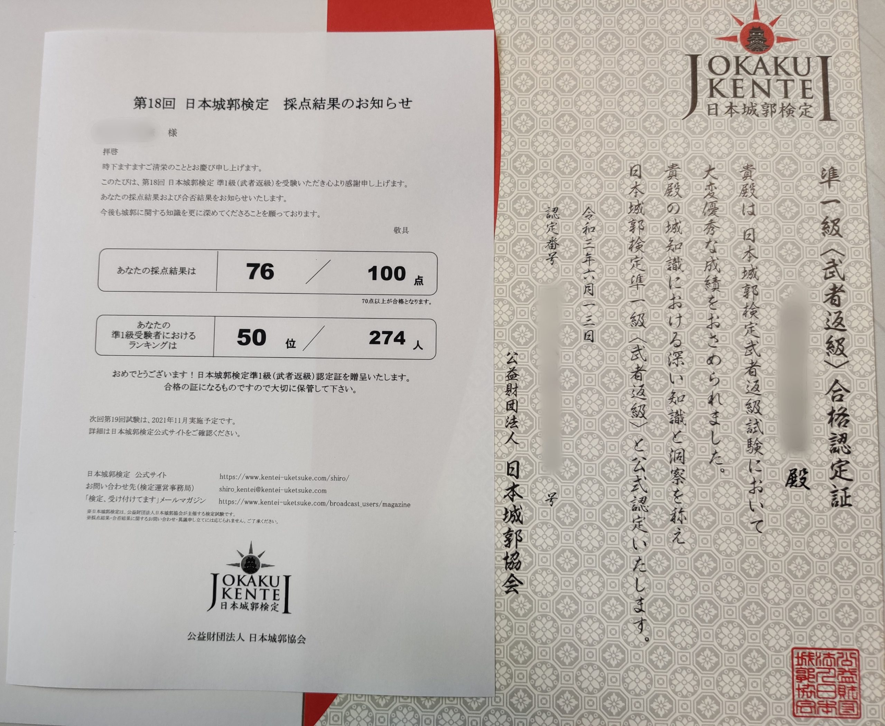
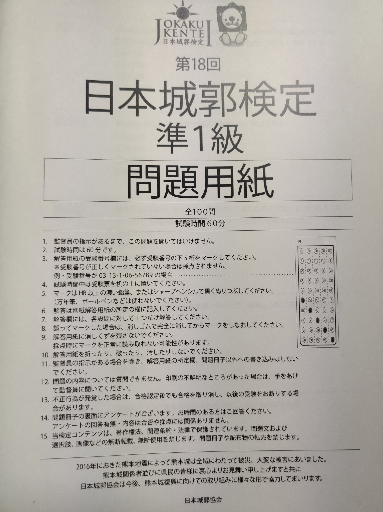
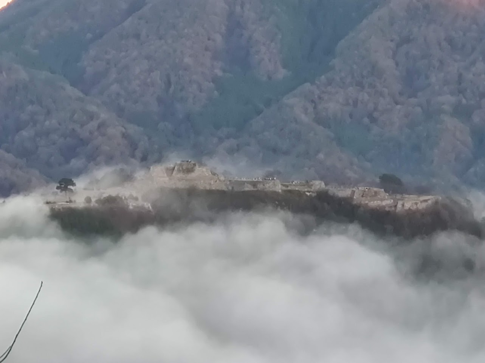
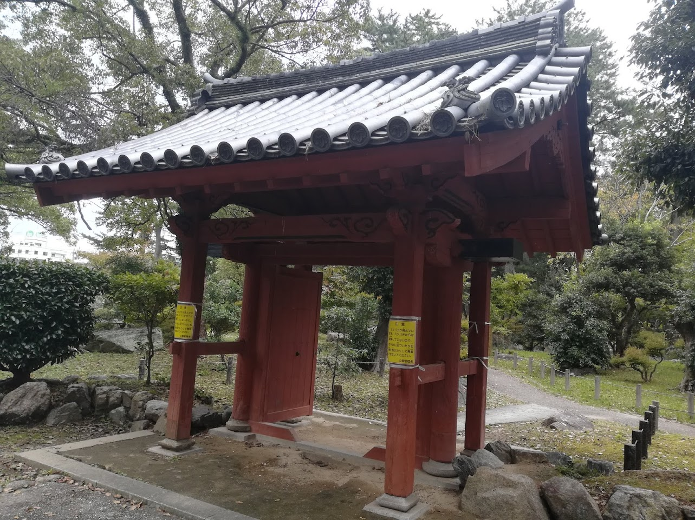

第18回日本城郭検定の準1級に合格したので、本記事では準1級の受験対策や受験した感想について述べる。

## 日本城郭検定とは

**日本城郭検定** とは、公益財団法人・日本城郭協会が主催する日本のお城にまつわる検定試験である。試験区分は5階級に分かれており、初心者から玄人まで幅広い層が受験できる。

階級は1級、準1級、2級、3級、オンライン入門級の5つに分かれている。オンライン入門級だけは特殊な開催方式で、いつでも無料で受験することができる。詳しくは以下の記事を参照。



準1級から3級は半年に1回、1級は1年に1回試験が行われる。問題はすべて4択で、100問中概ね7割以上正当すれば合格である[^1]。それぞれの級の平均合格率は以下のようになっている。

[^1]: 問題の難易度によって合格ラインが変わる。実際に過去に合格ラインが50点まで下げられた事があるらしい

| 級    | 平均合格率 |
| ----- | ---------- |
| 3級   | 82.8%      |
| 2級   | 73.6%      |
| 準1級 | 35.8%      |
| 1級   | 4.9%       |

↑各級の合格率[^2]。準1級は3人に1人、1級はなんと20人に1人程度しか合格していない。1級は準1級合格者でなければ受験できないため、その難易度の高さが際立つ。

[^2]: [日本城郭検定とは - 城の検定「日本城郭検定」公式サイト](https://www.kentei-uketsuke.com/shiro/about/)

今回、3回目の受験にして準1級に合格できた[^3] 。本ページでは合格に至るまでの勉強方法などについて共有する。

[^3]: ちなみに前回は1点足りなくて落ちた

## 準1級の対策方法

準1級は試験範囲が非常に広く、闇雲にインプットを増やしても合格に近づくことは難しい。そのため、効率よく試験知識を身につけるためにはインプット方法を工夫する必要がある。

準1級に合格するために最低限必要なことは大きく次の4つだと思う[^4]。

[^4]: 逆に、各回で発表される準1級のテーマ（第18回は『作事』）は特に気にする必要がない。というより、問題の予測が難しく出題数もそれほど多くないため、時事問題に力を注いだほうがよい

1. 過去問を丸暗記する
2. 時系列や関連する人物を整理する
3. いろんなお城を攻める
4. 時事問題対策をする

以下ではそれぞれの項目についてより詳しく掘り下げる。

### 過去問を丸暗記する

正確な割合は不明だが、準1級の問題は半分以上過去問で構成されていると思われる。特に、直近1~2年の過去問から再出題される割合が非常に高く感じる。そのため、準1級合格のために最も効率的な勉強方法は **試行回数を重ねること** である。準1級は過去問題集がないため、過去問を入手するためには本番の受験回数を増やすのが最も手っ取り早い。

過去問を入手できたら、正答率100%になるまで過去問を丸暗記するのが最も効率良い勉強法になる。

### 時系列や関連する人物を整理する

準1級では、城の築城背景や関連する人物のエピソードを問われることが多い。そのため、特に戦国時代から関ケ原の戦いまでの間の歴史上の出来事は頭の中で大まかに再現できる必要がある。

「○○城の築城はxxxx年」というところまで覚える必要はないが、主要な城なら「○○城は◇◇の戦いに備えて☆☆氏が築城した城で、この城が☓☓という構造を持っていたおかげで勝った／負けた」ぐらいは言えるようにしておきたい。直接問題で問われることもあるし、消去法で選ぶ時の手がかりにもなりやすい。

自分の場合、朝や寝る前のスキマ時間にyoutubeの合戦まとめ動画を見て知識を整理した。個人的には [YUKIMURA CHANNEL](https://www.youtube.com/channel/UCt3u21GWUjaNt5WV0TIjrpw) の動画が好みで毎日少しずつ視聴していた。

### いろんなお城を攻める

過去問の重要性が高いのは間違いないが、準1級に合格するためには知らない問題でも4割以上は正答する必要がある。そのためには、色々な城を定期的に攻めることが重要になる。

日本100名城・続日本100名城だけが優れた城というわけではないが、検定を主催する公益財団法人・日本城郭検定協会が選定しているので、やはりこれらの城を中心的に攻めるのがよい。

城に関する知識は書籍や動画などから得ることもできるが、記憶に残りやすくするためには実際に城攻めしたほうがよい。実際、僕も「○○城に現存する門の名前は？」という問題を見て「よく覚えていないけど徳が高そうな名前だった気がする……！」という朧気な記憶だけで正解したことがある[^5]

[^5]: ↓ 

### 時事問題対策をする

「お城で時事問題？」と思われるかもしれないが、準1級では近年の復元事例や最近の発掘調査の結果が問われることがある。出題数はそれほど多くないが、他のカテゴリよりも問題の予想が容易なので、対策さえすれば得点源にしやすい。

時事問題で対策すべき事項は大きく分けて2つだけである。

1. 試験日前後2年の復元事例
2. 直近2~3年の重用文化財登録

1\. は、「城 復元」などでググって主要な城の門、橋、櫓、石垣の復元事例（予定含む）を10個ぐらい言えるようにするだけでよい。復元事例の時事問題では重箱の隅を突くような問題は少ないので、聞いたことがある城の情報だけさらっと覚えるだけで十分役に立つ。

2\. は文化庁のニュースリリースから最新情報を仕入れるのが早い。

[報道発表 | 文化庁](https://www.bunka.go.jp/koho_hodo_oshirase/hodohappyo/index.html)

ニュースリリースのうち、毎年1回発表される「文化審議会の答申（史跡等の指定等）について」というページの『「新指定・新登録・新選定」答申物件』のPDFに、その年に新たに登録される（された）重要文化財が記載されている。過去2~3年分の答申から城に関係ありそうな案件を見つけて頭に入れれば良い。

重用文化財問題は範囲自体は狭いものの、重箱の隅をつつくような問題が出題されることが多い。そのため、記載されている情報は正確に覚えること。特に、史跡名は **一言一句違わず書いてある通りに** 覚える必要がある。

## 合格した感想

1年以上勉強を続けた結果、ようやく合格できてほっとしている。

城郭検定の勉強のおかけで、城を訪れた際にその城で見たほうがいいポイントに目が行きやすくなった。特に事前知識がなくても案内板の説明だけで十分楽しめていたが、基礎知識を身に着けたことでより城巡りが楽しめるようになった気がする。

知識の上では数え切れないぐらいたくさんの城の知識を身につけられたが、実際に行ったことがある城は45城とまだまだ少ない。現存天守が残る弘前城や松江城、最近天守が復興されて入れるようになった熊本城、様々な石垣が残り「石垣の博物館」と呼ばれる金沢城などなど行ってみたい城は多い。また、行ったことがある城でも知識をつけた今ならまた別の楽しみ方ができると思うので、2回目の登城にも挑戦したい。そして実力をつけて、いつかは1級にもチャレンジしてみたいと思う。
