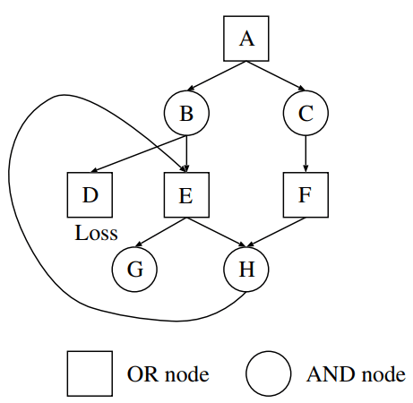
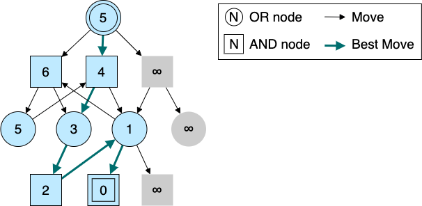
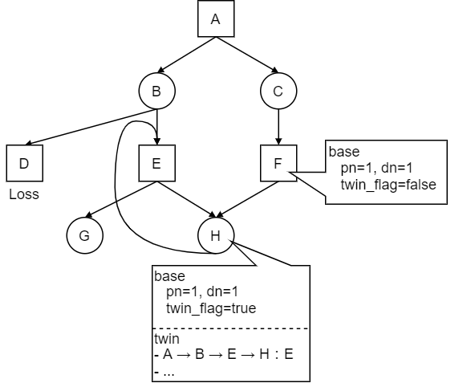

詰将棋ソルバーの開発で困ることが多いGHI問題について、正しい対策方法を調べたのでまとめる。本ページは主に以下の文献紹介と詰将棋に対して適用する際の個人的な考察をまとめたものになっている。

- \[1\] Kishimoto, Akihiro and Martin Müller. “A solution to the GHI problem for depth-first proof-number search.” _Inf. Sci._ 175 (2005): 296-314.

## GHI問題

**Graph History Interaction（GHI）問題**とは、詰将棋のようなループを含むAND/OR木の探索で現れる問題である。

AND/OR木の探索では、局面の探索結果を一時的に保存する手段として置換表が多く用いられる。置換表に探索結果を保存することで、別経路で同一局面に合流した時に以前の探索結果を流用して探索を効率化できるためである。しかし、置換表に保存する値が適切ではないと、詰み／不詰の判断を誤ってしまう事がある。このような問題のことをGHI問題と呼ぶ。

以下では簡単のために、詰将棋のように「千日手はAND node側が負け」という性質を持つ探索木のみを考える。



上の図のような節点 A を根とする探索木を考える[^1]。ここで、節点 D は不詰、節点 G は詰みであると仮定する。この探索木は A → C → F → H → E → G の詰み手順が存在するので、節点 A は詰みである。しかし、探索において置換表を使用する場合、以下の手順で探索を行うと誤って不詰と判定してしまう。

[^1]: 細かいことだが、詰将棋では2手でループになる手順は存在しないので、この図のようなループは厳密には起こり得ない

1. A → B → E → H → E：E に2回訪れることになるので、この経路は詰まない。特に節点 H に注目すると、どの手を選んでも不詰になる節点なので、**置換表には H が不詰であることが記録される**。ここで E の探索は一旦保留にし、B に戻るものとする
2. A → B → D：仮定より D は詰まない。ここで B の探索は一旦保留にし、A に戻るものとする
3. A → C → F → H：**置換表には H が不詰であると記録されている**。よって、途中で手順を変えようがない C, F も不詰であることが記録される
4. A：B, C がともに不詰だと分かったので、A は詰まない

このような問題が発生してしまう原因は、**「ある局面が詰むかどうか」はその局面に至るまでに通った経路に依存する**ためである。上の図の例だと、節点 H は E 経由で訪れると不詰、それ以外なら詰みという構造になっている。経路依存の探索結果をすべて同一視して置換表に保存すると、このような問題が発生することがある。これがGHI問題である。

長手数の詰将棋を解く場合、局面のループが発生しやすいため、GHI問題が原因で詰み／不詰の判断を誤ることがある。そのため、詰将棋ソルバーを自作する際はGHI問題の対策が必ず必要になる。

## GHI問題対策

GHI問題の解決策は大きく分けて2つある。**途中経路の異なる同一局面を別物として扱う方法**と、**経路の情報も含めて置換表に書き込む方法**だ。

### 途中経路の異なる同一局面を別物として扱う

「局面が詰みかどうか」はその局面に至るまでの手順に依存する。そのため、探索上では経路ごとに別物の局面として扱うことでGHI問題を回避することができる。探索のイメージを以下に示す。



同じ節点であっても、そこに至るまでの手順によって節点の名前を変えている。このように局面を区別することで、E2 と E3 を別局面として扱えるようになり、正しい詰み手順を確実に見つけられるようになる。

この方法のメリットはアルゴリズムがとてもシンプルのため、コードの保守性や可読性が高く保てることである。局面のループや合流を一切考えないため、GHI問題についてほとんど意識することなく探索を進めることができる。

一方、デメリットは置換表の効率性を享受できないことである。置換表には局面の合流時に探索を省略できる利点があるが、この方法では局面の合流は全く発生しないので置換表を使う意味が薄い。実際、この方法を採用するやねうら王の詰め将棋エンジン[^2]では、探索結果をシンプルな木構造で保持している。

[^2]: [YaneuraOu/source/engine/yaneuraou-mate-engine/yaneuraou-mate-search.cpp at master · yaneurao/YaneuraOu · GitHub](https://github.com/yaneurao/YaneuraOu/blob/master/source/engine/yaneuraou-mate-engine/yaneuraou-mate-search.cpp)

### 経路の情報も含めて置換表に書き込む

置換表の効率性を保ちつつGHI問題対策を行うためには、置換表に書き込む探索結果を工夫する必要がある。この方法には様々なバリエーションがあるが、ここでは参考文献 \[1\] の手法について詳しく扱う。



置換表において、各局面の探索結果を _base_ と _twin_ という2種類のエントリに分けて管理する。base には通常の（ループについて考慮しない）df-pn探索の置換表と同様に、局面の証明数／反証数を格納する。局面のループを検知していない限り、twin のエントリは使用せずに探索を続ける。

局面のループを検知した場合、base の証明数、反証数を \\((+\\infty, 0)\\) に設定するかわりに、twin の置換表に現局面に至るまでの経路（のハッシュ値）と次の一手を格納する。各局面の twin テーブルには、経路と次の一手のペアを複数個格納することができるものとする。また、base には局面に千日手が絡んでいる（twin に1 個以上結果が保存されている）フラグを格納する。

探索中に置換表にアクセスした際に、「千日手が絡んでいるフラグ」が立っていた場合、その経路で千日手による不詰になるかどうかを確認する。

1. twin に保存された経路のいずれかと一致する場合、千日手による不詰である
2. （AND Node限定）twin に保存された次の一手のいずれかにより局面を進め、千日手による不詰となった場合、現局面も千日手による不詰である[^3]

[^3] この手順を省いても、探索を進めれば千日手による不詰はすぐに確認できる。ただ、置換表に保存された手を使うことで指し手生成を省略することができ、しかも高い確率で千日手手順が見つかるというメリットがある

以上のように、「経路依存の不詰」と「経路非依存の不詰」を分けて持つことで、置換表の恩恵を受けつつGHI問題を正しく解決することができる。

## 蛇足：KomoringHeights v0.1のGHI問題対策

拙作の詰将棋ソルバー「KomoringHeights」のGHI問題対策は実は不完全なものになっている。



アイデアとしては「経路依存の不詰（連続王手の千日手による不詰）」と「経路非依存の不詰（連続王手の千日手ではない不詰）」を区別して扱うものになっている。別経路の探索の際には「経路依存の不詰」の反証駒を無視することで、経路依存の探索結果を別経路へ適用しないようにしている。

```cpp
// source/engine/user-engine/typedefs.hpp
// 詰み／不詰に関連する定数。「経路に依存する不詰（千日手）」と「経路に依存しない不詰」を区別して定数を定義している。

inline constexpr Generation kProven = std::numeric_limits<Generation>::max();
inline constexpr Generation kNonRepetitionDisproven = kProven - 1;
inline constexpr Generation kRepetitionDisproven = kNonRepetitionDisproven - 1;
```

```cpp
// source/engine/user-engine/komoring_heights.cpp
// 置換表のLook UPのコード。「経路に依存する不詰（千日手）」の場合は反証駒の情報を使わないようにしている

// 経路に依存しない不詰
bool TTEntry::IsNonRepetitionDisprovenNode() const {
  return generation_ == kNonRepetitionDisproven;
}

// 経路に依存する不詰
bool TTEntry::IsRepetitionDisprovenNode() const {
  return generation_ == kRepetitionDisproven;
}

// 反証駒の判定を行う関数。「経路に依存する不詰（千日手）」の場合は false が返る
bool TTEntry::DoesDisprove(::Hand hand) const {
  return IsNonRepetitionDisprovenNode() && hand_is_equal_or_superior(hand_, hand);
}
```

ただし、この解法はいわゆる嘘解法であるので注意。実際、「経路依存の不詰」を取り出す際に現局面に至るまでの経路を確認していないので、このページの冒頭の例のように経路によっては詰む局面を「経路依存の不詰」と判定してしまう可能性がある。ただ、やねうら100万問問題集[^4]やミクロコスモスはすべて問題なく解けるので、これが原因で詰み／不詰の判断を誤る確率は限りなく低いと思われる。

[^4]: [https://yaneuraou.yaneu.com/2020/12/25/christmas-present/](やねうら王公式からクリスマスプレゼントに詰将棋500万問を謹呈 | やねうら王 公式サイト）

（2021-11-03追記）

下記コミットで本ページに記載した千日手対策をKomoringHeightsに取り込んだ。旧バージョンでは [添川公司「新桃花源」](http://www.ne.jp/asahi/tetsu/toybox/kenkyu/cho001a.htm)のような難解詰将棋で詰み／不詰の判断を誤っていたが、新バージョンではこれが解消されている。

<https://github.com/komori-n/KomoringHeights/commit/4e268e5b44840f381eade8f7749430dfe39e2927>

## まとめ

AND/OR木の探索で発生するGHI問題の対策方法についてざっとまとめた。内容はかなり圧縮していたが、GHI問題対策はかなりめんどくさいということは分かっていただけたと思う。

今度まとまった時間が取れたら、KomoringHeightsでも完全なGHI問題対策を取り入れたい。
