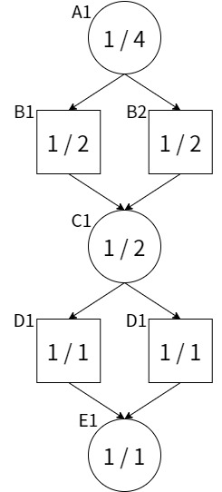
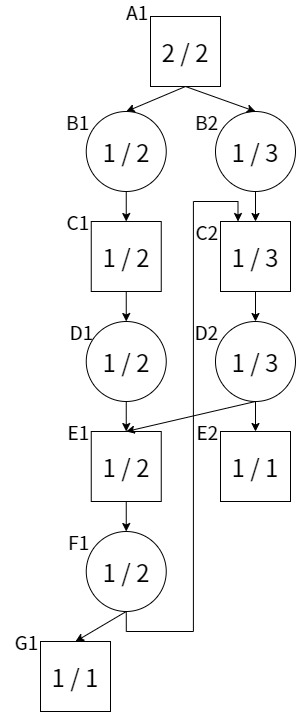
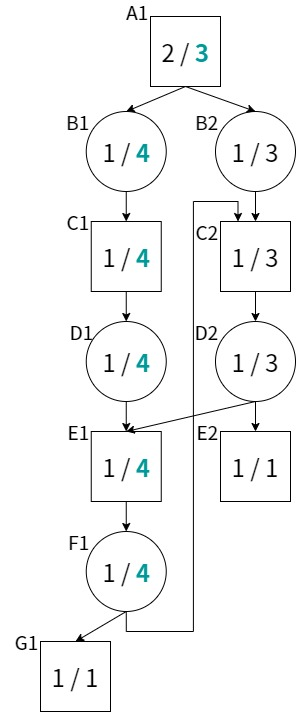

## 概要

詰将棋ソルバー『KomoringHeights』v0.4.0を公開した。

<https://github.com/komori-n/KomoringHeights/releases/tag/kh-v0.4.0>



v0.2.1時代と比較してv0.4.0では多くの改善点がある。そのため、本ページではv0.2.1からv0.4.0までの間に導入した詰将棋探索テクニックを簡潔に述べる。

## 性能改善

v0.2.1とv0.4.0を比べたとき、最も変わった点は探索性能の改善である。読みを深める局面を厳選することによって、これまで長い時間ががかかっていた詰将棋の求解が大幅に高速化されている。

性能改善の効果を示すために、v0.2.1とv0.4.0の探索時間の簡単な比較を行った。測定環境は以下の通り。

- Windows 10 Education 21H1
- Intel Core i5-8400
- RAM: 16GB
- USI_Hash: 1024 MB

以下に比較に用いた詰将棋を示す。

- 橋本孝治 「ミクロコスモス」：1525手詰
  - 詰将棋探検隊 1995年12月 記録大賞
  - 原図 詰パラ1986年6月 看寿賞
- 伊藤看寿「将棋図巧1番」：69手詰
- 伊藤看寿「将棋図巧100番（寿）」：611手詰

以下に性能比較結果を示す。

| version | ミクロコスモス | 将棋図巧1番 | 将棋図巧100番 |
| ------- | -------------- | ----------- | ------------- |
| v0.2.1  | 5m58s          | 6m49s       | 0m35s         |
| v0.4.0  | 2m49s          | 0m46s       | 0m27s         |

この表より、探索速度が大幅に向上していることがわかる。v0.2.1と比較して、v0.4.0での解答速度は1.3倍~8.9倍になっている。

このように、v0.4.0では探索性能が大幅に改善されている。以下ではその中から主要な3項目について説明する。

### df-pn+

探索速度の根本的な改善のために、df-pn+アルゴリズム[^1]を導入した。df-pn+アルゴリズムは、初めて訪れた局面の(pn, dn)を一様に(1, 1)で初期化するのではなく、局面の詰みやすさに応じて値を増減させるアルゴリズムである。展開前の局面に対して値に差をつけることにより、より詰みに近い局面を優先して子局面の展開を行うことができる。素朴な発想のヒューリスティックではあるが、局面の詰みやすさをうまく評価できれば探索性能が大きく向上することが知られている。KomoringHeightsのdf-pn+評価関数の設計は、GPS将棋[^2]を大いに参考にした。この評価関数はシンプルながらもとても洗練されているようで、導入するだけで将棋図巧1番の探索が10倍程度高速化できた。

[^1]: Nagai, Ayumu. “Application of df-pn+ to Othello endgames.” Proceedings of Game Programming Workshop’99. 1999.
[^2]: <https://gps.tanaka.ecc.u-tokyo.ac.jp/gpsshogi/>

### pn/dn二重カウント対策

一般に、置換表を用いたdf-pnアルゴリズムは局面の合流を扱うのが苦手である。もし局面に合流があると、証明数（pn）／反証数（dn）を二重でカウントしてしまい、局面の詰みづらさを過剰に見積もってしまうことになる。df-pnアルゴリズムではpn／dnが小さい順に探索を進めるため、局面の過小評価は探索性能の劣化に直結する。

例えば上記の局面グラフを考える。もし局面E1が不詰ならば局面A1もまた不詰であることが示せる。反証数の「不詰を示すために展開すべき未探索局面数」という定義に従うと、A1のdnは1と計算されてほしい。しかし、局面A1, C1でdnの二重カウントを行ってしまっているため、計算結果が4倍になっている。つまり、A1での詰みづらさが過小評価されてしまう。

詰将棋ソルバーの先行研究では、局面の合流を検出して二重カウント問題を抑制する方法がいくつか提案されている[^3] [^4]。アイデアとしては、置換表に合流を検出できるような変数を格納しておき、合流を見つけた時はpn/dnの計算方法を帰ることで値が過剰に大きくならないようにしている。

[^3]: 長井歩, and 今井浩. “df-pn アルゴリズムの詰将棋を解くプログラムへの応用.” 情報処理学会論文誌 43.6 (2002): 1769-1777.
[^4]: Kishimoto, Akihiro. &#8220;Dealing with infinite loops, underestimation, and overestimation of depth-first proof-number search.&#8221; Proceedings of the AAAI Conference on Artificial Intelligence. Vol. 24. No. 1. 2010.

しかし、先行研究で示されている合流検出アルゴリズムは計算コストがそこそこ大きいため、KomoringHeightsでは採用していない。厳密な合流検出アルゴリズムを実装する代わりに、合流が発生しそうな雰囲気がある局面では予めpn/dnが大きくなりすぎないような工夫をしている。

（KomoringHeightsにおける簡易二重カウント対策については別記事を執筆予定…）

### PV探索の改善

df-pnアルゴリズムでは手順の最短性を保証するのが難しいため、KomoringHeightsの探索部は大きく分けて「詰み／不詰の証明」と「詰み手順の構成」の2つに分かれている。多くの問題では「詰み／不詰の証明」に大部分の時間が割かれるため、「詰み手順の構成」についてはあまり最適化が進んでいなかった。しかし、v0.2.1時点の実装では、チップイン[^5]のような合流を多く含む問題においては「詰み手順の構成」にとても長い時間を要していた。

[^5]: 有吉澄男「チップイン」　詰パラ2004年3月

そこで、v0.4.0では置換表に最善手・詰み手数を保存するよう修正し、「詰み手順構成」を高速化した。また、置換表とは別に証明木を持つことにより、余詰探索も高速に行えるようになった。

## 機能改善

性能面以外でも、以前は解けなかった問題を解けるようにするためにいくつか改善を行っている。

### GHI問題対策

詰将棋探索では、Graph History Interaction（GHI）問題が常につきまとってくる。GHI問題とは、局面の探索順序に依存するような探索結果を置換表に書き込むことで発生する問題である。詰将棋の場合、千日手の取り扱いに注意しないとGHI問題が発生しやすい。

以前の実装ではGHI問題対策が不完全だったため、新桃花源[^6]のように複雑なループを含む問題が解けなかった。v0.4.0では完全なGHI問題対策を実装したため、新桃花源が解けるようになった。

[^6]: 添川公司「新桃花源」　詰パラ2006年8月

詳しくは[^7]および以下の記事を参照。



[^7]: Kishimoto, Akihiro, and Martin Müller. “A solution to the GHI problem for depth-first proof-number search.” Information Sciences 175.4 (2005): 296-314.

### infinite loop対策（TCA）

以前の実装ではごく稀に探索が無限ループに陥ることがあった。無限ルーブは最小距離法により防いでいたつもりであったが、チップインのように複雑な合流を含む問題で無限ループに陥ることがあった。

例えば上記の局面グラフを考える。定義に従って局面A1から探索を進めると、A1-&gt;B1-&gt;C1-&gt;D1-&gt;E1-&gt;F1-&gt;G1 のパスがPV（最善応手列）となる。ここで局面F1に注目すると、子局面のdnの和が2ではなく4になることがわかる。

すると、A1~F1のdnが更新され、PVはA1-&gt;B2-&gt;C2-&gt;D2-&gt;E2に変化する。しかし、今度はD2の子局面のdnの和が3ではなく5になることがわかる。すると、またPVはA1-&gt;B1-&gt;C1-&gt;D1-&gt;E1-&gt;F1-&gt;G1へ戻ることになる。F1の子局面にC2があるため、またまたPVの切り替えが発生する。

つまり、上記のような局面グラフを持つ場合、df-pnの定義どおりにpn/dnの計算を行うと無限ループに陥ることになる。

v0.2.1では、最小距離法を用いて無限ループをごまかすことにより、上記ような局面グラフでは無限ループが発生しないようになっていた。しかし、いくつかの詰将棋では似たような原理により無限ループが発生することが判明している。

v0.4.0では、無限ループ対策としてThreshold Controlling Algorithm（TCA）[^8]を導入した。TCAを簡潔に表現すると、無限ループの危険がありそうな局面で探索を少し延長することで無限ループを回避する手法である。

[^8]: Kishimoto, Akihiro. “Dealing with infinite loops, underestimation, and overestimation of depth-first proof-number search.” Proceedings of the AAAI Conference on Artificial Intelligence. Vol. 24. No. 1. 2010. （GHI問題対策の文献と同一）

無限ループ対策を最小距離法からTCAに切り替えることで、以下のデメリットが生じた。

- 探索局面数の増加
- 長手数余詰を返す頻度の増加

1については、TCAを適用する局面を絞ることで性能劣化を抑えることにした。無限ループが生じているとき、pnまたはdnが無限に上昇していくという特徴があるため、pn/dnがある程度大きな値のときのみTCAの探索延長を行うことで探索局面数の増加を抑えた。

2については、TCAの性質上直接防ぐのは難しいため、簡易余詰探索を導入した。余詰探索については次節で詳しく触れる。

### 余詰探索

df-pnアルゴリズムによる探索では、人間にとって不自然な手順を解答として返すことがある。例えば、以下の局面を考える。

この図は「ミクロコスモス」の62手目の局面である。この局面は、攻め方から見て大きく2通りの詰み手順が存在する。

- 作意手順｜▲3四桂 △同と ▲4一と右 △3二玉
- 変化別解｜▲4一と右 △3二玉 ▲2一と右 △2二玉 ▲3四桂 △同と ▲2一と △3二玉

作意手順は桂馬をすぐに打つ手順なのに対し、変化別解では玉をわざわざ2二まで送ってから桂馬を打つ手順になっている。人間の感覚からすると作意手順の方が自然に見えるが、コンピュータは変化別解の方の手順を返してしまうことがある。

詰将棋の解答としては、複数の攻め手順がある場合は最も短く詰む手順を返したい。そのため、v0.4.0では、部分的に余詰め探索を行うオプションを追加した。詰み手順に現れるすべての攻め方手番の局面に対し、見つけた詰み手順以外の手を選べばより早く詰まないかどうかのチェックを行う。デフォルトでは各局面で300局面分だけ追加探索を行うようにしている。一見すると追加探索局面の数が少ないように見えるかもしれないが、このような少量の探索を行うだけで、「ミクロコスモス」の変化長手数別解を回避することができる。

### Small Tree GC

以前の実装では、置換表に空きがなくなったら古いものから順に上書きするアルゴリズム（FIFO式のreplacement GC）を用いていた。このような手法だと、置換表領域を100%近く使い切る場合、何度も同じ局面が消されて無限ループに近い状態になることがあった。

そのため、v0.4.0ではSmall Tree GC[^9]により置換表の削除を行うようにした。具体的には、置換表の使用率が85%を超えたら、探索した局面数が少ない順に全体の30%のエントリを削除するようにした。

[^9]: Nagai, Ayumu. “A new depth-first-search algorithm for AND/OR trees.” ICGA Journal 22.1 (1999): 35-36.

Small Tree GCの実装により、詰将棋を解くために最低限必要なメモリ量が少なくなった。例えば、v0.2.1で「ミクロコスモス」を解くためには`USI_Hash`を1024MB以上に設定する必要があったのに対し、v0.4.0では`USI_Hash` 128MBでも「ミクロコスモス」の詰みを読み切ることができる。

## 細かい修正

上で挙げた主要な変化点以外にも、v0.2.1からv0.4.0にかけて多くの細々とした修正を行っている。

- **探索局面数のカウント方法の変更**
- 局面の優等関係を探索中局面（`kOtherState`）にも適用してpn/dnを初期化
- 探索途中に評価値のような何かを表示
- 証明駒／反証駒が最善ではなかった問題を修正
- デバッグ用コマンドを追加（`user show`/`user pv`）
- 千日手用エントリ（twin）を置換表本体から分離
- メンテできていないファイルを削除
- 探索深さ制限`DepthLimit`に対応
- 探索局面数制限`NodesLimit`に対応
- 探索制限時間に対応
- 簡易高速0手不詰ルーチンを追加
- 全体的にリファクタリング
- M1 Mac用のコンパイルオプションの追加
- deep df-pn[^10]（性能が良くないのでデフォルトOFF）

1番目だけ軽く触れておくと、v0.2.1とv0.4.0では探索局面のカウント方法が変更になっている。npsを比較するとv0.4.0のほうが2倍近く高速化されているように見えるかもしれないが、実際には30%程度しか高速化できていない。v0.2.1では、末端局面の固定深さ探索が探索局面数に反映できていなかった。v0.4.0では、`Node::DoMove()`をコールするたびに探索局面数を加算するシンプルな方式に変更することで、より実態にあった局面数が出力されるようになった。旧バージョンとnpsや探索局面の比較を行う場合は注意していただきたい。

[^10]: Zhang, Song, Hiroyuki Iida, and H. Jaap van den Herik. “Deep df-pn and its efficient implementations.” Advances in Computer Games. Springer, Cham, 2017.

## まとめと今後の展望

KomoringHeights v0.4.0 で使われる技術についてざっと解説した。半年前と比較して、最新技術の導入やコードの細かなリファクタリングを重ねたことで、詰将棋ソルバーとして実用に耐えそうなレベルまで成熟したと感じる。特に、現在最長の詰将棋であるミクロコスモスがMacbook Pro(M1)では1分20秒程度、スマホでは3分程度で解けるようになってとても嬉しい。

最後に、今後の機能実装の予定について挙げておく。ただし、ここで挙げている機能はあくまで構想段階のため、過度な期待はしないでいただきたい。

- [コンピュータ向け超難解詰将棋作品集](http://toybox.tea-nifty.com/memo/2005/05/post_3535.html) の完全解答（制限時間24時間）
- 置換表の表現方法の大改修（大幅な高速化の予感）
- 無駄合の検出、除去
- 余詰・キズの出力
- 並列化
