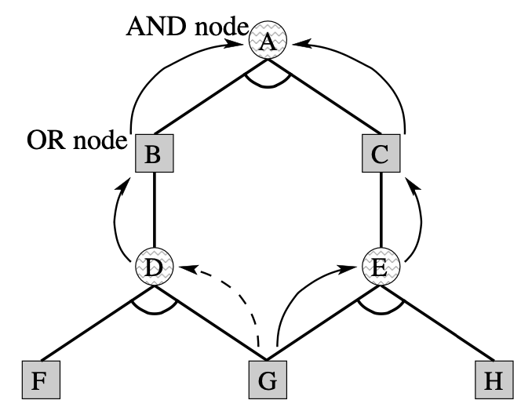



KomoringHeights v0.4.1の簡易二重カウント対策のアイデアについて説明する。

## 概要

詰将棋の探索にはdf-pnアルゴリズムがよく用いられる。df-pnアルゴリズムは、展開すべき局面数が最小となる子局面を貪欲に展開する探索方法で、詰将棋に限らずconnect4などのゲームに適用することができる[^1]。df-pnアルゴリズムについては以下のページを参照。

[^1]: Allis, Louis Victor. Searching for solutions in games and artificial intelligence. Wageningen: Ponsen & Looijen, 1994.



一般に置換表を用いるdf-pnアルゴリズムでは、局面の合流を扱うのが苦手である。もし局面に合流があると、証明数（pn）／反証数（dn）を二重でカウントしてしまい、局面の詰みづらさを過剰に見積もってしまうことになる。df-pnアルゴリズムではpn／dnが小さい順に探索を進めるため、局面の過小評価は探索性能の劣化に直結する。

本ページでは、既存の二重カウントの回避方法について整理した後に、KomoringHeights（v0.4.1）におけるお手軽二重カウント回避方法について説明する。v0.4.1で採用している簡易二重カウント対策は、単純なアイデアながら少ない実装コストで探索性能を大きく向上させられる。



## 先行研究

### 合流の検出

証明数／反証数の二重カウント問題を回避するためには、局面グラフの合流を検出ができなければならない。

合流を検出するためには、以下の追加情報のいずれかを置換表に保存する必要がある。

- 直前手
- 親局面の置換表エントリへのポインタ

これらの情報があれば、次回以降に同じ局面に到達したときに局面の合流を検出することができる。なお、直前手だけでは取った駒がわからないので、厳密な合流検出のためには親局面へのポインタも必ず必要になる。

長井歩, and 今井浩. &#8220;df-pn アルゴリズムの詰将棋を解くプログラムへの応用.&#8221;&nbsp; 情報処理学会論文誌 &nbsp;43.6 (2002): 1769-1777. Fig. 3

探索中に局面の合流を見つけたとき、探索経路および置換表に書かれた親局面をたどり、それらの手順が分岐した局面を特定する。このようにして、二重カウント問題が発生しそうな分岐局面を特定することができる。

### 長井・今井の手法

長井・今井の手法[^2]では、証明数の二重カウント対策をad-hocな方法で行っている。長井・今井の手法では、合流の検出で親局面をたどる際に、以下の規則に従って遡る。

[^2]: 長井歩, and 今井浩. “df-pn アルゴリズムの詰将棋を解くプログラムへの応用.

- OR node：無条件に親局面をたどる
- AND node：証明数が親局面と一致するなら親局面をたどる

AND nodeで親局面をたどる条件を絞ることで、合流検出の計算時間を短くできる。

合流を検知した攻め方局面\\(n_i\\)に対し、子局面の集合を\\((n)\_{i=1}^k\\)とすると、そのdnを

\\begin{align}
\\mathrm{dn}(n) =
\\begin{cases}
\\displaystyle{\\sum\_{i=1}^{k}} \\mathrm{dn}(n_i), &amp; \\text{合流未検知} \\\\
\\displaystyle{\\max\_{i=1,\\dots,k}} \\mathrm{dn}(n_i) &amp; \\text{合流検知}
\\end{cases}
\\end{align}

により求める。合流を検知しているときは、反証数を加算しないようにすることで詰みづらさを過小に見積もってしまうのを防ぐことができる。

長井・今井の手法は詰将棋に特化した単純な手法であるため、複雑な合流構造を持つ局面グラフでは効果を発揮することができない。

### SNDA(The Source Node Detection Algorithm)

The Source Node Detection Algorithm(SNDA)[^3]では、長井・今井の手法を拡張している。

[^3]: Kishimoto, A. (2010). Dealing with Infinite Loops, Underestimation, and Overestimation of Depth-First Proof-Number Search. Proceedings of the AAAI Conference on Artificial Intelligence, 24(1), 108-113. Retrieved from <https://ojs.aaai.org/index.php/AAAI/article/view/7534>

長井・今井の手法と同様に、各局面の置換表エントリに親局面へのポインタを保存しておくことで局面の合流を検出する。探索中に局面の合流を検出した場合、ポインタを辿り共通する祖先局面（のうち最も葉に近い）\\(n\\)を求める。

\\(n\\)における子局面\\((n_i)\_{i=1}^k\\)のうち前半の\\(l\\)局面が合流を持つとき、\\(n\\)におけるpn/dnを次の式に従って求める。

\\begin{align}
\\mathrm{dn}(n) &amp;= \\max\_{i=1,\\dots,l} \\mathrm{dn}(n_i) + \\sum\_{i=l+1}^k \\mathrm{dn}(n_i),\\ \\ \\text{(OR Node)} \\\\
\\mathrm{pn}(n) &amp;= \\max\_{i=1,\\dots,l} \\mathrm{pn}(n_i) + \\sum\_{i=l+1}^k \\mathrm{pn}(n_i).\\ \\ \\text{(AND Node)}
\\end{align}

通常のdf-pnアルゴリズムのように値の総和を求めるのではなく、二重カウントの可能性がある局面は\\(\\max\\)を併用することでpn/dnが実態以上に大きくならないようにしている。

## 簡易的な方法

既存手法では、局面の合流を真面目に判定するのはかなりの手間が必要である。置換表に追加の情報を保存しなければならないし、合流検出や証明数／反証数の計算の手間も増える。

ただ、詰将棋という問題の性質を考慮することで、「子局面が合流を含みやすい局面かどうか」を高速に判定できる。

詰将棋の探索では、どの持ち駒を打っても大して変わらない局面がしばしば存在する。例えば、以下の局面を考える。

この局面における玉方の駒打ちはいわゆる「無駄合」と呼ばれる合駒である。8八~2二の7マスに対し玉方は654024通りの合駒が可能だが、それらはほとんど詰み手順は変わらない。2二以外への合駒は▲同角で無効であり、2二への合駒は▲2三桂打で詰みであるためである。この局面の詰みを示すために展開すべき局面の数は、654024と比べるとずっと少ない。

このように、詰将棋ではどれを選んでもそれほど変わらない子局面に合流する手がいくつか存在する。以下にその例を挙げる。

- 合駒
- 持ち駒の角・飛車による王手
- 盤上の歩・角・飛車の不成による王手

もし局面\\(n\\)の子局面\\((n)\_{i=1}^k\\)に対し、上で挙げた合流しやすそうな局面が\\(l\\)個含まれる場合、もとの局面\\(n\\)のpn/dnを

\\begin{align}
\\mathrm{dn}(n) &amp;= \\max\_{i=1,\\dots,l} \\mathrm{dn}(n_i) + \\sum\_{i=l+1}^k \\mathrm{dn}(n_i),\\ \\ \\text{OR Node} \\\\
\\mathrm{pn}(n) &amp;= \\max\_{i=1,\\dots,l} \\mathrm{pn}(n_i) + \\sum\_{i=l+1}^k \\mathrm{pn}(n_i),\\ \\ \\text{AND Node}
\\end{align}

により計算する。こうすることで、SNDAと同様の理屈で二重カウント問題を軽減することができる。

この手法の利点はメモリ使用効率および探索性能が高いことである。置換表に親局面をたどるための追加情報を保存しないため、1局面あたりの置換表エントリのサイズを小さく抑えることができる。また、指し手生成時に未然に二重カウントを防ぐことができるため、二重カウント対策導入前と比較してnpsの低下はほとんどない。

この手法の欠点は合流検出があまり厳密ではないことである。ここで提案している手法は長井・今井の手法やSNDAと比べると、かなり乱暴な議論に見えるかもしれない。上で挙げた3条件を満たせば局面の合流が必ず発生するわけではないし、3条件を満たさなくても局面が合流するケースは無数に存在する。

次節では、この簡易的な二重カウント対策による性能向上の効能を数値実験により示す。

## 数値実験

いくつかの局面に対し、簡易的な二重カウント回避により探索局面が削減できるかどうかを実験する[^4]。

[^4]: df-pnアルゴリズムは探索順序が効率に大きく影響する手法である。実際、pnが等しい局面をどのような順序で探索するかによって探索局面数が変わる。そのため、以下の記録はあくまで参考程度として捉えていただきたい

以下の2つのバイナリの間で合駒が大量に現れる中手数詰将棋「将棋図巧 1番[^5]」の解図に必要な探索局面数を比較した。比較にはKomoringHeights v0.4.1（USI_Hash=1024, 余詰探索OFF）を使用した。

[^5]: 伊藤看寿「将棋図巧1番」 69手詰。5連続飛車の限定打・限定合で有名。

| 二重カウント回避なし | 二重カウント回避あり |
| -------------------- | -------------------- |
| 183957288            | 21800413             |

本ページで紹介した簡易二重カウント対策を入れるだけで、探索局面数を88.1%も削減することができる。「将棋図巧1番」はさすがに極端な例だが、多くの詰将棋では遠隔王手や合駒がほぼ必ず含まれるので、二重カウント対策による高速化が期待できる。

## まとめ

詰将棋探索において、無駄合や不成を含む局面で簡易的に二重カウントを防ぐことで探索効率が向上することが確認できた。

二重カウント問題についてはまだまだ改善の余地がある気がするので、時間があればもう少し深堀りしてみたい。
