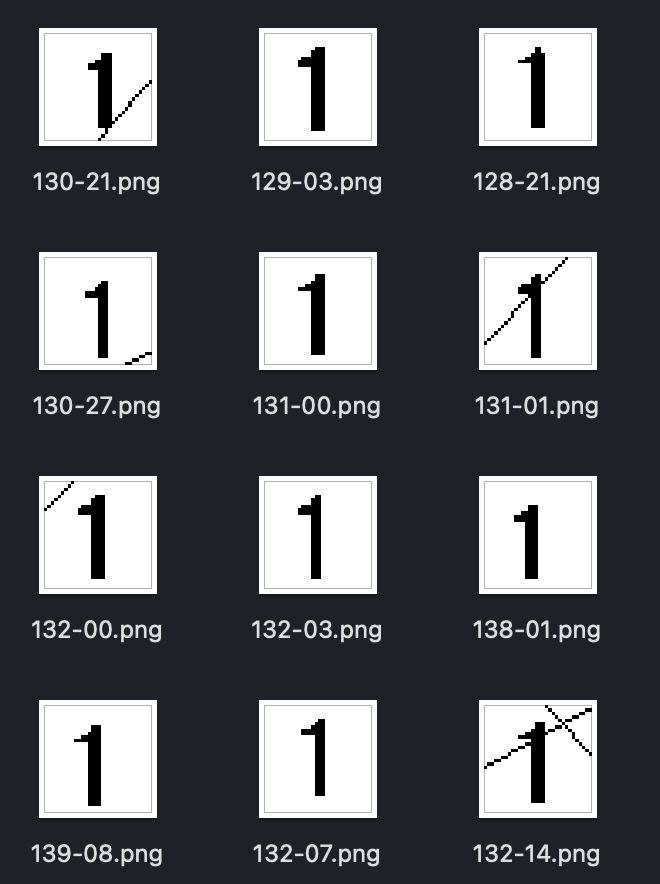
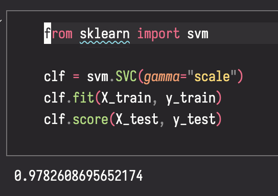



[Are you human? – ksnctf](https://ksnctf.sweetduet.info/problem/34) のWriteup。重要な部分はぼかして書いているが、**解法のネタバレが含まれる**ので注意。

## 問題設定

zipファイル `image.zip` とpythonスクリプト `ecc.py` が渡される。

まず、`ecc.py` をざっと読むと、コマンドライン引数で渡されたファイルをReed-Solomon code（[リード・ソロモン符号](https://ja.wikipedia.org/wiki/%E3%83%AA%E3%83%BC%E3%83%89%E3%83%BB%E3%82%BD%E3%83%AD%E3%83%A2%E3%83%B3%E7%AC%A6%E5%8F%B7); RS符号）という誤り訂正符号で符号化するコードであることが分かる。このRS符号といえば、地デジ放送でも使われる誤り訂正符号で、連続したビットの誤りに強い符号化方式である。`ecc.py` では、N=255、K=64のRS符号を使って与えられたファイルを符号化する。その後、符号化したバイト列のうち1%程度を乱数で上書きし、ファイルへ出力している。

一方、`image.zip` には7571（=0x1d93）枚のpng画像が含まれている。例えば `image/00000000.png` を開いてみると、以下のように数字が羅列されたファイルであることが分かる。


画像サイズは 1024×32ピクセルで、各行には32個の16進数が並んでいる。他の画像も同様のフォーマットで、00000000.png から 0001d920.png まで 0x10 飛ばしの連番が付けられている。最後の画像 `image/0001d920.png` には 10 個の数字しか書かれていないので、すべてを合わせると 242250 個の 16 進数、すなわち 121125 バイト分の文字列が含まれている。

冒頭を調べてみると “FF D8 FF E1” となっており、jpeg画像のヘッダのようである。ちょうど `121125 % 255 == 0` なということもあり、jpeg画像を `ecc.py` により符号化し、その結果をpng画像に変換したものと考えられる。

そこで、flagを得るためには、png画像に書かれた文字を読み取り、RS符号を復号をすればよいことが分かる。RS符号の誤り訂正能力により、文字の読み取りの際に多少の誤りが含まれていても問題ない。具体的には、1チャンク（255文字）に含まれる誤りの個数が (255-64)/2=95 個以下であれば、RS符号で訂正することができる。16進数文字列2文字が1バイトということに注意すると、正解率が約80%以上であれば、元のファイルを復元できる。この程度の正解率であれば、機械学習を使って文字を自動的に読み取ることが可能そうだ。

## 画像読み取り

画像の数字の読み取りといえば MNIST である[^1]。MNISTのサンプルコードはネット上に無限に存在するので、機械学習に詳しくなくても簡単に文字の認識ができそうだ。

[^1]: 今回のケースではそれほど高い正解率が求められていないので、[tesseract](https://github.com/tesseract-ocr/tesseract) で文字列を直接読むことも可能だったかもしれない（未検証）

学習のためにまず、入力画像に前処理を施す。

```py
# 適当な前処理。画像の文字列部分を特定して白黒の2値に単純化する
def preprocess(img):
    data = img.getdata()
    ctr = Counter(data)
    l = ctr.most_common(2)
    # 一番面積が広い色が背景
    bg = l[0][0]
    # 次に面積が広い色が文字部分
    fg = l[1][0] if len(l) > 1 else None
    l = map(lambda px: (0, 0, 0) if px == fg else (255,255,255), data)
    img.putdata(list(l))
    return img
```

最も頻繁に使われている色を背景色、次に頻繁に使われている色を文字色と決め打ちして2値化する。このような前処理を施すことで、機械的に分類しやすい入力画像が得られる。

次に、学習のための正解データを用意する。0~F の 16 種類の文字に対し、前処理した画像を各 100 枚ずつ集める。



次に、集めた画像をもとに分類器を学習する。分類器のモデルは、CNNのような流行りのモデルを使ってもよいが、今回はお手軽に学習するためにSVM（サポートベクタマシン）を使用した。scikit-learnでサクッと学習させてみたところ、score 0.978のモデルが得られた。



このモデルを用いてzipファイルで与えられた画像たちを読み、121125バイトのバイト列が得られた。

## RS符号の復号

[wikipediaのリード・ソロモン符号の記事](https://ja.wikipedia.org/wiki/%E3%83%AA%E3%83%BC%E3%83%89%E3%83%BB%E3%82%BD%E3%83%AD%E3%83%A2%E3%83%B3%E7%AC%A6%E5%8F%B7) を眺めると、復号の手順には行列式や連立一次方程式など複雑な操作が含まれていることが分かる。すでに機械学習パートで疲れ果てていたので、RS符号復号は既存のライブラリの [reedsolo](https://github.com/tomerfiliba/reedsolomon) に投げることにした。



ライブラリに丸投げするとき、バイト列の表現方法に注意しなければならない。列 \\((D_i)\\) に対し、与えられたスクリプト（ecc.py）では多項式を

\\begin{align}
\\sum\_{i=1}^{N} \\alpha^{D_i} x^{i-1}
\\end{align}

のように構成するのに対し、reedsolo では

\\begin{align}
\\sum\_{i=1}^{N} D_i\\ x^{i-1}
\\end{align}

のように構成する。つまり、多項式の表現方法が異なるので、事前に変換してあげる必要がある。具体的には、reedsolo に渡す前に \\(d \\mapsto \\alpha^d\\) の変換を行い、誤り訂正後にその逆変換を行う必要がある。

```py
from reedsolo import RSCodec

# A[i] = alpha ** i
A = [1<<i for i in range(8)]
for _ in range(8,255):
    a = A[-1]<<1
    if a>>8:
        a ^= 0b100011101
    A += [a]
A += [0]
Ai = [A.index(i) for i in range(256)]


N = 255
K = 64
rsc = RSCodec(N - K)
ans = b""
with open("out_image.bin", "rb") as f:
    x = f.read()
    assert len(x) % N == 0
    block_num = len(x) // N
    ex_start = block_num * K
    for i in range(block_num):
        plain = x[i*K:(i+1)*K]
        ex = x[ex_start+i*(N-K):ex_start+(i+1)*(N-K)]

        plain = bytes([A[c] for c in reversed(plain)])
        ex = bytes([A[c] for c in reversed(ex)])
        tmp = rsc.decode(plain + ex)[0]
        ans += bytes([Ai[c] for c in reversed(tmp)])
```

このスクリプトを走らせることで、期待通りフラグが書かれたjpeg画像が手に入る。

解法の方針は容易に浮かぶが、実際に解くには想像以上に時間がかる問題だった。
